# 一键部署QwQ-32B推理模型，2种方式简单、快速体验

`QwQ-32B`推理模型正式发布并开源，凭借其卓越的性能和广泛的应用场景，迅速在全球范围内获得了极高的关注度。基于阿里云函数计算 FC提供算力，`Function AI`现已提供**模型服务、应用模板**两种部署方式辅助您部署`QwQ 32B`系列模型。您选择一键部署应用模板与模型进行对话或以API形式调用模型，接入AI应用中。欢迎您立即体验`QwQ-32B`。

## QwQ-32B更小尺寸，性能比肩全球最强开源推理模型

QwQ-32B在一系列基准测试中进行了评估，包括数学推理、编程和通用能力。以下结果展示了QwQ-32B与其他领先模型的性能对比，包括 DeepSeek-R1-Distilled-Qwen-32B、DeepSeek-R1-Distilled-Llama-70B、OpenAI-o1-mini以及原始的DeepSeek-R1-671B。

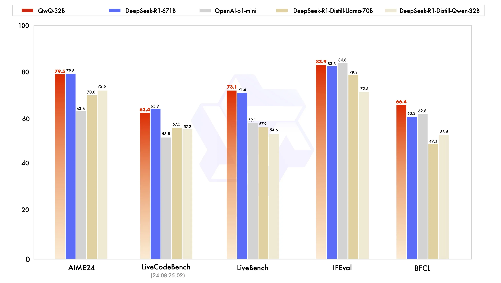

在测试数学能力的AIME24评测集上，以及评估代码能力的LiveCodeBench中，千问QwQ-32B表现与DeepSeek-R1-671B相当，远胜于OpenAI-o1-mini及相同尺寸的R1蒸馏模型。在由Meta首席科学家杨立昆领衔的“最难LLMs评测榜” LiveBench、谷歌等提出的指令遵循能力IFEval评测集、由加州大学伯克利分校等提出的评估准确调用函数或工具方面的BFCL测试中，千问QwQ-32B的得分均超越了DeepSeek-R1-671B。

## 前置准备

本教程在函数计算中创建的GPU函数，函数运行使用的资源按照函数规格乘以执行时长进行计量，如果无请求调用，则只收取浅休眠（原闲置）预留模式下预置的快照费用，`Function AI`中的**极速模式**通过预置实例快照实现毫秒级响应，其技术原理对应函数计算的**浅休眠（原闲置）预留模式**，适用于需要快速冷启动的场景。建议您领取函数计算的[试用额度](https://common-buy.aliyun.com/package?spm=a2c4g.11186623.0.0.117a7c77brgZf7&planCode=package_fcfreecu_cn)抵扣资源消耗，超出试用额度的部分将自动转为按量计费，更多计费详情，请参见[计费概述](https://help.aliyun.com/zh/functioncompute/fc/product-overview/billing-overview-of-fc)。

## 方式一：应用模板部署

### 1. 创建项目

登录[函数计算控制台](https://fcnext.console.aliyun.com/)，在左侧导航栏单击**Function AI**，在**FuncitonAI**页面导航栏，选择**项目**，然后单击**创建项目**，选择**基于模板创建**。

### 2. 部署模板

1. 在搜索栏输入`QWQ`进行搜索，单击基于**Qwen-QwQ 推理模型构建AI聊天助手**，进入**模板详情**页，单击**立即部署**。
  
  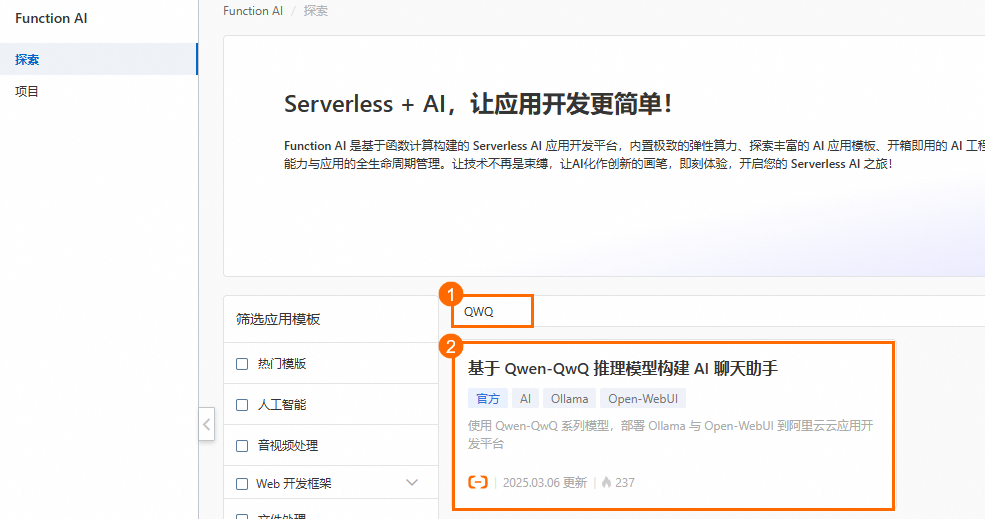
  
  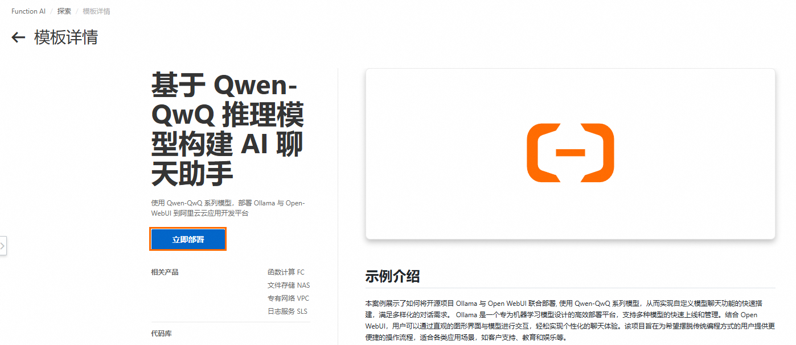
2. 选择**地域**，单击**部署项目**，在**项目资源预览**对话框中，您可以看到相关的计费项，详情请见[计费涉及的产品](https://help.aliyun.com/zh/cap/product-overview/billing-overview#title-z1y-ai5-gmw)。单击确认部署，部署过程大约持续 10 分钟左右，状态显示**已部署**表示部署成功。
  
  **
  
  **说明**
  
  - 选择地域时，一般是就近选择地域信息，如果已经开启了NAS文件系统，选择手动配置模型存储时，请选择和文件系统相同的地域。
  - 如果您在测试调用的过程中遇到部署异常或模型拉取失败，可能是当前地域的GPU显卡资源不足，建议您更换地域进行重试。
  
  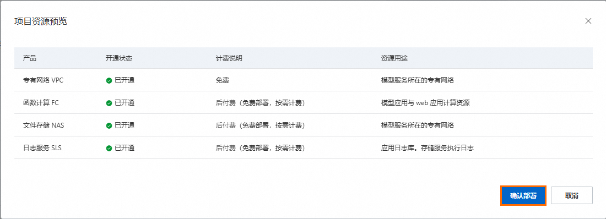
  
  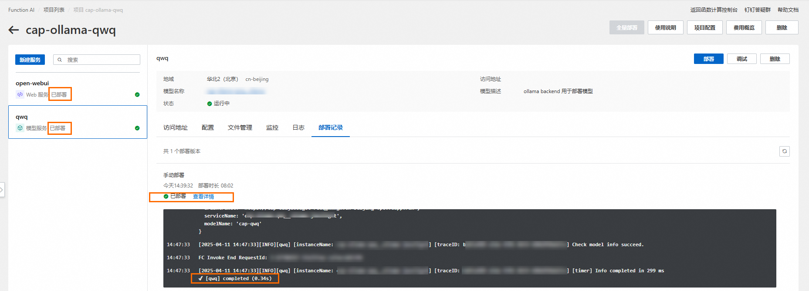

### 3. 验证应用

部署完毕后，点击**Open-WebUI**服务，在**访问地址**内找到**公网访问**单击访问。在OpenWebUI界面体验QwQ模型进行对话。

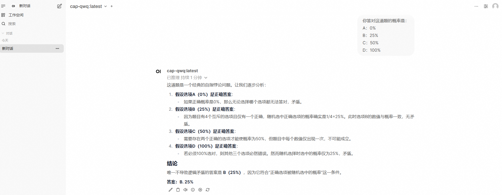

## 方式二：模型服务部署

使用API形式进行模型调用，接入线上业务应用。

### 1. 创建空白项目

1. 登录[函数计算控制台](https://fcnext.console.aliyun.com/)，在左侧导航栏单击**Function AI**，在**FuncitonAI**页面导航栏，选择**项目**，然后单击**创建项目**。
2. 选择**创建空白项目**，在弹出的对话框，填写**项目名称**和**项目描述**，然后单击**创建**。
3. 在项目详情页面，单击左上角的**新建服务**，选择**模型服务**，进入服务配置页面。

### 2. 部署模型服务

1. 选择模型QwQ-32B-GGUF，目前仅支持杭州地域。
  
  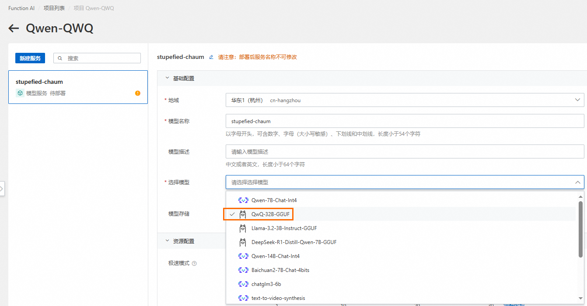
2. 单击**资源配置**，QwQ-32B-GGUF推荐使用 Ada 系列，可直接使用默认配置。您可以根据业务诉求填写需要的卡型及规格信息。
  
  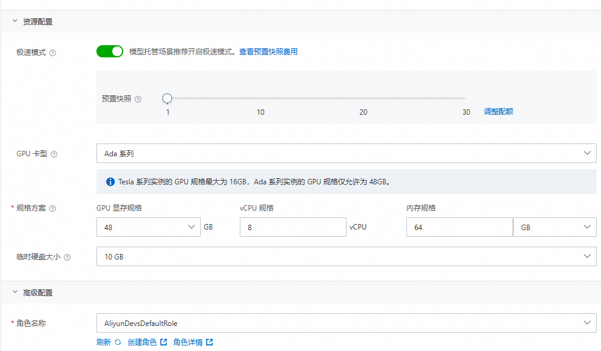
3. 单击**预览并部署**，在**服务资源预览**对话框中，您可以看到相关的计费项，详情请见[计费涉及的产品](https://help.aliyun.com/zh/cap/product-overview/billing-overview#title-z1y-ai5-gmw)。单击**确认部署**，该阶段需下载模型，预计等待10~30分钟即可完成。
  
  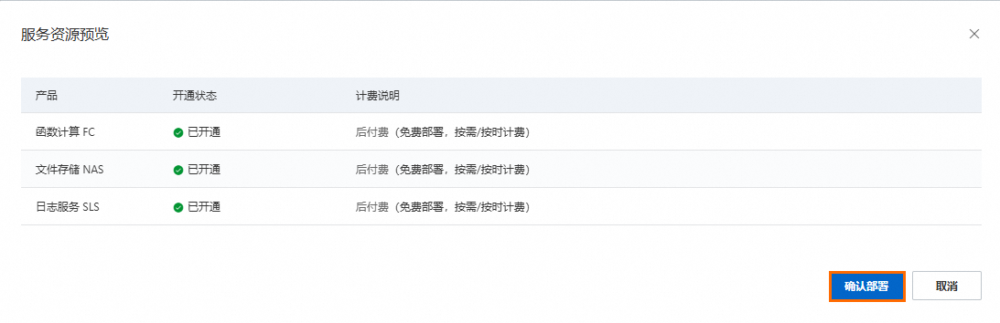
  
  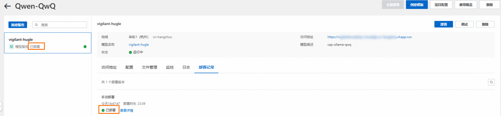

### 3. 验证模型服务

单击**调试**，即可测试和验证相关模型调用。

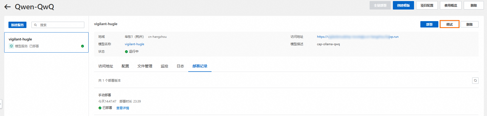

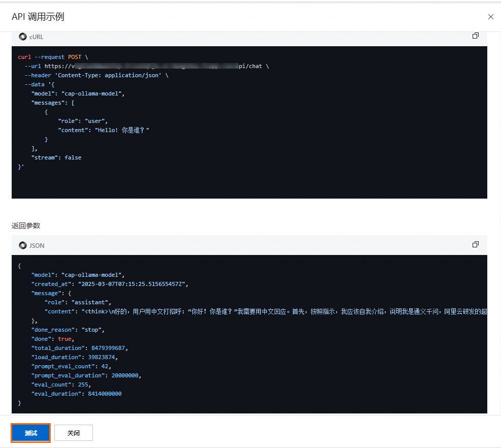

在本地命令行窗口中验证模型调用。

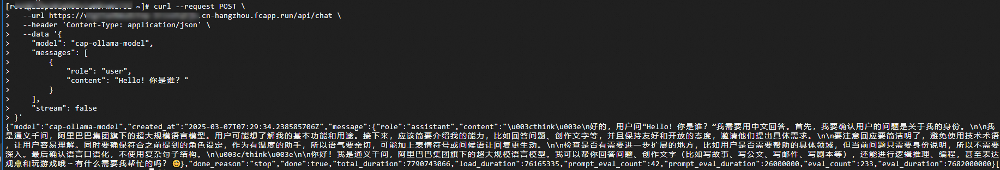

### 4. 第三方平台 API 调用

您可以选择在[Chatbox](https://web.chatboxai.app/)等其他第三方平台中验证和应用模型调用，以下以Chatbox为例。

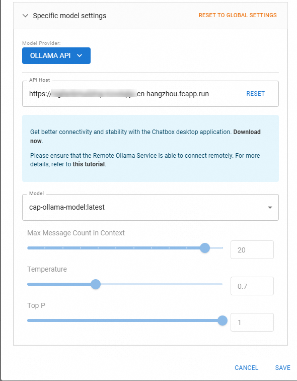

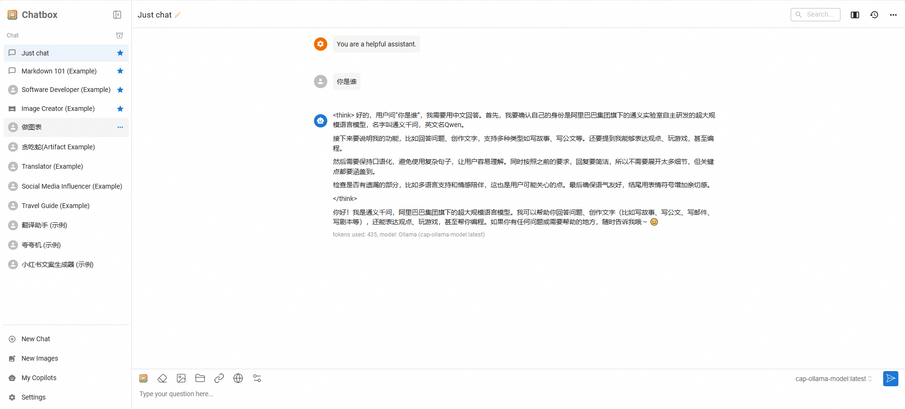

## 删除项目

您可以使用以下步骤删除应用，以降低产生的费用。

1. **进入项目详情**>**点击删除**，会进入到删除确认对话框。
  
  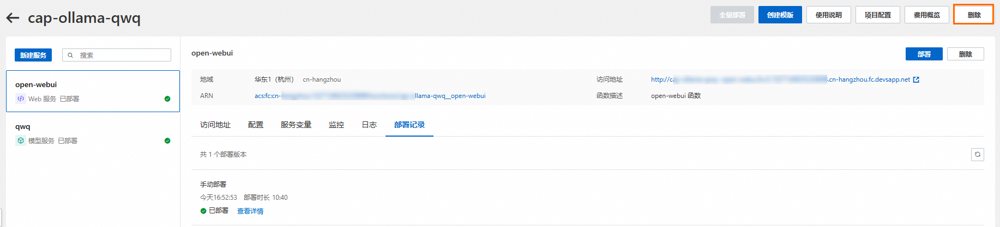
2. 您可以看到要删除的资源。默认情况下，`Function AI`会删除项目下的所有服务。如果您希望保留资源，可以**取消勾选**指定的服务，删除项目时只会删除**勾选**的服务。
  
  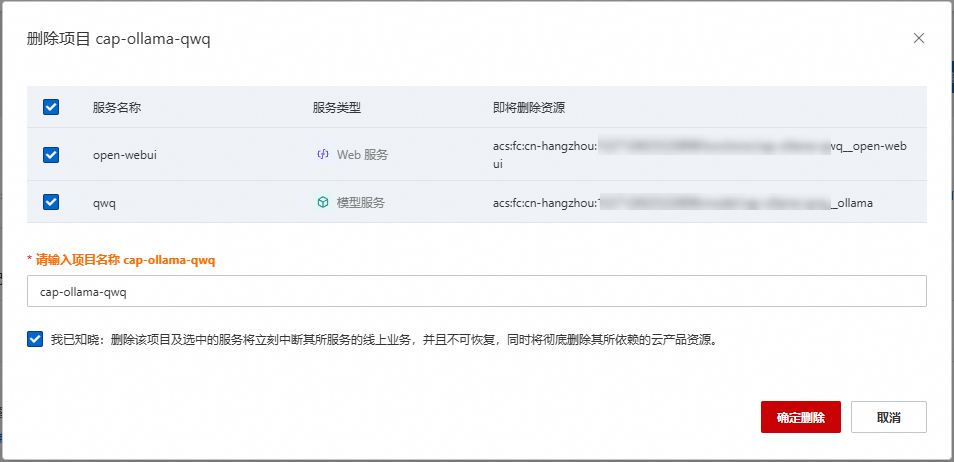
3. 勾选**我已知晓：删除该项目及选中的服务将立刻中断其所服务的线上业务，并且不可恢复，同时将彻底删除其所依赖的云产品资源**，然后单击**确定删除**。
