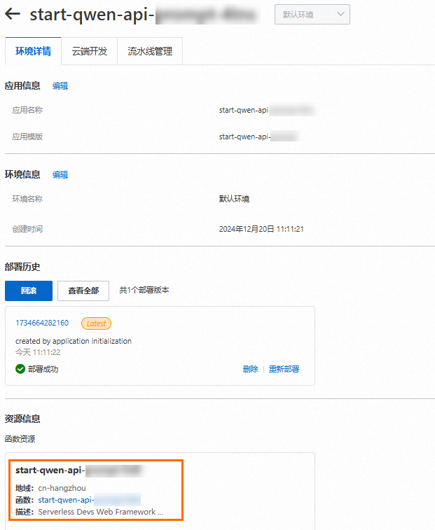
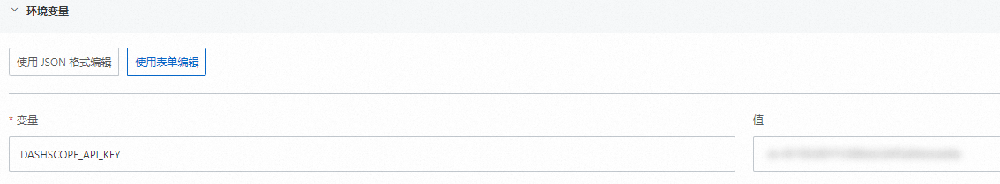
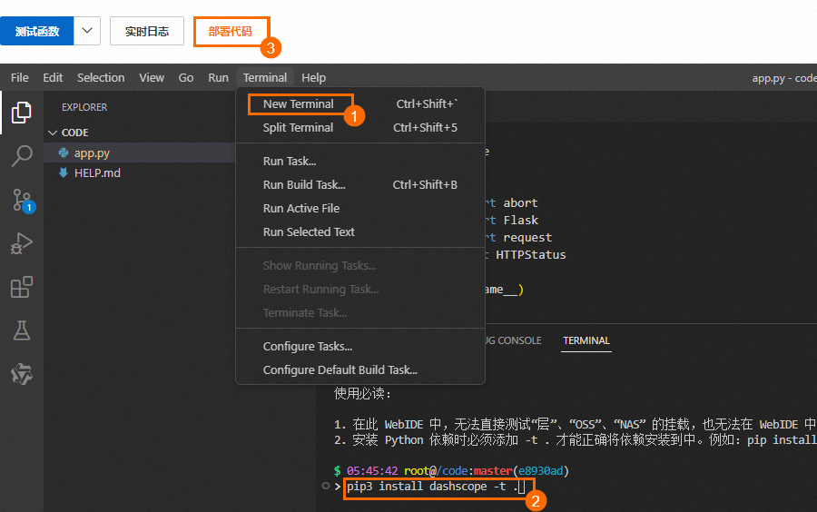
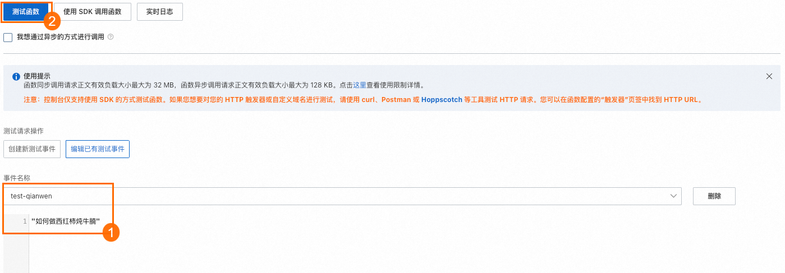

# 使用函数计算部署千问大模型实现AI对话

千问是阿里云自主研发的大语言模型，能够在用户自然语言输入的基础上，通过自然语言理解和语义分析，在不同领域、任务内为用户提供服务和帮助。本文介绍如何通过函数计算实现基于千问的AI对话。

## **背景信息**

千问模型接受用户以文本形式的指令（prompt）以及不定轮次的对话历史（history）作为输入，并基于这些信息生成回复作为输出。在这一过程中，文本将被转换为语言模型可以处理的Token序列。Token是模型用来表示自然语言文本的基本单位，可以直观地理解为“字”或“词”。对于中文文本来说，1个Token通常对应一个汉字；对于英文文本来说，1个Token通常对应3至4个字母或1个单词。例如，中文文本“你好，我是千问”会被转换成序列['你', '好', '，', '我', '是', '通', '义', '千', '问']，而英文文本"Nice to meet you."则会被转换成['Nice', ' to', ' meet', ' you', '.']。

由于模型调用的计算量与Token序列长度相关，输入或输出Token数量越多，模型的计算时间越长，我们将根据模型输入和输出的Token数量计费。可以从API返回结果的`usage`字段中了解到您每次调用时使用的Token数量。您也可以使用[Token计算器](https://dashscope.console.aliyun.com/tokenizer)或者调用[Token计算API](https://help.aliyun.com/zh/dashscope/developer-reference/token-api)来预估文本对应的Token数量。

关于千问系列模型介绍和调用价格等信息，请参见[模型列表](https://help.aliyun.com/zh/model-studio/models)。

## **前提条件**

[获取API Key](https://help.aliyun.com/zh/model-studio/get-api-key#c38fb45bc6sje)

## **部署说明**

本文中[步骤一](#43e36ba082ah1)和[步骤二](#9f8250c082cs6)介绍通过[函数计算控制台](https://fcnext.console.aliyun.com/)创建函数、编写代码和安装SDK的方式部署应用。为了方便操作，您也可以直接单击start-qwen-api-messages或start-qwen-api-prompt按钮，然后根据提示完成一键部署该应用。部署完成后单击应用，在应用详情页面找到函数资源，然后直接根据[步骤三](#af2db2d082jav)测试结果即可。



## **步骤一：创建Web函数**

1. 登录[函数计算控制台](https://fcnext.console.aliyun.com)，在左侧导航栏，选择**函数管理**>**函数列表**。
2. 在顶部菜单栏，选择地域，然后在**函数列表**页面，单击**创建函数**。
3. 在**创建函数**页面，选择**Web 函数**，重点设置以下配置项，然后单击**创建**。
  
  - 单实例并发度：100
  - 运行环境：自定义运行时/Python/Python3.10
  - 代码上传方式：使用示例代码
  - 函数角色：AliyunFcServerlessDevsRole
4. 在**函数详情**页，点击**配置**页签，找到**高级配置**单击其右侧**编辑**，在高级配置面板找到**环境变量**区域，设置变量`DASHSCOPE_API_KEY`的值为您从阿里云百炼控制台获取的API-KEY，然后单击部署。
  
  

## **步骤二：编写并部署千问AI对话代码**

函数创建成功后，您可以开始编写使用千问的AI对话代码。

1. 在函数详情页面，单击**代码**页签，在代码编辑器中编写代码。
  
  以下代码是以Python为例，通过调用千问模型对一个用户指令进行响应。
  
  ## 通过messages调用
  
  ```
  import dashscope import random from flask import abort from flask import Flask from flask import request from http import HTTPStatus app = Flask(__name__) def call_with_messages(content): messages = [{'role': 'system', 'content': 'You are a helpful assistant.'}, {'role': 'user', 'content': content}] response = dashscope.Generation.call( dashscope.Generation.Models.qwen_turbo, messages=messages, # set the random seed, optional, default to 1234 if not set seed=random.randint(1, 10000), result_format='message', # set the result to be "message" format. ) if response.status_code == HTTPStatus.OK: print(response) else: print('Request id: %s, Status code: %s, error code: %s, error message: %s' % ( response.request_id, response.status_code, response.code, response.message )) return response @app.route("/invoke", methods=['POST', 'GET']) def index(): bytes = request.stream.read() if bytes: payload = str(bytes, encoding='utf-8') print("Request Payload: " + payload) return call_with_messages(payload) else: abort(403) if __name__ == "__main__": app.run(host="0.0.0.0", port=9000)
  ```
  
  ## 通过prompt调用
  
  ```
  import dashscope import random from flask import abort from flask import Flask from flask import request from http import HTTPStatus app = Flask(__name__) def call_with_prompt(prompt): response = dashscope.Generation.call( model=dashscope.Generation.Models.qwen_turbo, prompt=prompt ) # The response status_code is HTTPStatus.OK indicate success, # otherwise indicate request is failed, you can get error code # and message from code and message. if response.status_code == HTTPStatus.OK: print(response.output) # The output text print(response.usage) # The usage information else: print(response.code) # The error code. print(response.message) # The error message. return response @app.route("/invoke", methods=['POST', 'GET']) def index(): bytes = request.stream.read() if bytes: payload = str(bytes, encoding='utf-8') print("Request Payload: " + payload) return call_with_prompt(payload) else: abort(403) if __name__ == "__main__": app.run(host="0.0.0.0", port=9000)
  ```
2. 在WebIDE的终端窗口，执行`pip3 install dashscope -t .`安装DashScope SDK，执行完成后单击**部署代码**。
  
  

## **步骤三：测试函数**

在函数详情页面，单击**测试**页签，填写事件名称和事件内容，然后单击**测试函数**，执行完成后，可以直接查看执行结果。



本文事件内容以`"如何做西红柿炖牛腩？"`为例，测试函数的返回结果如下：

## 通过messages调用

```
{ "code": "", "message": "", "output": { "choices": [ { "finish_reason": "stop", "message": { "content": "材料：\n牛腩500克、西红柿2个、大葱1根、生姜3片、大蒜2瓣、八角1颗、香叶2片、干辣椒4个、料酒1勺、生抽1勺、老抽1勺、白糖1小勺、食盐适量、清水适量。\n\n做法：\n1. 牛腩切块，冷水入锅，加入料酒焯水，撇去浮沫后捞出沥水备用。\n2. 热锅凉油，放入大葱、姜片、蒜瓣、八角、香叶和干辣椒煸炒出香味。\n3. 加入西红柿翻炒至软烂出汁。\n4. 放入牛腩块继续翻炒均匀，加入生抽、老抽和白糖调味。\n5. 倒入足够的清水，大火烧开后转中小火慢炖1小时左右，至牛腩熟透且汤汁浓稠。\n6. 最后加入适量的食盐调味即可。", "role": "assistant" } } ], "finish_reason": null, "text": null }, "request_id": "61dbd6b0-810b-9115-ad26-65e9ba93f84d", "status_code": 200, "usage": { "input_tokens": 15, "output_tokens": 212, "total_tokens": 227 } }
```

## 通过prompt调用

```
{ "code": "", "message": "", "output": { "choices": null, "finish_reason": "stop", "text": "\n\n做西红柿炖牛腩的步骤如下：\n\n所需材料：\n- 牛腩500克\n- 西红柿3个\n- 姜片适量\n- 大葱段适量\n- 料酒适量\n- 生抽适量\n- 红糖适量\n- 八角2颗\n- 桂皮1小块\n- 食盐适量\n- 清水适量\n\n步骤：\n\n1. 牛腩切块，放入开水中焯水，捞出洗净备用。\n\n2. 热锅凉油，加入姜片和大葱段炒香。\n\n3. 加入牛腩翻煎至两面微黄。\n\n4. 加入料酒、生抽、红糖、八角和桂皮继续翻煎。\n\n5. 加入足够的清水，水量要盖过牛腩，大火烧开后撇去浮沫。\n\n6. 改为中小火慢炖1小时左右，直到牛腩变得软烂。\n\n7. 在炖煮过程中可以适当调整味道，如加盐等。\n\n8. 西红柿切成块，放入炖好的牛腩中再煮约10分钟即可。\n\n9. 出锅前可撒上一些葱花点缀。\n\n以上就是做西红柿炖牛腩的详细步骤。希望对你有所帮助！" }, "request_id": "a9a5f430-745d-9f5d-b406-8588978f638b", "status_code": 200, "usage": { "input_tokens": 8, "output_tokens": 278, "total_tokens": 286 } }
```

测试完成后，如果您暂时不需要使用此应用，请及时删除应用以及关联的其他资源。

## **相关文档**

- 千问API详情：[通过API使用通义千问](https://help.aliyun.com/zh/dashscope/developer-reference/use-qwen-by-api)。
