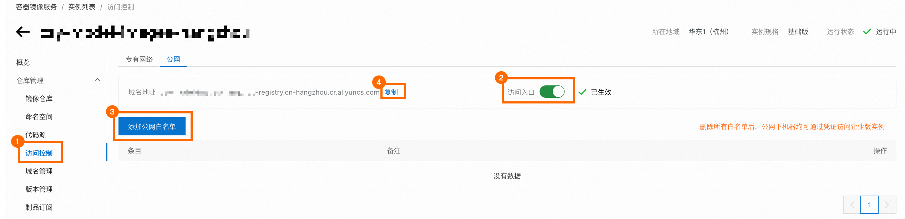
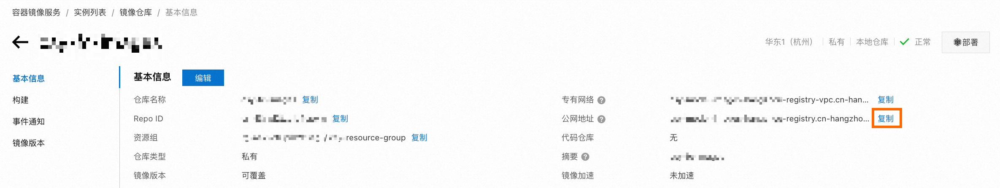
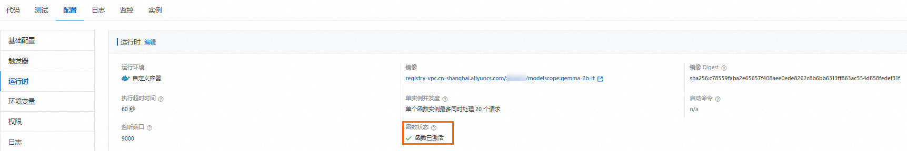
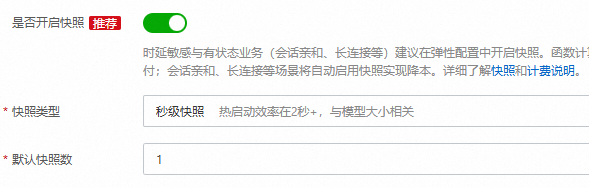
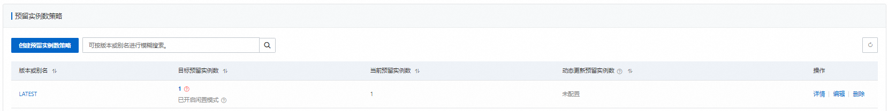
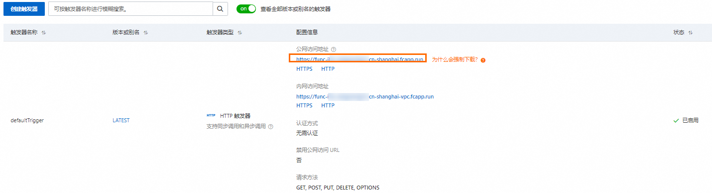

# 基于函数计算低成本部署Google Gemma模型服务

Google在2024年02月21日正式推出了首个开源模型族Gemma，并同时上架了2b和7b两个版本。您可以使用函数计算的GPU实例以及函数计算的闲置模式低成本快速部署Gemma模型服务。

## **前提条件**

- 已开通函数计算服务，详情请参见[快速创建函数](https://help.aliyun.com/zh/functioncompute/fc-2-0/create-a-function-in-the-function-compute-console#p-t79-y7o-68z)。
- 已创建命名空间和镜像仓库，详情请参见[创建命名空间](https://help.aliyun.com/zh/acr/getting-started/build-images-on-container-registry-enterprise-edition-instances#section-m0h-3y9-s89)和[创建镜像仓库](https://help.aliyun.com/zh/acr/getting-started/build-images-on-container-registry-enterprise-edition-instances#section-7ek-3k0-l1n)。

## **操作步骤**

部署Gemma模型服务的过程中将产生部分费用，包括GPU资源使用、vCPU资源使用、内存资源使用、磁盘资源使用和公网出流量以及函数调用的费用。具体信息，请参见[计费概述](https://help.aliyun.com/zh/functioncompute/fc/product-overview/billing-overview-of-fc)。

### **创建应用**

1. 请根据下列步骤，获取ACR仓库的域名和仓库地址。
  
  1. 登录[容器镜像服务控制台](https://cr.console.aliyun.com/cn-hangzhou/instances)，选择函数所在的地域，点击目标企业版实例卡片中的**管理**。
  2. 在左侧导航栏点击**访问控制**，然后选择**公网**页签。如果访问入口的开关处于关闭状态，请打开开关。如果您希望任何公网机器均可登录您的仓库，请删除所有公网白名单。否则，请根据您的情况设定公网白名单。完成后，请保存该ACR实例的**域名地址**。
    
    
  3. 在左侧导航栏点击**ACR 镜像仓库**，然后点击目标仓库的**仓库名称**，进入仓库详情页面。
  4. 请保存该仓库的**公网地址**。
    
    
2. 下载Gemma模型权重。您可以选择从Hugging Face或ModelScope平台下载，本文以从ModelScope下载Gemma-2b-it模型为例，详情请参见[Gemma-2b-it](https://modelscope.cn/models/AI-ModelScope/gemma-2b-it/summary)。
  
  **
  
  **重要**
  
  如果您使用Git下载模型，请先安装Git扩展LFS后，执行`git lfs install`初始化Git LFS，然后再执行`git clone`进行下载。否则，由于模型过大，可能导致下载的模型不完整，无法正常使用Gemma服务。
3. 创建Dockerfile文档和模型服务代码文件`app.py`。
  
  - Dockerfile
    
    ```
    FROM registry.cn-shanghai.aliyuncs.com/modelscope-repo/modelscope:fc-deploy-common-v17 WORKDIR /usr/src/app COPY . . RUN pip install -U transformers RUN pip install -U accelerate CMD [ "python3", "-u", "/usr/src/app/app.py" ] EXPOSE 9000
    ```
  - app.py
    
    ```
    from flask import Flask, request from transformers import AutoTokenizer, AutoModelForCausalLM model_dir = '/usr/src/app/gemma-2b-it' app = Flask(__name__) tokenizer = AutoTokenizer.from_pretrained(model_dir) model = AutoModelForCausalLM.from_pretrained(model_dir, device_map="auto") @app.route('/invoke', methods=['POST']) def invoke(): request_id = request.headers.get("x-fc-request-id", "") print("FC Invoke Start RequestId: " + request_id) text = request.get_data().decode("utf-8") print(text) input_ids = tokenizer(text, return_tensors="pt").to("cuda") outputs = model.generate(**input_ids, max_new_tokens=1000) response = tokenizer.decode(outputs[0]) print("FC Invoke End RequestId: " + request_id) return str(response) + "\n" if __name__ == '__main__': app.run(debug=False, host='0.0.0.0', port=9000)
    ```
    
    关于函数计算支持的所有HTTP Header，请参见[函数计算公共请求头](https://help.aliyun.com/zh/functioncompute/fc/user-guide/context-and-log-format-1#section-3f8-5y1-i77)。
  
  完成后代码目录结构如下所示。
  
  ```
  . |-- app.py |-- Dockerfile `-- gemma-2b-it |-- config.json |-- generation_config.json |-- model-00001-of-00002.safetensors |-- model-00002-of-00002.safetensors |-- model.safetensors.index.json |-- README.md |-- special_tokens_map.json |-- tokenizer_config.json |-- tokenizer.json `-- tokenizer.model 1 directory, 12 files
  ```
4. 依次执行以下命令构建并推送镜像。其中`{REPO_ENDPOINT}`是步骤1中目标镜像仓库的公网地址，`{REGISTRY}`是ACR实例的**域名地址**。
  
  ```
  IMAGE_NAME={REPO_ENDPOINT}:gemma-2b-it docker login --username=mu****@test.aliyunid.com {REGISTRY} docker build -f Dockerfile -t $IMAGE_NAME . docker push $IMAGE_NAME
  ```
  
  **
  
  **重要**
  
  当使用Apple芯片的Mac系统构建镜像时，请将第3行的`docker build`命令替换为使用以下命令，以构建兼容函数计算的镜像。
  
  ```
  docker build --platform linux/amd64 -f Dockerfile -t $IMAGE_NAME .
  ```
5. 创建函数。
  
  1. 登录[函数计算控制台](https://fcnext.console.aliyun.com)，在左侧导航栏，选择**函数**。
  2. 在顶部菜单栏，选择地域，然后在**函数**页面单击**创建函数**。
  3. 在创建函数页面，选择使用**容器镜像**方式，设置以下配置项，然后单击**创建**。
    
    重点配置项说明如下，其余配置项选择默认值即可。
    
    | **配置项** | **说明** |
    | --- | --- |
    | **镜像配置** |  |
    | **镜像选择方式** | 选择**使用 ACR 中的镜像**。 |
    | **容器镜像** | 单击下方的**选择 ACR 中的镜像**，然后在**选择容器镜像**面板，选择[步骤3](#519194100ejaa)推送的镜像。 |
    | **监听端口** | 设置为9000。 |
    | **高级配置** |  |
    | **是否使用GPU** | 选择**使用GPU**。 |
    | **GPU 卡型** | 选择**Tesla 系列 T4 卡型**。 |
    | **规格方案** | - **GPU显存规格**设置为16 GB。<br>- **vCPU 规格**设置为2核。<br>- **内存规格**设置为16 GB。 |
6. 待上一步创建的函数的状态变更为**函数已激活**时，您可以为其开启闲置预留模式。
  
  
  
  1. 在函数详情页面选择**配置**页签，在左侧导航栏，选择**预留实例**，然后单击**创建预留实例数策略**。
  2. 在**创建预留实例数策略**面板中，**版本或别名**选择LATEST，**预留实例数**设置为1，**闲置模式**选择**启用**，然后单击**确定**。
    
    
    
    待**当前预留实例数**变更为1，且您可以看到**已开启闲置模式**的字样，表示GPU闲置预留实例已成功启动。
    
    

### **使用Google Gemma服务**

1. 在函数详情页面，选择**配置**页签，然后在左侧导航栏，选择**触发器**，在触发器页面获取触发器的URL。
  
  
2. 执行以下命令调用函数。
  
  ```
  curl -X POST -d "who are you" https://func-i****-****.cn-shanghai.fcapp.run/invoke
  ```
  
  预期输出如下。
  
  ```
  <bos>who are you? I am a large language model, trained by Google. I am a conversational AI that can understand and generate human language, and I am able to communicate and provide information in a comprehensive and informative way. What can I do for you today?<eos>
  ```
3. 在函数详情页面，选择**实例**页签，在实例页面单击目标实例ID右侧**操作**列的**实例指标**，在实例详情页面的**实例指标**页签查看指标情况。
  
  您可以看到在没有函数调用发生时，该实例的显存使用量会降至零。而当有新的函数调用请求到来时，函数计算平台会迅速恢复并分配所需的显存资源。从而达到降本效果。
  
  **
  
  **说明**
  
  查看指标的实例，需要先启用日志功能，具体请参见[配置日志功能](https://help.aliyun.com/zh/functioncompute/fc/configure-the-logging-feature)。

函数调用结束后，函数计算会自动将GPU实例置为闲置模式，您无需手动操作。在下次调用到来之前，函数计算将该实例唤醒，置为活跃模式进行服务。

## **删除资源**

如您暂时不需要使用此函数，请及时删除对应资源。如果您需要长期使用此应用，请忽略此步骤。

1. 返回[函数计算控制台](https://fcnext.console.aliyun.com/)概览页面，在左侧导航栏，单击**函数**。
2. 单击目标函数右侧**操作**列的**更多**>**删除**，在弹出的对话框中，勾选**我确认要删除以上资源，并同时删除此函数。我已知晓这些资源删除后将无法找回**，然后单击删除函数。

## **费用说明**

- **套餐领取**：为了方便您体验本文提供的应用，首次开通用户可以领取试用套餐并开通函数计算服务。更多信息，请参见[试用额度](https://help.aliyun.com/zh/functioncompute/fc-2-0/product-overview/trial-quota)。试用套餐不支持抵扣磁盘使用量的费用，超出512 MB的磁盘使用量将按量付费。
- 更多关于函数计算的计费信息，请参见[计费概述](https://help.aliyun.com/zh/functioncompute/fc-2-0/product-overview/billing-overview)。

## **相关文档**

- 关于Google发布的开源模型族Gemma的更多详情，请参见[gemma-open-models](https://blog.google/technology/developers/gemma-open-models/)。
- 关于GPU实例闲置模式计费详情以及计费示例，请参见[计费概述](https://help.aliyun.com/zh/functioncompute/fc-2-0/product-overview/billing-overview#09d5c9507eqlx)。
