# 基于函数计算部署GPT-Sovits语音生成模型实现AI克隆声音

[GPT-Sovits](https://github.com/RVC-Boss/GPT-SoVITS?spm=a2c6h.13858375.0.0.27105a24vn4lM0)是一个热门的文本生成语音的大模型，只需要少量样本的声音数据源，就可以实现高度相似的仿真效果。通过函数计算部署GPT-Sovits模型，您无需关心GPU服务器维护和环境配置，即可快速部署和体验模型，同时，可以充分利用函数计算按量付费，弹性伸缩等优势，高效地为用户提供基于GPT-Sovits模型的文本到语音生成服务。

## **方案概览**

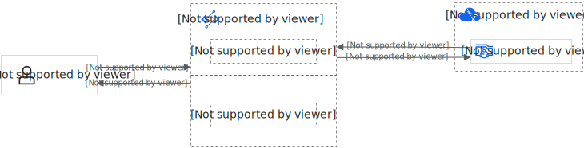

本方案的技术架构包括以下基础设施和云服务：

- 函数计算：用于提供GPT-Sovits模型的应用服务。
- 文件存储 NAS：用于存放预训练的GPT-Sovits模型。
- 专有网络 VPC：用于配置专有网络，方便函数计算访问文件存储 NAS。

**

**重要**

1. 阿里云不对第三方模型的合法性、安全性、准确性进行任何保证，阿里云不对由此引发的任何损害承担责任。
2. 您应自觉遵守第三方模型的用户协议、使用规范和相关法律法规，并就使用第三方模型的合法性、合规性自行承担相关责任。

## **部署**GPT-Sovits**模型**

1. 登录[函数计算3.0控制台](https://fcnext.console.aliyun.com/)，在左侧导航栏，单击**应用**。
  
  **
  
  **重要**
  
  控制台左上角显示**函数计算 FC 3.0**时，表示当前为3.0控制台。如果您登录的是**函数计算 2.0**的控制台，请点击右上角的**体验函数计算 3.0**进行切换。
2. 在应用页面，单击**创建应用**，选择**通过模板创建应用**，在下方模板选择区域，单击**人工智能**页签，找到**语音克隆生成GPT-SoVITS，**光标移至该卡片，单击**立即创建**。
  
  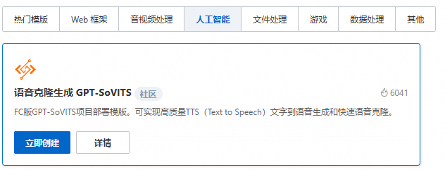
3. 在**创建应用**页面，设置以下配置项，然后单击**创建应用。**
  
  | **配置项名称** | **说明** | **示例值** |
  | --- | --- | --- |
  | **角色名** | 默认选择角色**AliyunFCServerlessDevsRole**，首次创建应用的用户，需要根据界面提示，单击**前往授权**跳转至快速授权页面，完成授权并创建该角色。 | AliyunFCServerlessDevsRole |
4. 在**活动应用创建提醒**对话框中，选中函数计算FC和文件存储NAS两个收费项，选中**我已经了解上面的内容，并同意上述描述**，单击**同意并进行部署**。
5. 等待约1分钟，部署状态变为部署成功，表示应用部署成功，并生成访问域名，单击访问域名后的链接开始体验应用。
  
  **
  
  **重要**
  
  - 请注意保护域名的安全，不要泄露给其他人，以防产生额外费用。
  - ***.devsapp.net域名是CNCF SandBox项目Serverless Devs社区所提供，仅供学习和测试使用，不可用于任何生产使用。社区会对该域名进行不定期拨测，并在域名下发1天后进行回收，建议您及时为应用[绑定自定义域名](https://help.aliyun.com/zh/functioncompute/fc/configure-custom-domain-names#title-v5p-8zy-vdy)，以获得更好的使用体验。
  - 如果应用未绑定自定义域名，且部署的时间超过1天，应用将无法正常访问，此时需要重新部署一次应用，应用域名即可正常访问。

## **快速体验**

部署完成后，您可以使用已经准备好的DEMO声音样例，进行声音的合成和体验。

我们准备了一些童年经典动画片的台词，您可以使用这些文本合成声音。

- 既然你诚心诚意的发问了，我们就大发慈悲的告诉你，为了防止世界被破坏，为了守护世界的和平，贯彻爱与真实的邪恶，可爱又迷人的反派角色，武藏、小次郎！我们是穿梭在银河的火箭队，白洞，白色的明天在等着我们！ ——《小精灵》
- 成为全国第一是我从小的梦想，我不会放弃，这点小伤根本不能让我放弃。 ——《灌篮高手》
- 舒克舒克舒克舒克开飞机的舒克，贝塔贝塔贝塔贝塔开坦克的贝塔。——《舒克和贝塔》

### **合成操作步骤**

1. 选择**默认语音模板**，输入**需要生成的文本**，单击**合成语音**。

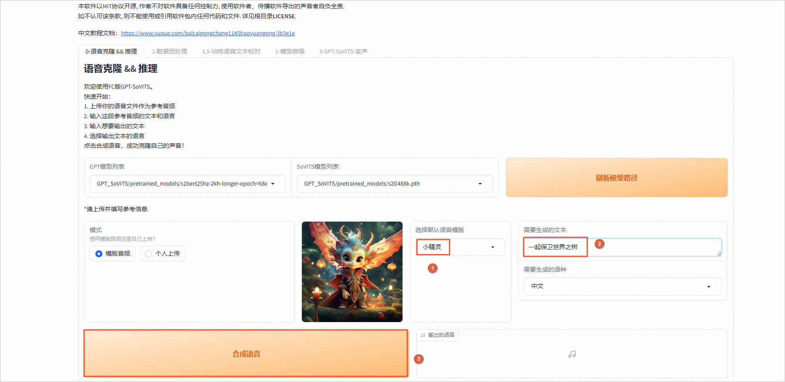

1. 等待语音合成之后，可以单击播放。

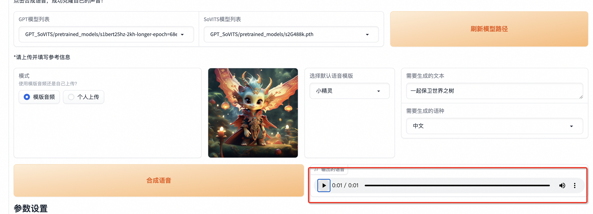

### **使用API进行语音合成**

GPT-Sovits API支持推理类API接口`/tts`，可以实现由文本合成声音的功能。更多支持的API列表及更多信息，请参见[GPT-Sovits github项目中的API定义](https://github.com/RVC-Boss/GPT-SoVITS/blob/fast_inference_/api_v3.py)。

本文以使用Postman工具部署并调用接口`/tts`为例，演示如何基于GPT-Sovits API实现AI语音生成。

1. 获取GPT-Sovits API地址。
  
  1. 登录[函数计算3.0控制台](https://fcnext.console.aliyun.com/)。
  2. 在左侧导航栏，单击**应用**。
  3. 在**应用**界面，找到“部署GPT-Sovits模型”步骤中创建的应用，点击应用名称。
    
    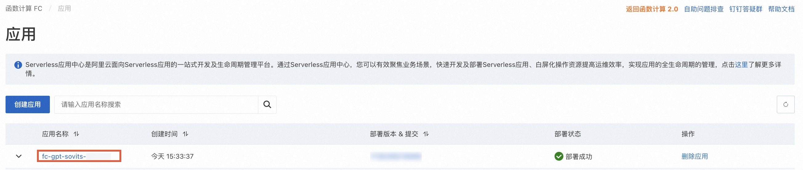
  4. 在**应用详情**页面，在**资源信息**下方找到后缀为`__api`的函数，点击函数名称。
    
    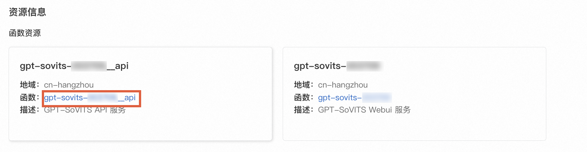
  5. 在函数详情页面，将光标悬浮在**触发器**卡片上，公网访问地址右侧的地址即为API域名。请复制API域名用于后续调用API实现语音合成。
    
    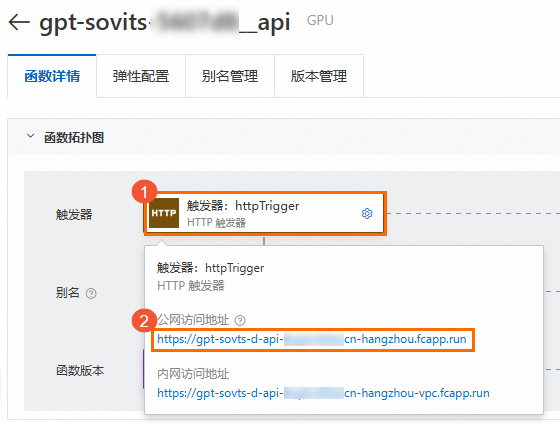
2. 上传参考语音音频。
  
  1. 在**应用详情**页面，在**基础资源**下方找到**文件存储NAS**，点击**挂载点**右侧的链接。
    
    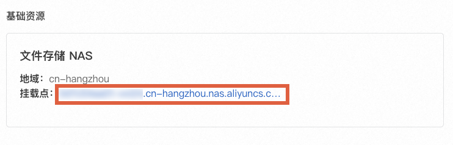
  2. **文件系统详情**页面上方的名称即为NAS文件系统名。点击**文件系统列表**返回上一级页面。
    
    
  3. 在**文件系统列表**页，找到对应的NAS文件系统，点击右侧菜单中的**浏览器**选项，跳转到NAS浏览器。如果您未创建过NAS浏览器应用，请按照提示进行部署，部署完成后即可开始使用NAS浏览器。
    
    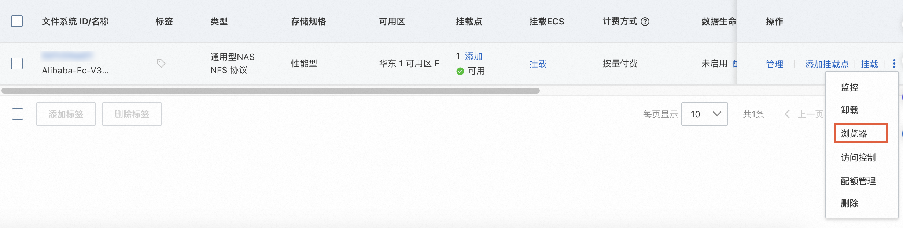
  4. 在浏览器中，进入函数应用名对应的路径`/gpt-sovits-******__api`。点击上传参考语音音频。参考音频需符合如下条件：
    
    1. 音频为WAV格式文件。
    2. 音频时长在3至10秒之间。
    
    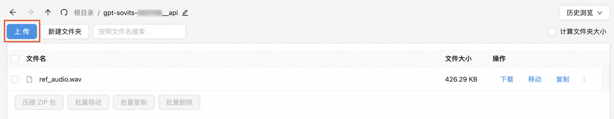
3. 使用Postman调用语音合成API。
  
  1. 在Postman工具界面，填写[步骤1](#98ae371ba3ypc)复制的域名，并拼接接口`/tts`，选择请求方式POST，填写请求参数，然后单击**Send**。Body的示例如下所示，其中`ref_audio_path`为参考音频路径，请填写[步骤2](#ac50781abd3gv)上传音频的路径。更多可选参数，请参见[GPT-Sovits github项目中的API定义](https://github.com/RVC-Boss/GPT-SoVITS/blob/fast_inference_/api_v3.py)。
    
    ```
    { "text": "先帝创业未半而中道崩殂，今天下三分，益州疲弊，此诚危急存亡之秋也。", // 设定文本内容 "text_lang": "zh", // 文本语言 "ref_audio_path": "/mnt/gpt-sovits-******__api/<AUDIO_FILE_NAME>", // 参考语音音频路径 "prompt_lang": "zh" // 生成语音的语言 }
    ```
  2. 语音生成结束后，音频将出现在下方返回结果中。您可以试听或保存音频。
    
    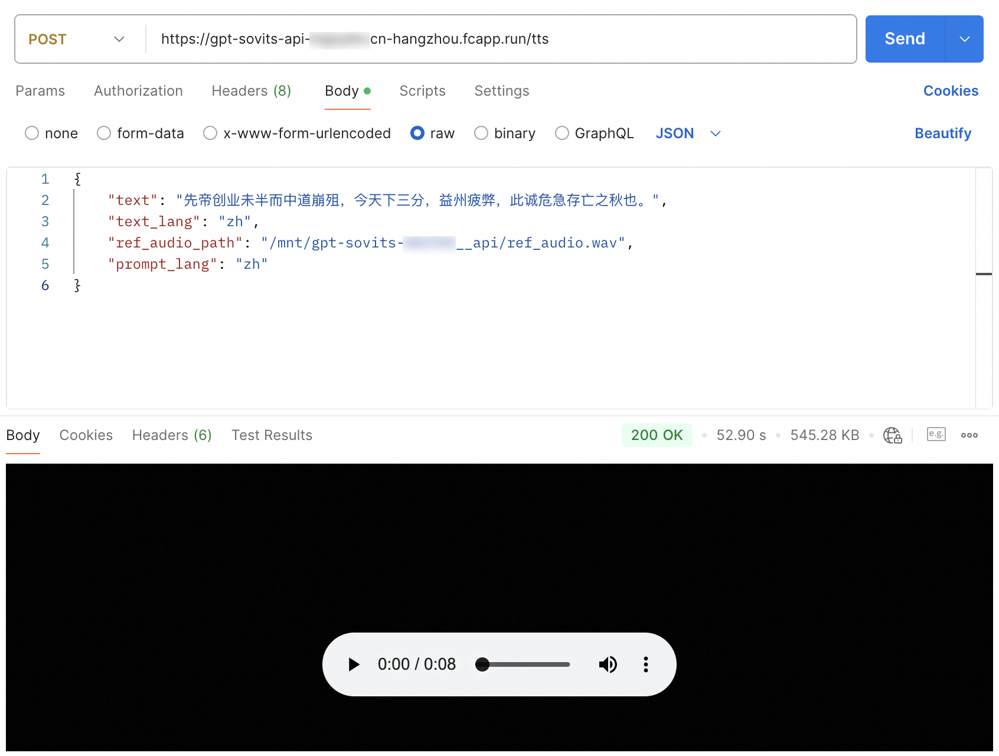

## **声音训练**

您可以通过声音源文件微调GPT-Sovits大模型，生成您期望的声音。在微调训练过程中，训练步骤的所有中间产物将置于NAS的output文件夹下。训练将使用默认的UVR5和ASR模型。若需要使用其他的UVR5和ASR模型，可根据[官方README](https://github.com/RVC-Boss/GPT-SoVITS/blob/main/docs/cn/README.md)下载，并分别置于NAS的tools/asr/models和tools/uvr5/uvr5_weights目录下。

1. 数据预处理。准备一个较长的您需要克隆的原始声音，单击**数据预处理**，输入您需要上传的语音文件，单击**开始数据预处理**。
  
  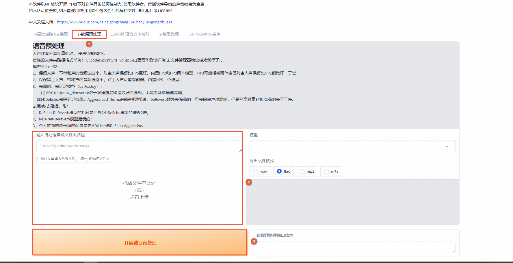

1. 微调文本。单击**训练语音文本校对**，调整原始文本的内容。
  
  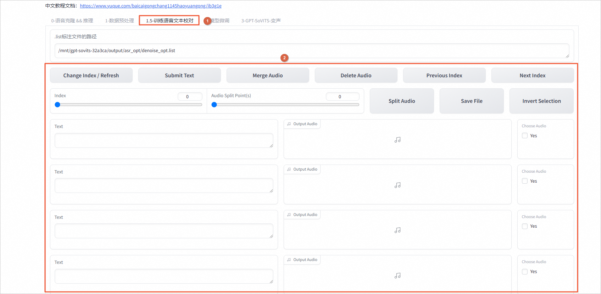
2. 开始训练，单击**模型微调**，开启SoVITS训练和GPT训练。训练后的模型将存储在NAS下的GPT_weights和SoVITS_weights文件夹内。
  
  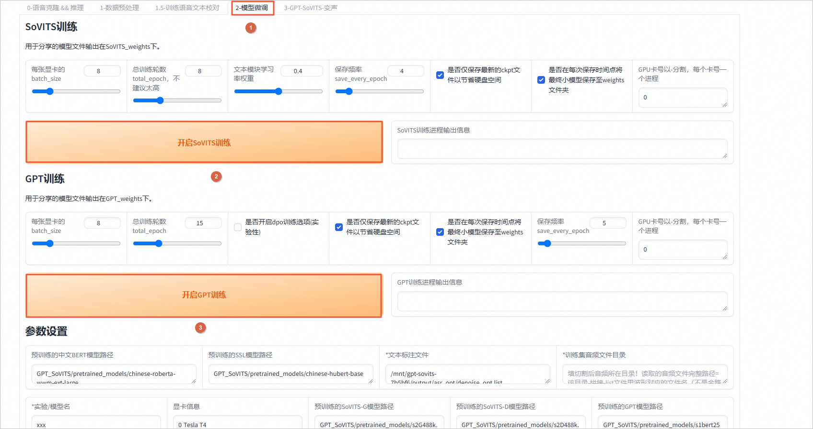
3. 训练完之后，在**语音克隆&&推流**页签，刷新和选择自己训练的模型，再体验合成语音。
  
  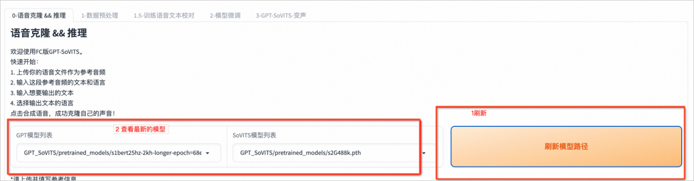

## **清理资源**

您部署GPT-Sovits会使用函数计算FC产品，您创建模型管理器使用了文件存储NAS产品。如果您后续不再使用GPT-Sovits可以删除以下两个部分，函数计算不调用不会计费，文件存储NAS只要有模型存储即会付费，因此请您注意删除相关资源。如果您需要长期使用，请忽略此步骤，并随时注意账号扣费情况。

### **删除GPT-Sovits使用的FC。**

1. 前往[函数计算应用页面](https://fcnext.console.aliyun.com/applications)。
2. 在**应用**页面，找到您部署的应用，单击右侧**操作**列下的**删除**，根据页面提示删除该应用。
  
  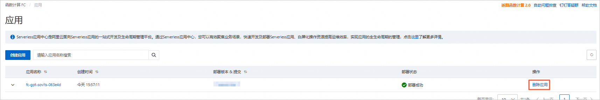

### **删除模型管理器使用的NAS。**

1. 登录[文件存储控制台](https://nasnext.console.aliyun.com/overview)，在**文件系统列表**页面，切换到华东1（杭州）地域，找Alibab-Fc开头到目标文件系统，在**操作**列，选择**>删除**。
  
  **
  
  **说明**
  
  本实验文件存储NAS实例所在地域为华东1（杭州）。
  
  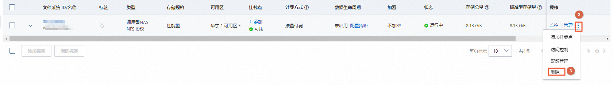
2. 在**删除文件系统**面板，移除挂载点及生效策略，然后单击**删除**。
