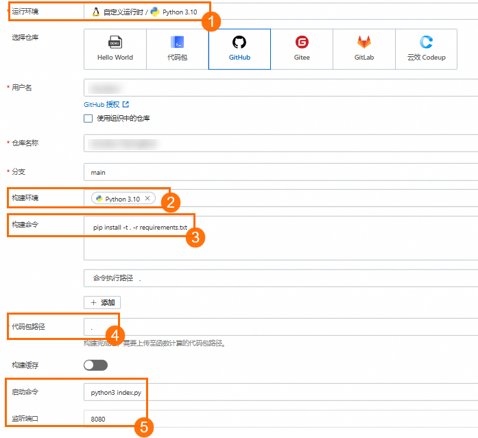
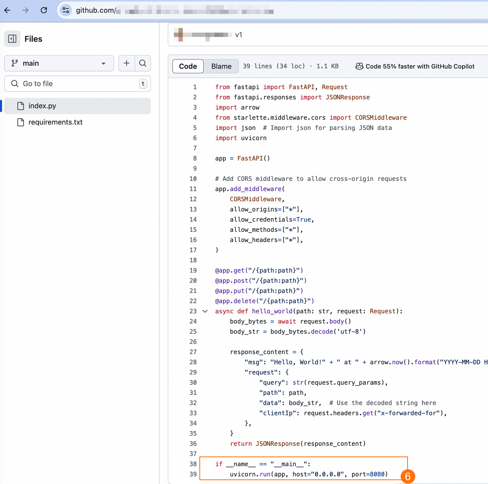
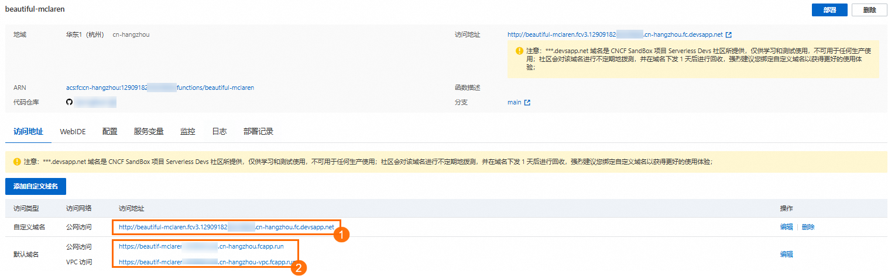

# 托管存量Web项目至Funciton AI实现服务Serverless化和持续部署

如果您已有一个Web项目工程代码，可以通过函数计算的Funciton AI平台托管该Web项目，实现Web服务的弹性高可用、按量付费、免运维等Serverless带来的价值，同时，通过代码仓库的绑定，实现Web项目的持续部署。

## 前提条件

您的Web工程已经托管到主流的代码托管平台，即GitHub、Gitee、GitLab、Codeup其中一种。

本文以托管在GitHub平台的基于Python 、FastAPI框架开发的RESTful API服务为例，介绍如何托管存量Web工程到Funciton AI。

## **操作步骤**

1. 登录[函数计算3.0控制台](https://fcnext.console.aliyun.com/overview)，在左侧导航栏单击**Funciton AI**，在**Funciton AI**页面导航栏，选择**项目**，然后单击**创建项目**。
2. 选择**创建空白项目**，在弹出的对话框，填写**项目名称**和**项目描述**，然后单击**创建**。
3. 在项目详情页面，单击左上角的**新建服务**，选择**Web 服务**，进入服务配置页面，设置以下选项。
  
  如图所示，配置项设置需符合以下原则：
  
  - 运行环境和构建环境一致（图示中①和②）。
  - 根据源代码工程中实际情况，设置**启动命令**和**监听端口**，例如，示例项目入口是`index.py`，端口是8080（图示中⑤）。
    
    需要注意的是HTTP server启动设置host为`0.0.0.0`（图示中⑥）。
  - 构建命令根据代码仓库实际情况设置。Python构建命令可以设置为`pip install -t . -r requirements.txt`（图示中③），`index.py`和`requirements.txt`需在工程的根目录。
    
    命令行执行路径使用了默认的`.`，代码包路径也使用了根目录`.`（图示中④），表示在工程的根目录执行`pip install -t . -r requirements.txt`命令，并将依赖库下载到根目录，和`index.py`一起打包为ZIP作为函数计算的代码包。
4. 单击**预览&部署**，然后在弹出的**服务资源预览**对话框确认待部署资源后单击**确认部署**。
  
  部署成功后，在服务情况页面获取API服务的Endpoint，如下图所示，其中：
  
  - 自定义域名（图示中①）是平台临时派发的测试域名，仅支持HTTP，可用于浏览器直接打开。该临时域名仅供学习和测试使用，生产环境建议[绑定您自己的域名](https://help.aliyun.com/zh/functioncompute/fc/configure-custom-domain-names)。
  - 如果您仅使用API服务，可以不使用自定义域名，仅使用服务公网地址或服务内网地址（图示中②）。
  
  
5. （可选）将修改后的代码推送到上面绑定的代码仓库的master分支，就可以自动部署，在部署记录中，可以看到所有部署历史。
