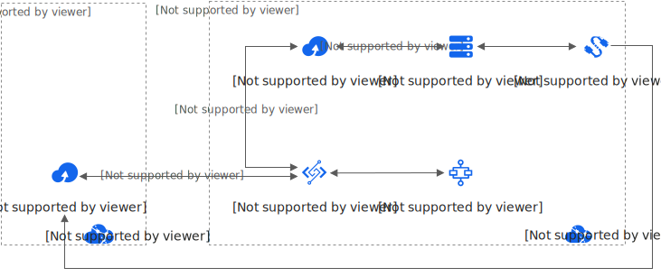

# 低成本跨境文件传输

本文介绍如何通过OSS加速域名，配合函数计算和Serverless 工作流，快速打造低成本、高效的跨境对象存储数据同步传输系统。

## 应用场景

- 需要跨境传输对象存储数据。
- 对数据的跨境传输成本有严格的控制。
- 对文件同步延时不敏感，能接受一定程度的网络抖动带来的文件同步延迟。
- 希望传输数据的系统有足够的弹性和扩展性应对大规模文件的写入。

## 方案简介

方案架构如下：

方案流程如下：

1. ECS模拟应用访问上海和硅谷的OSS，负责内容的制作和上传。
2. 内容通过内网域名上传到上海的OSS。
3. 文件上传OSS，触发函数计算调用Serverless 工作流，每个工作流负责一个文件的上传，保障文件通过硅谷的OSS加速域名被快速同步。
4. ECS模拟硅谷当地用户读取OSS文件，并校验数据是否正确。

## 方案优势

- 运维成本低：开发人员关注代码逻辑即可。
- 网络成本低：相比云企业网高速通道的方式，网络成本降低。
- 同步服务部署成本低：文件上传OSS后即可触发函数计算调用Serverless 工作流，按量触发，无需准备ECS资源。
- 弹性高效：一个文件同步触发一个Serverless 工作流任务，充分利用资源，高效同步。

## 方案详情

更多信息，请参见[低成本跨境传输文件最佳实践](https://bp.aliyun.com/detail/118)。
