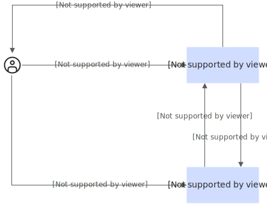
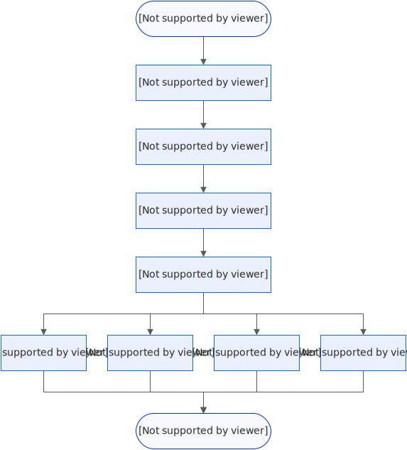
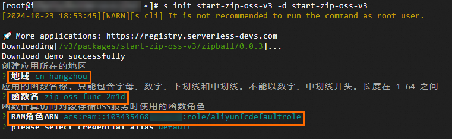

# 使用函数计算实现多个文件的打包下载

当您需要从对象存储OSS中批量下载多个文件时，可能会遇到批量下载不方便、小文件较多等情况。 您可以通过函数计算将对象存储OSS中的多个文件打包下载至本地，既可以节约时间又可以节省流量和相关费用。

## 流程及实现细节

### **流程图**

使用函数计算在对象存储OSS中同时下载多个文件的流程图如下：



1. 按需调用函数，指定存储空间及待压缩文件。
2. 调用函数后，函数计算从对象存储OSS中下载目标文件并压缩成ZIP包。
3. 函数计算将ZIP包上传到对象存储OSS中。
4. 函数计算将给您返回目标ZIP文件在对象存储OSS中的地址。
5. 您可以通过[步骤4](#step-3iw-z21-opy)返回的地址下载目标文件。

### 实现细节流程图中[步骤2](#step-f8v-9w6-yvc)与[步骤3](#step-bet-ymr-k9e)实现的原理如下。使用这种调用方式有以下优势：

- 函数运行环境的磁盘空间是有限的，采用流式下载和上传的方式，在内存中只缓存少量数据。
- 上传ZIP文件到对象存储OSS时，利用对象存储OSS分片上传的特性，将分片以队列的形式多线程并发上传。

## 前提条件

- 已开通函数计算服务。具体操作，请参见[开通函数计算服务](https://help.aliyun.com/zh/functioncompute/fc/use-event-functions-to-handle-oss-file-upload-events#cee2f69b43c8h)。
- 已开通OSS服务并在OSS创建存储空间。具体操作，请参见[开通OSS服务并创建存储空间](https://help.aliyun.com/zh/oss/user-guide/console-quick-start#23ea35a057g4k)。
- 已安装并配置Serverless Devs。具体操作，请参见[快速入门](https://help.aliyun.com/zh/functioncompute/fc/developer-reference/install-serverless-devs-and-docker)。

## 操作步骤

1. 执行以下命令，初始化项目。
  
  ```
  sudo s init start-zip-oss-v3 -d start-zip-oss-v3
  ```
  
  根据界面提示，依次选择地域，设置函数名称并输入函数的RAM角色。
  
  
2. 执行以下命令，进入项目，并进行项目部署。
  
  ```
  cd start-zip-oss-v3 && s deploy - y
  ```
  
  部署成功后，输出示例如下。记录返回的`system_url`，用于调用函数时使用。
  
  ```
  region: cn-hangzhou description: functionArn: acs:fc:cn-hangzhou:1034354682****:functions/zip-oss-func-2m1d functionName: zip-oss-func-jbip handler: main.main_handler internetAccess: true memorySize: 3072 role: acs:ram::1034354682****:role/aliyunfcdefaultrole runtime: python3.9 timeout: 1800 triggers: - description: qualifier: LATEST triggerConfig: methods: - GET - POST - PUT authType: anonymous disableURLInternet: false triggerName: http-test triggerType: http url: system_url: https://zip-ossunc-jbip-gvdzx****.cn-hangzhou.fcapp.run system_intranet_url: https://zip-ossunc-jbip-gvdzx****.cn-hangzhou-vpc.fcapp.run __component: fc3
  ```
3. 应用部署成功后，调用部署好的函数下载多个文件。
  
  1. 在`start-zip-oss-v3`目录下创建event.json文件，并在文件中指定Bucket名称、待下载的文件所在的目录或指定待下载文件名称列表。
    
    - 通过`source-dir`指定要下载的文件所在的目录。
      
      ```
      { "bucket": "bucketname", "source-dir": "filepath/" }
      ```
    - 通过`source-files`指定要下载的文件列表。
      
      ```
      { "bucket": "bucketname", "source-files": ["files1.txt","filepath/files2.txt"] }
      ```
  2. 使用curl命令直接调用函数。
    
    **
    
    **说明**
    
    请将命令示例中的访问地址更新为您部署应用成功后返回的公网访问地址`system_url`。
    
    ```
    curl -v -L -o /tmp/my.zip -d @./event.json https://zip-oss-func-zip-oss-****.cn-hangzhou.fcapp.run
    ```
    
    调用成功后，您可以在`/tmp`文件夹中查看到下载的压缩文件`my.zip`。同时登录[对象存储控制台](https://oss.console.aliyun.com/)，在对应Bucket的`output`目录也可以看到下载的压缩文件。

## 实验数据

| **场景** | **文件数** | **压缩前总大小** | **压缩后总大小** | **执行时间** |
| --- | --- | --- | --- | --- |
| 1 | 7 | 1.2 MB | 1.16 MB | 0.4s |
| 2 | 57 | 1.06 GB | 0.91 GB | 63s |

您可以通过以上表格获取以下两个信息：

- 场景1说明使用函数计算实现多个文件的下载，可以减少文件的存储空间。
- 场景2说明使用函数计算实现多个文件的下载，可以在短时间内下载大量文件。

## **相关文档**

如果您需要解压上传到OSS的ZIP文件，可以在函数计算部署函数实现ZIP文件自动解压，也可以直接在OSS配置ZIP文件自动解压，具体请参见[使用函数计算实现自动解压上传到OSS的ZIP文件](https://help.aliyun.com/zh/functioncompute/fc/use-cases/use-function-compute-to-automatically-decompress-zip-files-uploaded-to)和[ZIP包解压](https://help.aliyun.com/zh/oss/user-guide/zip-package-decompression)。
