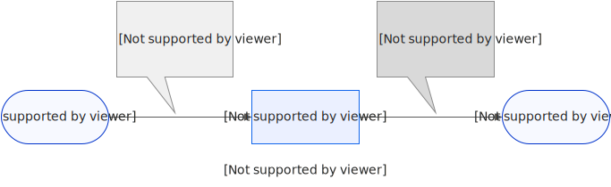
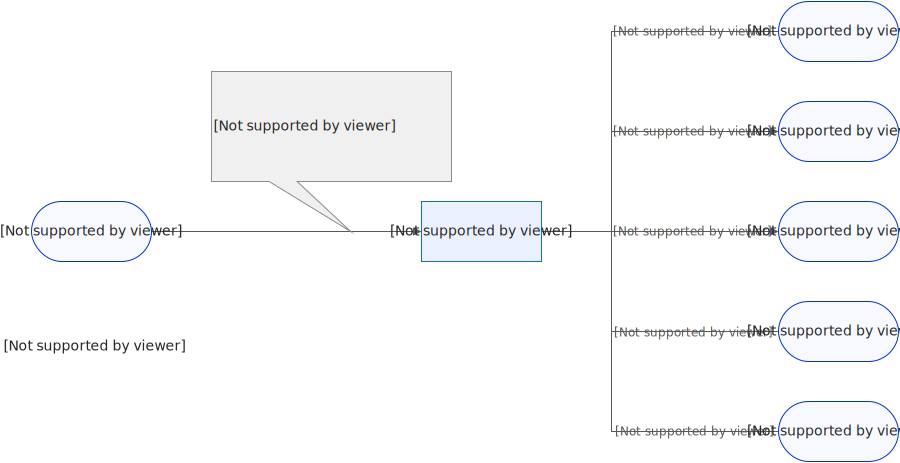
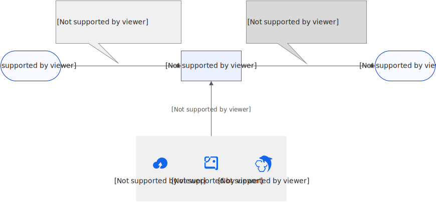
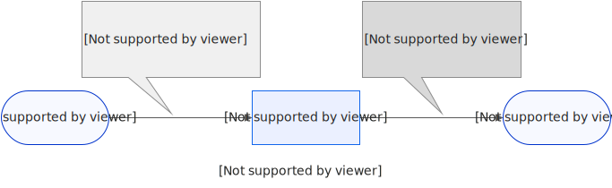

# 使用函数计算对RocketMQ的消息数据进行清洗

您可以使用函数计算提供的数据清洗模板处理消息数据，也可以根据业务情况在模板基础上修改代码满足自定义清洗需求。本文以对云消息队列 RocketMQ 版中的数据进行内容分割为例，介绍消息处理模板的类型和使用方式。

## 功能介绍

消息数据清洗任务提供基本的算子能力，底层逻辑使用函数计算。云消息队列 RocketMQ 版消息数据清洗任务创建完成后，您可以登录函数计算，进行代码自定义及相应函数配置的修改。

| **算子** | **算子能力说明** |
| --- | --- |
| 消息过滤 | 按照正则表达式匹配消息内容，将匹配成功的消息发送至目标。更多信息，请参见[事件模式](https://help.aliyun.com/zh/eventbridge/user-guide/event-patterns-1#concept-2230620)。 |
| 消息转换 | 根据字符串匹配，进行消息内容替换，例如字符大小写转换。将转换后的消息发送至目标。更多信息，请参见[事件内容转换](https://help.aliyun.com/zh/eventbridge/user-guide/event-transformation-1#concept-2230742)。 |
| [内容分割](#44686b2218sd6) | 根据正则表达式对消息内容进行分割，将分割后的消息逐条发送至目标。 |
| [动态路由](#31e18ef335kbg) | 根据正则表达式匹配消息内容，将匹配成功的消息路由至对应目标，将匹配不成功的消息路由至默认目标。 |
| [内容富化](#87412e143bl5a) | 根据富化源对消息内容进行富化。例如，消息原始内容包含AccountID，处理时根据AccountID查询数据库，获得客户地域后填至源消息体中，并发送至目标服务。 |
| [内容映射](#b8834d1dbevcv) | 根据正则表达式对消息内容进行映射处理。例如，屏蔽消息中敏感字段或将消息大小缩减至最小标准。 |

## **场景示例**

## 内容分割

例如，需要将原始消息学生名单`[张三，男，4班|李四，女，3班|王五，男，4班]`拆分为三条独立消息，然后分三条消息推送至各目标服务。在实现上，可以使用内容分割算子，分割后的消息如下所示：

```
message: [张三，男，4班] message: [李四，女，3班] message: [王五，男，4班]
```



## 动态路由

例如，以下是一份牙膏信息清单。

```
message: [BrandA, toothpaste, $12.98, 100g BrandB, toothpaste, $7.99, 80g BrandC, toothpaste, $1.99, 100g]
```

需要按照自定义动态规则，将列表路由至目标Topic。规则描述如下所示。

- 如果消息以BrandA开头，发送至BrandA-item-topic和BrandA-discount-topic这两个topic。
- 如果消息以BrandB开头，发送至BrandB-item-topic和BrandB-discount-topic这两个topic。
- 其余消息发送至Unknown-brand-topic。

规则的JSON描述如下。

```
{ "defaultTopic": "Unknown-brand-topic", "rules": [ { "regex": "^BrandA", "targetTopics": [ "BrandA-item-topic", "BrandA-discount-topic" ] }, { "regex": "^BrandB", "targetTopics": [ "BrandB-item-topic", "BrandB-discount-topic" ] } ] }
```



## 内容富化

本文以一个IP地址段处理的场景富化为例。假设某服务的访问日志如下所示。

```
{ "accountID": "164901546557****", "hostIP": "192.168.XX.XX" }
```

需要统计IP地址的来源，并且映射关系存储于数据库MySQL。

```
CREATE TABLE `tb_ip` ( -> `IP` VARCHAR(256) NOT NULL, -> `Region` VARCHAR(256) NOT NULL, -> `ISP` VARCHAR(256) NOT NULL, -> PRIMARY KEY (`IP`) -> );
```

处理后的消息结果如下所示。

```
{ "accountID": "164901546557****", "hostIP": "192.168.XX.XX", "region": "beijing" }
```



## 内容映射

例如，以下是某公司员工登记信息，涉及了员工工号、电话号码等隐私内容。

```
张三，工号1，131 1111 1111 李四，工号2，132 2222 2222 王五，工号3，133 3333 3333
```

需要将以上消息中员工隐私信息进行屏蔽，然后推送至目标服务。如下所示。

```
张*，工号*，*** **** **** 李*，工号*，*** **** **** 王*，工号*，*** **** ****
```



## **操作步骤**

### **1.创建**云消息队列 RocketMQ 版实例Topic

1. 登录[消息队列 RocketMQ 版控制台](https://ons.console.aliyun.com/)，在左侧导航栏，选择**实例列表**，在上方菜单栏，选择地域，然后单击**创建实例**。
2. 在**创建 RocketMQ 实例**面板，选择**实例版本**，例如**4.0系列**，**实例类型**选择**标准版实例**，输入实例名称如`test`，输入实例描述，然后单击**确定**。
3. 在**实例列表**页面，单击目标实例，在实例详情页面的左侧导航栏，选择**Topic管理**，然后单击**创建Topic**。
4. 在**创建Topic**面板，设置Topic名称，例如`source-topic`和`target-topic`，输入**描述**，**消息类型**选择**普通消息**，然后单击**确定**。
  
  **
  
  **说明**
  
  至少需要创建2个Topic，一个作为事件源发送原始消息，另一个作为事件目标接收清洗后的数据。两个Topic可以属于同一RocketMQ实例，也可以属于不同的RocketMQ实例。

### **2.创建事件流**

1. 登录[事件总线 EventBridge控制台](https://eventbridge.console.aliyun.com/)，左侧导航栏，选择**事件流**，在上方菜单栏，选择地域，然后单击**创建事件流**。
2. 在**创建事件流**页面的**Source（源）**、**Filtering（过滤）**、**Transform（转换）**和**Sink（目标）**配置向导分别设置事件源、过滤规则、数据清洗模板和事件目标，然后单击**保存**。
  
  | **Source（源）**和**Sink（目标）** | - **Source（源）**选择云消息队列 RocketMQ 版实例test，Topic选择`source-topic`。<br>- **Sink（目标）**选择云消息队列 RocketMQ 版实例test，Topic选择`target-topic`。<br>其余配置项保持默认值即可。 |
  | --- | --- |
  | **Filtering（过滤）** | 可选配置，保持默认值，然后单击**下一步**。 |
  | ③**Transform（转换）** | - **选择阿里云服务**：函数计算。<br>- 选择**新建函数模板**：创建事件流的同时将新建一个FC函数`EventStreaming_Transform_Customized_****`。<br>- **函数模板**：本文以选择内容分割模板为例。包括**内容分割**、**内容映射**、**内容富化**和**动态路由**。您可以根据需求选择以上模板，模板中提供了基础的数据处理逻辑，可以直接使用也可以自行调整。<br>函数名称自动生成为`EventStreaming_Transform_Split_`加后缀。模板代码逻辑包括将 events 解码为 UTF-8，再通过`ast.literal_eval`和`json.loads`解析消息数组对象。配置有效时页面顶部显示绿色**有效配置**标识。 |

### **3.测试验证**

#### **3.1 在源**RocketMQ实例Topic发送原始消息

1. 登录[消息队列 RocketMQ 版控制台](https://ons.console.aliyun.com/)，找到[创建事件流](#cd35d0e486jno)时配置的**Source（源）**实例的Topic`source-topic`，在其右侧**操作**列，单击**快速体验**。
2. 在**快速体验的消息生产和消费**面板，输入原始消息`[张三，男，4班|李四，女，3班|王五，男，4班]`，单击**确定**发送消息。

#### **3.2 在目标RocketMQ实例Topic确认消息被正确分割**

1. 在[消息队列 RocketMQ 版控制台](https://ons.console.aliyun.com/)，找到[创建事件流](#cd35d0e486jno)时配置的**Sink（目标）**实例Topic`target-topic`，单击该Topic名称，选择**消息查询**页签。
2. **查询方式**选择**按 Topic 查询**，然后单击**查询**。查询结果中，您可以看到上一步发送的消息发送到目标端时已被分割为3条消息，依次单击消息行的**详情**，可以看到3条消息分别为`"data": "张三，男，4班"`、`"data": "李四，女，3班"`和`"data": "王五，男，4班"`。

### **4.资源清理**

测试完成后，如果短期内不再需要使用该功能，请及时释放已创建的资源，以免产生不必要的费用。具体操作，请参见[删除Topic](https://help.aliyun.com/zh/apsaramq-for-rocketmq/cloud-message-queue-rocketmq-4-x-series/user-guide/manage-topics#section-ssj-3al-7kd)、[删除RocketMQ实例](https://help.aliyun.com/zh/apsaramq-for-rocketmq/cloud-message-queue-rocketmq-4-x-series/user-guide/manage-instances#section-i1m-9t7-44q)和[删除函数](https://help.aliyun.com/zh/functioncompute/fc/user-guide/creating-an-event-function#28fd27cfbb5p9)。
