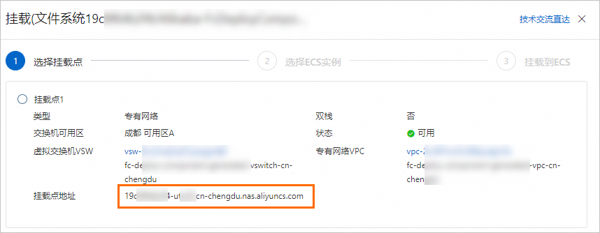
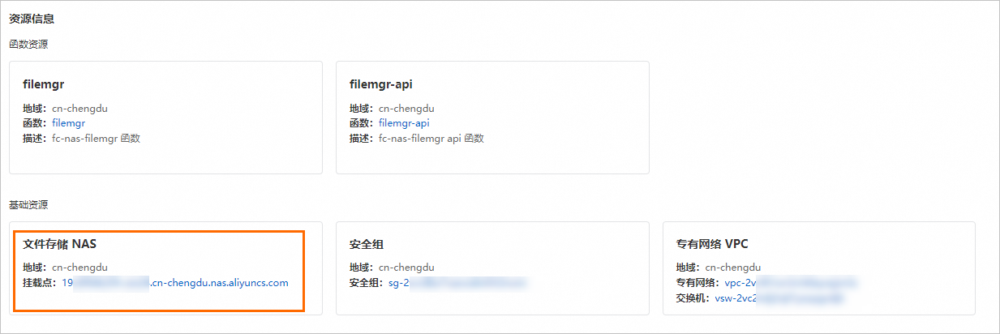
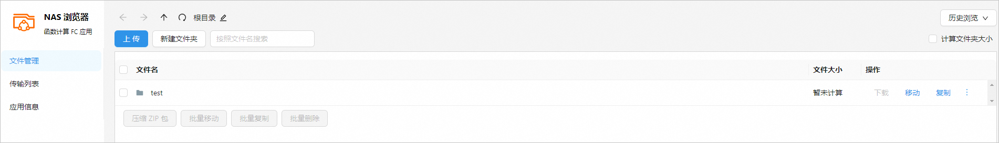
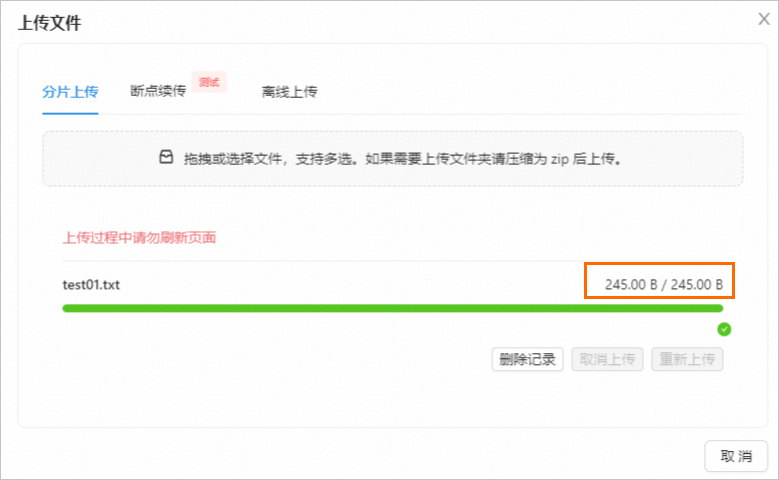
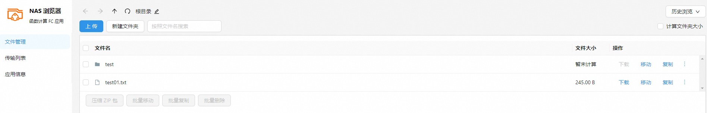

# 使用函数计算快速搭建可视化NAS浏览器应用

函数计算支持和NAS无缝集成，您可以在函数计算的函数中配置NAS，实时存储训练中的数据，也可以通过函数计算的应用中心快速部署NAS浏览器应用，实现可视化管理NAS文件系统上的文件，包括浏览、编辑、上传和下载NAS文件系统中的文件等。

## 背景信息

Serverless应用中心是一款无服务器的应用框架，开发者无需关心底层资源即可部署完整可用的Serverless应用架构。您只需简单几步，就可以体验Serverless应用架构，提升开发效率和降低运维成本。

## 计费说明

上传文件属于入流量，不计费。下载文件和应用本身网页会消耗较少流量。更多关于函数计算计费的详情，请参见[计费概述](https://help.aliyun.com/zh/functioncompute/fc/product-overview/billing-overview-of-fc)。

## 前提条件

- 已开通文件存储NAS服务。
  
  首次登录[文件存储NAS产品详情页](https://www.aliyun.com/product/nas)时，按照页面引导开通服务。
- 已开通函数计算服务，详情请参见[使用事件函数处理云服务产生的事件](https://help.aliyun.com/zh/functioncompute/fc/use-event-functions-to-handle-oss-file-upload-events#p-t79-y7o-68z)。

## 步骤一：创建文件系统并获取挂载点地址

如果您已创建文件系统，可跳过创建文件系统步骤，直接在文件系统列表中获取目标文件系统的挂载点地址。

1. 登录[NAS控制台](https://nasnext.console.aliyun.com/)。
2. 在**概览**页面的**文件系统选型指南**表格中，单击通用型NAS下方的**创建**。
3. 在**创建**面板，按如下说明配置必要参数。其他参数请您根据实际业务需求选择或选用默认配置。
  
  关于创建文件系统的参数说明，请参见[创建文件系统参数说明](https://help.aliyun.com/zh/nas/user-guide/create-a-file-system#table-7fb-5qd-9cv)。
  
  | **参数** | **说明** |
  | --- | --- |
  | **地域** | 在下拉列表中，选择**西南1（成都）**。 |
  | **可用区** | 选择**成都可用区A**。 |
  | **协议类型** | 选择**NFS**。 ** **说明** **NAS 浏览器**应用仅支持NFS协议。 |
  | **挂载点类型** | 选择**专有网络**。 |
  | **专有网络VPC** | 选择VPC网络。 |
  | **虚拟交换机** | 选择VPC网络下创建的交换机。 |
4. 单击**立即购买**，根据页面提示，完成购买。
5. 返回NAS控制台，选择**文件系统**>**文件系统列表**。
6. 在刚创建的文件系统的**操作**列，单击**挂载**，然后复制挂载点地址备用。
  
  

## **步骤二：创建并部署**fc-nas-filemgr**应用**

1. 在[**fc-nas-filemgr应用模板**](https://fcnext.console.aliyun.com/applications/create?template=fc-nas-filemgr)页面，按如下说明配置必要参数，其他参数请根据实际业务配置或使用默认参数。
  
  **
  
  **重要**
  
  当前应用模板由社区贡献，非阿里云官方提供，建议您在使用当前应用模板前仔细阅读应用详情，以确保应用的安全，稳定等。
  
  | **参数** | **示例值** | **说明** |
  | --- | --- | --- |
  | **部署类型** | **直接部署** | - **通过代码仓库部署** 推送代码到指定的代码仓库中，然后触发流水线部署。后期更新项目时，可以直接将代码推送到远程仓库进行安全发布。 - **直接部署** 代码将直接部署上线，后期更新维护项目时，需要对函数等资源进行操作，需要您手动适配CI/CD等能力。 直接部署无需代码仓库授权，函数计算平台不会将案例代码存入指定代码仓库。此方式仅用于应用的快速体验。 |
  | **角色名称** | **AliyunFCServerlessDevsRole** | - 首次登录用户，需要单击**前往授权**配置角色权限。  - 如果您的角色名称已有相关权限，则无需设置。  |
  | **地域** | **西南1（成都）** | 选择[步骤一](#fa055695d8jc3)NAS文件系统所在的地域。 |
  | **NAS挂载点地址** | 19c8f64****-u****.cn-chengdu.nas.aliyuncs.com | 选择[步骤一](#fa055695d8jc3)创建的NAS文件系统的挂载点地址。 |
2. 单击**创建并部署默认环境**。
  
  等待几分钟后，应用部署完成。您可以在应用**环境详情**页签的**资源信息**区域查看到NAS的**地域**及**挂载点**信息。
  
  

## **步骤三：管理NAS文件系统**

1. 在应用详情页面，选择**环境详情**页签。
2. 单击**访问域名**右侧的域名地址，跳转至Web版的**NAS浏览器**页面，体验管理NAS文件系统。
  
  例如，在根目录下创建一个`test`文件夹和上传`test01.txt`文件至根目录。
  
  **
  
  **重要**
  
  NAS浏览器不支持上传空文件。
  
  1. 新建文件夹
    
    在**文件管理**页面，单击**新建文件夹**，在**新建文件夹**对话框中，输入`/test`，然后单击**创建**。
    
    
  2. 上传文件
    
    在**文件管理**页面，单击**上传**，在**上传文件**对话框中，选择**分片上传**页签，然后将`test01.txt`文件直接拖拽上传，上传成功如下图所示，然后单击**取消**。
    
    **
    
    **重要**
    
    上传过程中请勿刷新页面，以免导致上传失败。
    
    
    
    上传完成后，您还可以点击页面上方根目录左侧的图标刷新，查看文件。
    
    
  
  如果不再使用**fc-nas-filemgr**应用管理NAS文件，可删除**fc-nas-filemgr**应用及该应用创建的资源。删除应用不影响存储在NAS中的数据。操作如下：
  
  单击**应用**，在应用详情页面单击右上角的**删除**，选择要删除的资源，根据界面提示操作即可。

## 相关文档

- 您也可以使用Serverless Devs工具部署您的应用或对您创建的项目进行管理，例如查看日志、查看指标和进行多种模式的调试等。具体信息，请参见[Serverless Devs常用命令](https://help.aliyun.com/zh/functioncompute/fc-2-0/developer-reference/serverless-devs-commands#task-2182726)。
- 关于如何为函数配置NAS存储挂载功能，请参见[配置NAS文件系统](https://help.aliyun.com/zh/functioncompute/fc/configure-a-nas-file-system-for-fc)。
- 如果您想删除配置的NAS文件系统，请参见[释放文件系统实例资源](https://help.aliyun.com/zh/nas/release-a-nas-file-system)。
