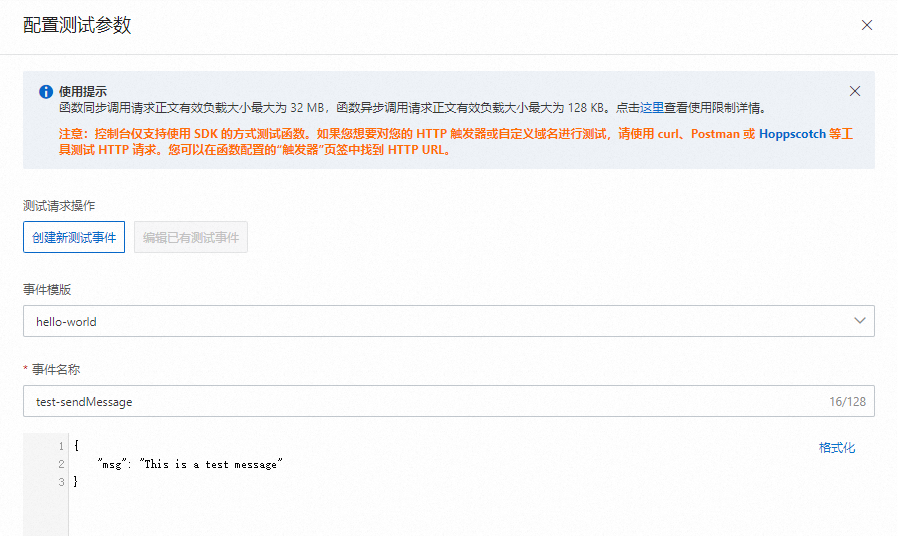
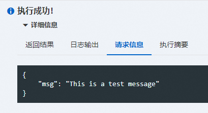
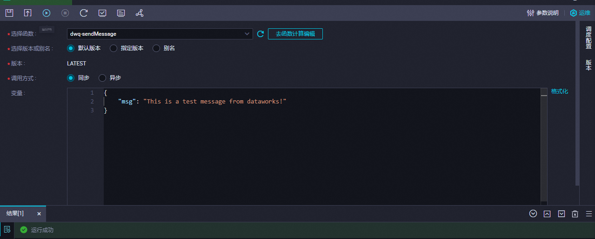

# 在DataWorks中通过函数计算节点发送邮件

本文为您介绍如何在DataWorks中通过函数计算节点调用函数计算服务，并实现发送邮件的功能。

## **前提条件**

- 已开通DataWorks服务，详情请参见[开通DataWorks服务](https://help.aliyun.com/zh/dataworks/activate-dataworks#task-2466053)。
- 已开通函数计算服务，详情请参见[开通函数计算服务](https://help.aliyun.com/zh/functioncompute/fc/use-event-functions-to-handle-oss-file-upload-events#p-t79-y7o-68z)。

## **使用限制**

DataWorks目前仅支持华东1（杭州）、华东2（上海）、华北2（北京）、华北3（张家口）、华南1（深圳）、西南1（成都）、中国香港、新加坡、马来西亚（吉隆坡）、印度尼西亚（雅加达）、德国（法兰克福）、英国（伦敦）、美国（硅谷）、美国（弗吉尼亚）地域的工作空间使用函数计算功能。

## 步骤一：创建事件函数

1. 登录[函数计算控制台](https://fcnext.console.aliyun.com/)，在左侧导航栏，单击**函数**，在顶部菜单栏切换地域至目标地域，在**函数**页面单击**创建函数**。
2. 选择**事件函数**，然后单击**创建事件函数**，在**函数代码**区域，**运行环境**选择**内置运行时**>**Python**>**Python 3.10**，**代码上传方式**选择**使用示例代码**，然后单击**创建**。
  
  更多函数配置说明，请参见[创建事件函数](https://help.aliyun.com/zh/functioncompute/fc/user-guide/creating-an-event-function#45e9ee65bd8n7)。
3. 在函数详情页面的**代码**页签，编辑代码文件`index.py`，输入发送邮件的业务逻辑代码，示例代码如下：
  
  **
  
  **重要**
  
  - 以下示例代码中的`mail_host`、`mail_port`、`mail_username`、`mail_password`、`mail_sender`、`mail_receivers`参数请根据实际情况设置。
  - 电子邮件的账号必须开启SMTP服务。某些电子邮件服务提供商默认未开启，需自行检查并开启。例如：163邮箱默认就未开启SMTP服务。
  - 某些电子邮件服务提供商基于安全原因，可能会使用一种类似授权码的专用密码，用于三方邮件客户端进行登录。这时`mail_password`需设置为授权码而不是账号密码。例如：163邮箱就存在授权码，且三方登录时必须使用授权码来作为密码登录。
  
  ```
  # -*- coding: utf-8 -*- import logging import json import smtplib from email.mime.text import MIMEText def handler(event, context): evts = json.loads(event) logger = logging.getLogger() logger.info('event: %s', evts) mail_host = 'smtp.163.com' ## 邮箱服务地址 mail_port = '465'; ## 邮箱smtp协议端口号 mail_username = 'sender_****@163.com' ## 登录用户名 mail_password = 'EWEL******KRU' ## 登录用户密码 mail_sender = 'sender_****@163.com' ## 发件人邮箱地址 mail_receivers = ['receiver_****@163.com'] ## 收件人邮箱地址 mail_content=generate_mail_content(evts) message = MIMEText(mail_content,'plain','utf-8') message['Subject'] = 'mail test' message['From'] = mail_sender message['To'] = mail_receivers[0] smtpObj = smtplib.SMTP_SSL(mail_host + ':' + mail_port) smtpObj.login(mail_username,mail_password) smtpObj.sendmail(mail_sender,mail_receivers,message.as_string()) smtpObj.quit() return 'mail send success' def generate_mail_content(evt): mail_content='' if 'msg' in evt.keys(): mail_content=evt['msg'] else: logger = logging.getLogger() logger.error('msg not present in event') ''' 此处可增加处理邮件内容读取逻辑 ''' return mail_content
  ```
4. 单击**部署代码**按钮。

## 步骤二：（可选）测试函数

通过配置**创建新测试事件**参数，模拟测试。

1. 在函数详情页面的**代码**页签，单击**测试函数**右侧的图标，从下拉列表中，选择**配置测试参数**。
  
  在**配置测试参数**面板，选择**创建新测试事件**或**编辑已有测试事件**，输入参数，点击**确定**。
  
  
  
  事件内容输入：
  
  ```
  { "msg": "This is a test message" }
  ```
2. 单击**测试函数**即可完成测试。
  
  
3. 检查收件人的邮箱中是否收到邮件。
  
  **
  
  **说明**
  
  某些电子邮件服务器可能会将未知发件人识别为垃圾邮件从而进行拦截，因此若您未在收件箱中找到测试邮件，则需到垃圾邮件中进行查找。

## 步骤三：在DataWorks中创建并配置函数计算节点

1. 登录[DataWorks控制台](https://dataworks.console.aliyun.com/overview)，单击左侧导航栏中的**工作空间**。
2. 在顶部菜单栏，切换地域为[步骤一：创建事件函数](#24926124fcuqm)中指定的地域。
3. 在**工作空间列表**中单击目标工作空间名称，进入工作空间详情页面。若您在当前地域下无工作空间，则需创建一个工作空间，详情可参见[创建工作空间](https://help.aliyun.com/zh/dataworks/user-guide/create-a-workspace)。
4. 单击左侧导航栏中的**数据开发与运维**下的**数据开发**，进入DataWorks数据开发页面。
5. 单击目标业务流程名称，在其展开的**通用**节点上右键单击并选择**函数计算**。在创建节点弹出框中输入节点名称并单击**确认**按钮，完成**函数计算**节点的创建。
  
  
6. 设置函数计算节点参数。
  
  
  
  | **参数** | **描述** |
  | --- | --- |
  | **选择函数** | 选择[步骤一：创建事件函数](#24926124fcuqm)的函数名称。 |
  | **选择版本或别名** | 选择调用函数时所使用的版本或别名，默认版本为LATEST。更多请见[版本管理](https://help.aliyun.com/zh/functioncompute/fc/user-guide/manage-versions#title-f9b-6r6-fhf)和[别名管理](https://help.aliyun.com/zh/functioncompute/fc/user-guide/manage-aliases#title-gw5-lua-9x1)。 |
  | **调用方式** | 本文选择**同步**。调用方式详情可参见[同步调用](https://help.aliyun.com/zh/functioncompute/fc/user-guide/synchronous-invocations#title-js5-pff-pxt)、[异步调用](https://help.aliyun.com/zh/functioncompute/fc/user-guide/asynchronous-invocation#title-5q9-1bp-yyt)。 |
  | **变量** | 调用函数的参数。本文示例如下：<br>```<br>{ "msg": "This is a test message from dataworks!" }<br>``` |
7. （可选）调试函数计算节点。节点配置完成后，您可单击图标，为代码变量赋值常量进行调试运行，测试节点代码逻辑是否正确。
8. 配置节点的周期调度属性。DataWorks提供的调度参数，可实现调度场景下代码动态传参。打开右侧的**调度配置**，设置参数。更多调度参数的配置，请参见[调度参数支持的格式](https://help.aliyun.com/zh/dataworks/user-guide/supported-formats-of-scheduling-parameters#concept-2185254)。更多调度属性，请参见[任务调度属性配置概述](https://help.aliyun.com/zh/dataworks/task-scheduling-properties-configuration-overview#task-2303936)。

## **步骤四：提交并发布节点**

1. 保存并提交节点。
  
  单击工具栏中的、图标，保存并提交节点。提交节点时，请根据提示输入变更描述，并根据需要选择是否进行代码评审及冒烟测试。
  
  **
  
  **说明**
  
  - 您需在调度配置中设置节点的**重跑属性**和**依赖的上游节点**，才可以提交节点。
  - 开启代码评审后，开发人员提交的节点代码必须通过评审人员的审核才可发布，详情请参见[代码评审](https://help.aliyun.com/zh/dataworks/user-guide/code-review#task-1961915)。
  - 为保障调度节点任务执行符合预期，建议您在发布前对任务进行冒烟测试，详情请参见[冒烟测试](https://help.aliyun.com/zh/dataworks/user-guide/perform-smoke-testing#task-2230073)。
2. **可选：**发布节点。
  
  如果您使用的是标准模式的工作空间，提交成功后，需单击右上方的**发布**，发布节点。相关介绍请参见[标准模式的工作空间](https://help.aliyun.com/zh/dataworks/user-guide/differences-between-workspaces-in-basic-mode-and-workspaces-in-standard-mode#section-lbq-jx0-5cd)、[发布任务](https://help.aliyun.com/zh/dataworks/user-guide/deploy-nodes#task-2470114)。

## 后续步骤

- 任务提交发布至生产运维中心调度后，您可通过DataWorks的运维中心进行相关运维操作，详情请参见[运维中心](https://help.aliyun.com/zh/dataworks/user-guide/perform-basic-maintenance-operations-on-auto-triggered-nodes#concept-2175789)。
- 在掌握如何创建和使用函数计算节点的基本步骤之后，您可通过最佳实践进一步深入了解该节点，详情请参见[在DataWorks中通过函数计算节点实现动态为PDF添加水印](https://help.aliyun.com/zh/functioncompute/fc/use-cases/dynamically-add-watermarks-to-pdf-files-by-using-a-function-compute-node-in-dataworks#c04ae3ee1dpgl)。
