# 在DataWorks中通过函数计算节点实现动态为PDF添加水印

本文为您介绍如何在DataWorks中通过函数计算节点调用函数计算服务，实现周期性对OSS中的增量PDF文件添加水印。

## **前提条件**

- 已开通DataWorks服务，详情请参见[开通DataWorks服务](https://help.aliyun.com/zh/dataworks/activate-dataworks#task-2466053)。
- 已开通函数计算服务，详情请参见[开通函数计算服务](https://help.aliyun.com/zh/functioncompute/fc/use-event-functions-to-handle-oss-file-upload-events#p-t79-y7o-68z)。
- 已开通OSS，详情请参见[开通OSS服务](https://help.aliyun.com/zh/oss/getting-started/activate-oss#task-njz-hf4-tdb)。

## **使用限制**

DataWorks目前仅支持华东1（杭州）、华东2（上海）、华北2（北京）、华北3（张家口）、华南1（深圳）、西南1（成都）、中国香港、新加坡、马来西亚（吉隆坡）、印度尼西亚（雅加达）、德国（法兰克福）、英国（伦敦）、美国（硅谷）、美国（弗吉尼亚）地域的工作空间使用函数计算功能。

## **步骤一：部署pdf文件加水印应用**

1. 登录[函数计算控制台](https://fcnext.console.aliyun.com/)，在左侧导航栏，单击**更多功能**>**应用**。
2. 在应用页面，点击**创建应用**，选择**通过模板创建应用**，在**文件处理**页签找到**pdf文件加水印**，光标移至该卡片，然后单击**立即创建**。
  
  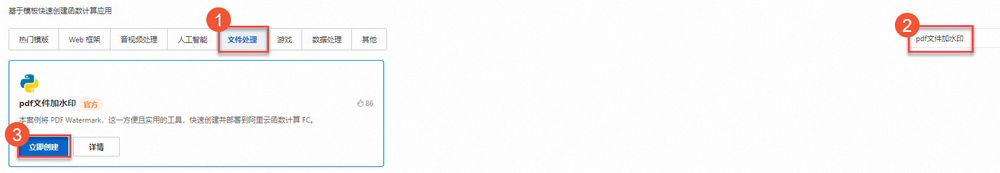
  
  **
  
  **说明**
  
  “pdf文件加水印”应用的源代码可参见[GitHub](https://github.com/devsapp/start-pdf-watermark/tree/V3/src/code)。此应用实现的逻辑为：将OSS中的PDF文件按照指定的内容添加水印并写回相同的OSS路径下。
3. 在创建应用页面选择**直接部署**，选择**地域**和**OSS 存储桶名**，如果您没有特殊要求，其余配置项保持默认值即可，然后单击**创建并部署默认环境**。
  
  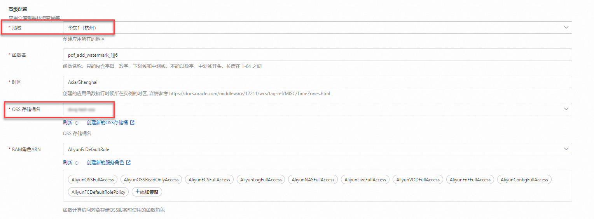
4. 在应用详情页，**部署状态**显示**部署成功**时，表示部署完成。
  
  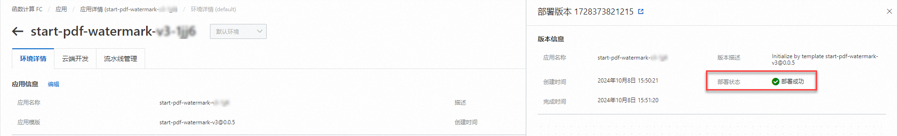

## **步骤二：（可选）测试函数**

通过配置**创建新测试事件**参数，模拟事件触发函数执行，为PDF添加水印并将处理结果传回Bucket的相同目录。

1. 准备OSS测试数据，进入**[Bucket列表](https://oss.console.aliyun.com/bucket)**页面，选择创建应用填写的OSS存储桶名。
  
  在文件列表页面，新建目录`DataworksPDF`，并上传`example.pdf`到此目录下。
  
  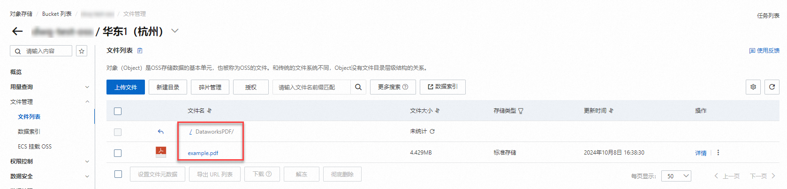
2. 在应用详情页，单击**函数资源**下的函数名称，进入**函数详情**页。
  
  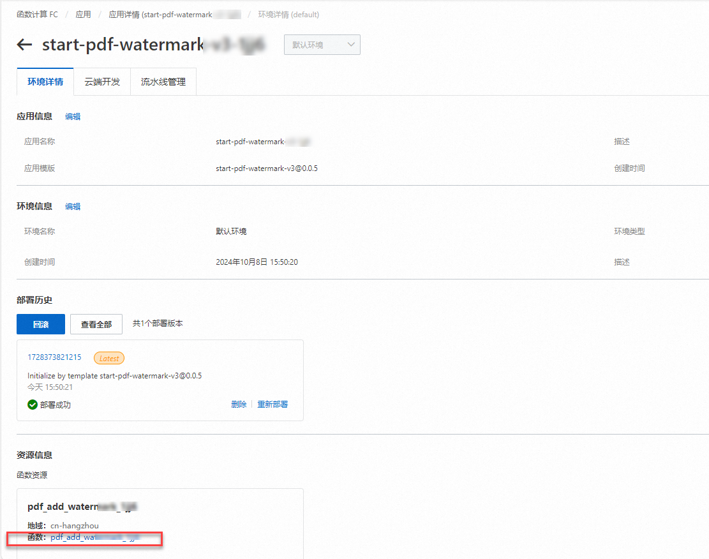
3. 在函数详情页面的**代码**页签，单击**测试函数**右侧的图标，从下拉列表中，选择**配置测试参数**。
  
  在**配置测试参数**面板，选择**创建新测试事件**或**编辑已有测试事件**，输入参数，点击**确定**。
  
  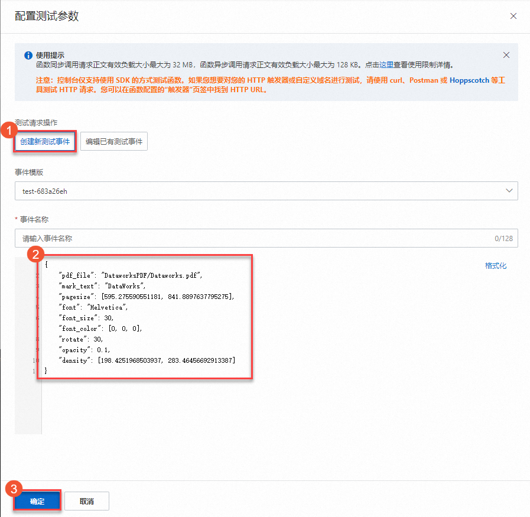
  
  事件名称：输入事件名称。
  
  事件内容：在下方代码输入框，输入JSON格式内容。本文示例如下：
  
  **
  
  **重要**
  
  如果直接复制以下JSON示例内容，请务必将`//`及其后面的注释内容删除，否则它无法通过JSON格式校验。
  
  ```
  // 以下配置为对pdf文件（DataworksPDF/example.pdf）添加水印文字（DataWorks），使用30号字体Helvetica，具体参数含义参见各个参数后面的注释 { "pdf_file": "DataworksPDF/example.pdf", // PDF文件在OSS Bucket中的路径 "mark_text": "DataWorks", // 水印文字，如果给PDF加水印，该参数必填 "pagesize": [595.275590551181, 841.8897637795275], // 可选参数，默认是A4大小，(21*cm, 29.7*cm), 其中1cm=28.346456692913385 "font": "Helvetica", // 字体，可选参数，默认为Helvetica, 中文字体可选择为zenhei或microhei "font_size": 20, // 字体大小，可选参数，默认为30 "font_color": [0, 0, 0], // 字体颜色，格式为 RGB，默认为黑色 "rotate": 30, // 旋转角度, 可选参数，默认为0 "opacity": 0.1, // 透明度, 可选参数，默认为 0.1，1表示不透明 "density": [198.4251968503937, 283.46456692913387] // 水印密度，水印文字间隔，默认是[141.73228346456693, 141.73228346456693]，即（7*cm, 10*cm), 表示每个水印文字在横坐标和纵坐标的间隔分别是7cm和10cm }
  ```
4. 单击**测试函数**按钮，显示执行成功后，可在OSS中对应的源文件路径下查看添加过水印的pdf文件。本文示例会生成`example_out.pdf`文件。
  
  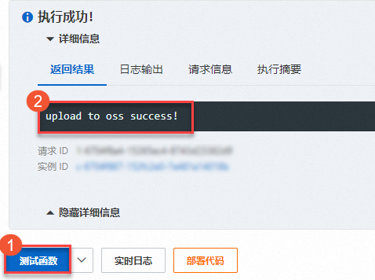
  
  查看OSS中的文件，如下：
  
  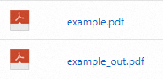

## **步骤三：在DataWorks中创建并配置函数计算节点**

1. 登录[DataWorks控制台](https://dataworks.console.aliyun.com/overview)。
2. 单击左侧导航栏中的**工作空间**。
3. 将页面顶部导航栏的地域列表切换为[步骤一：部署pdf文件加水印应用](#67fab40a43e8y)中指定的地域。
4. 在**工作空间列表**中单击**目标工作空间名称**，进入**工作空间详情**页面。若您在当前地域下无工作空间，则需创建一个工作空间，详情可参见[创建工作空间](https://help.aliyun.com/zh/dataworks/user-guide/create-a-workspace)。
5. 在空间详情页面的左侧导航栏，选择**数据开发与运维**>**数据开发**，进入DataWorks数据开发页面。
6. 单击目标业务流程名称，在其展开的**通用**节点上单击右键，选择**新建节点**>**函数计算**，然后在弹出的对话框，输入节点**名称**并单击**确认**按钮，完成**函数计算**节点的创建。
  
  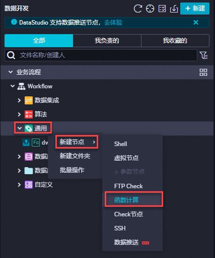
7. 设置函数计算节点参数。
  
  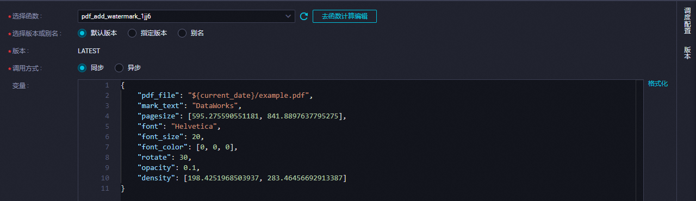
  
  | **参数** | **描述** |
  | --- | --- |
  | **选择函数** | 选择[创建应用时填写的函数名](#69d77f5c6ca1k)。 |
  | **选择版本或别名** | 选择调用函数时所使用的版本或别名，默认版本为LATEST。更多请见[版本管理](https://help.aliyun.com/zh/functioncompute/fc/user-guide/manage-versions#title-f9b-6r6-fhf)和[别名管理](https://help.aliyun.com/zh/functioncompute/fc/user-guide/manage-aliases#title-gw5-lua-9x1)。 |
  | **调用方式** | 本文选择**同步**。调用方式详情可参见[同步调用](https://help.aliyun.com/zh/functioncompute/fc/user-guide/synchronous-invocations#title-js5-pff-pxt)、[异步调用](https://help.aliyun.com/zh/functioncompute/fc/user-guide/asynchronous-invocation#title-5q9-1bp-yyt)。 |
  | **变量** | 调用函数的参数。本文使用[测试函数事件内容](#251c0143c1uir)中的JSON内容并进行适当修改，以实现每天增量对OSS中的pdf文件添加水印。<br>```<br>// 以下配置为对pdf文件（${current_date}/example.pdf）添加水印文字 { "pdf_file": "${current_date}/example.pdf", // PDF文件在OSS Bucket中的路径 "mark_text": "DataWorks", // 水印文字，如果给PDF加水印，该参数必填 "pagesize": [595.275590551181, 841.8897637795275], // 可选参数，默认是A4大小，(21*cm, 29.7*cm), 其中1cm=28.346456692913385 "font": "Helvetica", // 字体，可选参数，默认为Helvetica, 中文字体可选择为zenhei或microhei "font_size": 20, // 字体大小，可选参数，默认为30 "font_color": [0, 0, 0], // 字体颜色，格式为 RGB，默认为黑色 "rotate": 30, // 旋转角度, 可选参数，默认为0 "opacity": 0.1, // 透明度, 可选参数，默认为 0.1，1表示不透明 "density": [198.4251968503937, 283.46456692913387] // 水印密度，水印文字间隔，默认是[141.73228346456693, 141.73228346456693]，即（7*cm, 10*cm), 表示每个水印文字在横坐标和纵坐标的间隔分别是7cm和10cm }<br>```<br>**<br>**说明**<br>- 在`pdf_file`的值（`${current_date}/example.pdf`）中，`${current_date}`表示使用一个名称为`current_date`的变量。<br>- DataWorks在调度任务时会将`${current_date}`替换为实际的值，变量可在调度参数中设置。例如：在2024年10月09日执行任务时，`pdf_file`为`2024-10-09/example.pdf`；在2024年10月10日执行时，`pdf_file`为`2024-10-10/example.pdf`。<br>- 业务系统只需每天在当前任务调度前按时间规则生成相应路径的pdf文件，即可每天动态为新增的pdf文件添加水印。<br>- 本示例需要在运行任务之前向OSS中上传符合此路径`${current_date}/example.pdf`的pdf文件。例如：`2024-10-09/example.pdf`。 |
8. （可选）调试函数计算节点。节点配置完成后，您可单击图标，为代码变量赋值常量进行调试运行，测试节点代码逻辑是否正确。例如：`current_date=2024-10-09`，代表函数计算服务会对OSS中的`2024-10-09/example.pdf`文件添加水印。
9. 配置节点的周期调度属性。DataWorks提供的调度参数，可实现调度场景下代码动态传参。打开右侧的**调度配置**，在**参数**区域设置参数。本文示例添加参数`current_date`，参数值为`$[yyyy-mm-dd]`，表示运行任务时的当前年月日。更多调度参数的配置，请参见[调度参数支持的格式](https://help.aliyun.com/zh/dataworks/user-guide/supported-formats-of-scheduling-parameters#concept-2185254)。更多调度属性，请参见[任务调度属性配置概述](https://help.aliyun.com/zh/dataworks/task-scheduling-properties-configuration-overview#task-2303936)。
  
  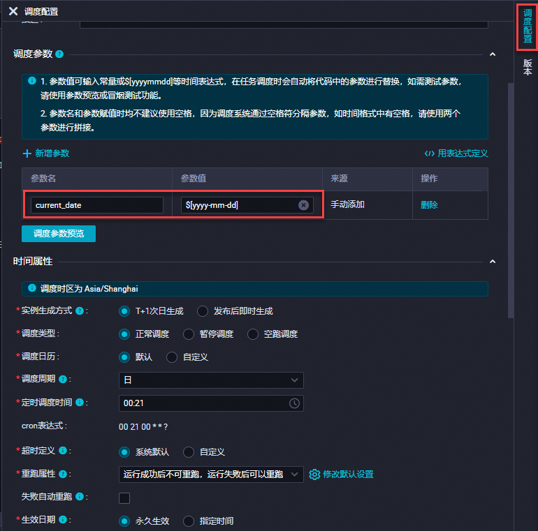

## **步骤四：提交并发布节点**

1. 保存并提交节点。
  
  单击工具栏中的、图标，保存并提交节点。提交节点时，请根据提示输入变更描述，并根据需要选择是否进行代码评审及冒烟测试。
  
  **
  
  **说明**
  
  - 您需在调度配置中设置节点的**重跑属性**和**依赖的上游节点**，才可以提交节点。
  - 开启代码评审后，开发人员提交的节点代码必须通过评审人员的审核才可发布，详情请参见[代码评审](https://help.aliyun.com/zh/dataworks/user-guide/code-review#task-1961915)。
  - 为保障调度节点任务执行符合预期，建议您在发布前对任务进行冒烟测试，详情请参见[冒烟测试](https://help.aliyun.com/zh/dataworks/user-guide/perform-smoke-testing#task-2230073)。
2. **可选：**发布节点。
  
  如果您使用的是标准模式的工作空间，提交成功后，需单击右上方的**发布**，发布节点。相关介绍请参见[标准模式的工作空间](https://help.aliyun.com/zh/dataworks/user-guide/differences-between-workspaces-in-basic-mode-and-workspaces-in-standard-mode#section-lbq-jx0-5cd)、[发布任务](https://help.aliyun.com/zh/dataworks/user-guide/deploy-nodes#task-2470114)。

## 后续步骤

- 任务提交发布至生产运维中心调度后，您可通过DataWorks的运维中心进行相关运维操作，详情请参见[运维中心](https://help.aliyun.com/zh/dataworks/user-guide/perform-basic-maintenance-operations-on-auto-triggered-nodes#concept-2175789)。
- 在掌握如何创建和使用函数计算节点的基本步骤之后，您可通过最佳实践进一步深入了解该节点，详情请参见[在DataWorks中通过函数计算节点发送邮件](https://help.aliyun.com/zh/functioncompute/fc/use-cases/use-the-function-compute-node-to-send-an-email-in-dataworks#517fa071a5tri)。
