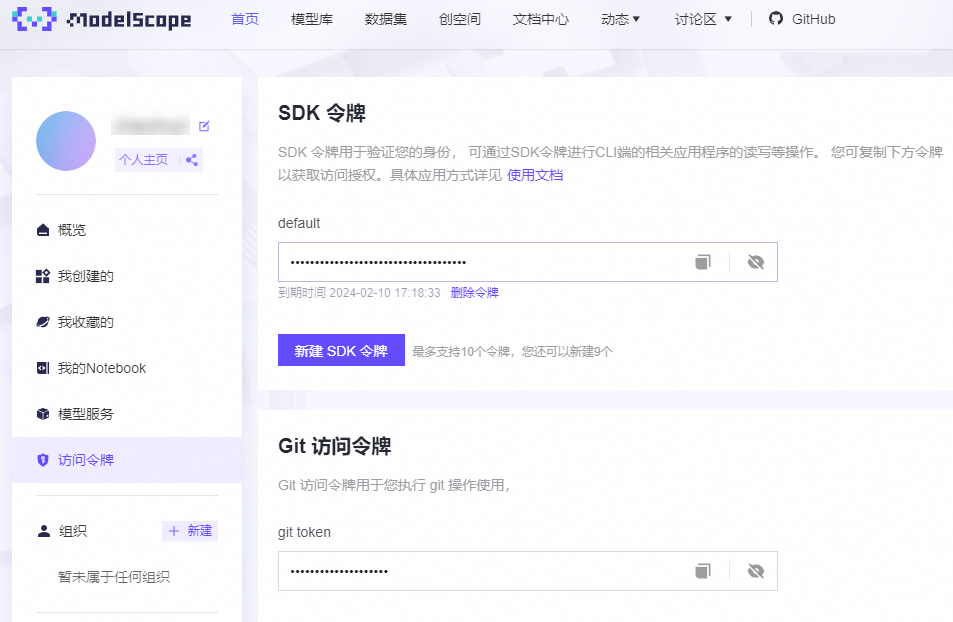
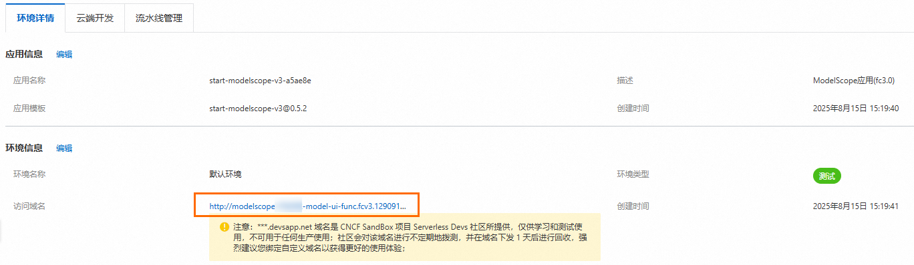
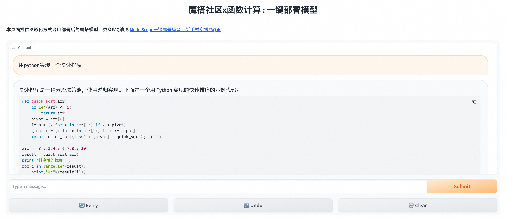

# 基于函数计算快速搭建低成本LLM应用

LLM（Large Language Model）是指大型语言模型，是一种采用深度学习技术训练的具有大量参数的自然语言处理模型。您可以基于ModelScope模型库和函数计算的浅休眠（原闲置）弹性实例低成本快速搭建LLM应用实现智能问答。

## **操作步骤**

本教程使用的LLM模型为[ChatGLM3-6B](https://modelscope.cn/models/ZhipuAI/chatglm3-6b/summary)。更多开源LLM，请参见[ModelScope官网](https://modelscope.cn/models)。

### **前提条件**

- 已开通函数计算服务。具体操作，请参见[开通函数计算服务](https://help.aliyun.com/zh/functioncompute/fc-2-0/create-a-function-in-the-function-compute-console#p-t79-y7o-68z)。
- 已开通文件存储NAS服务。具体操作，请参见[欢迎使用NAS文件系统](https://nasnext.console.aliyun.com/introduction)。
- 已注册ModelScope账号，并绑定阿里云账号。具体操作，请参见[ModelScope官网](https://modelscope.cn/models)。

### **创建应用**

1. 登录[函数计算控制台](https://fcnext.console.aliyun.com/)，在左侧导航栏，单击**更多功能**>**应用**。
2. 在应用页面，单击**创建应用**，选择**通过模板创建应用**，然后在应用列表找到**ModelScope**模板，光标移至该卡片，然后单击**立即创建**。
3. 在**创建应用**页面，设置以下配置项，然后单击**创建应用**。
  
  主要配置项说明如下，其余配置项保持默认值即可。
  
  | **配置项** | **说明** | **示例值** |
  | --- | --- | --- |
  | **项目基础配置** |  |  |
  | **角色名** | 默认使用**AliyunFCServerlessDevsRole**，首次创建应用的用户，需要根据界面提示，单击**前往授权**跳转至快速授权页面，完成授权并创建该角色。 | AliyunFCServerlessDevsRole |
  | **模型平台配置** |  |  |
  | **模型ID** | ModelScope的模型ID。 | ZhipuAI/chatglm3-6b |
  | **模型版本** | ModelScope的模型版本。 | v1.0.2 |
  | **资源创建配置** |  |  |
  | **地域** | 选择部署应用的地域。 ** **重要** 如果部署异常，例如AIGC公共镜像拉取耗时长，拉取失败，请切换到其他地域重试。 | 华东2（上海） |
  | **模型任务类型** | ModelScope的模型任务类型。 | chat |
  | **Access Token** | ModelScope的访问令牌。ModelScope账号与阿里云账号绑定后，在ModelScope官网首页获取。  | 57cc1b0a-08e8-4224-****** |
  | **模型运行实例类型** | 函数实例所使用的GPU卡型。 | fc.gpu.tesla.1 |
  | **显存大小** | 函数实例的显存大小（MB）。 | 16384 |
  | **内存大小** | 函数实例的内存大小（MB）。 | 32768 |
4. 为应用配置最小实例数。
  
  1. 应用部署完成后，在**资源信息**区域单击后缀为**model-app-func**的函数名称跳转至函数详情页。
  2. 在目标函数详情页面，选择**弹性配置**页签，在下方**弹性策略**区域，单击目标策略行的**配置**。
  3. 在**配置弹性策略**页面，设置最小实例数为≥1的值，然后单击**确定**。

### **使用LLM应用**

1. 在应用页面，点击域名地址，访问LLM应用。
  
  
2. 输入文本信息，然后单击**Submit**，您可以看到模型的回答结果。
  
  

### **删除资源**

如您暂时不需要使用此应用，请及时删除对应资源。如您需要长期使用此应用，请忽略此步骤。

1. 返回[函数计算控制台](https://fcnext.console.aliyun.com/)概览页面，在左侧导航栏，单击**更多功能**>**应用**。
2. 单击目标应用右侧**操作**列的**删除应用**，在弹出的删除应用对话框，勾选**我已确定资源删除的风险，依旧要删除上面已选择的资源**，然后单击**删除应用及所选资源**。

## **LLM模型列表**

由于当前社区以及多种层出不穷的微调模型，本表格仅列举了当前热度较高的常用LLM基础模型，在其之上的微调模型同样是可以部署至函数计算平台，并开启浅休眠（原闲置）预留模式。

如果您有任何反馈或疑问，欢迎加入钉钉用户群（钉钉群号：**64970014484**）与函数计算工程师即时沟通。

| **家族** | **LLM模型** |
| --- | --- |
| [千问](https://modelscope.cn/organization/qwen) | - Qwen-14B - Qwen-14B-Chat - Qwen-14B-Chat-Int8 - Qwen-14B-Chat-Int4 |
| - Qwen-7B - Qwen-7B-Chat - Qwen-7B-Chat-Int8 - Qwen-7B-Chat-Int4 |  |
| - Qwen-1.8B - Qwen-1.8B-Chat - Qwen-1.8B-Chat-Int4 |  |
| [百川智能](https://modelscope.cn/organization/baichuan-inc) | - Baichuan2-13B-Base - Baichuan2-13B-Chat - Baichuan2-13B-Chat-4bits |
| - Baichuan2-7B-Base - Baichuan2-7B-Chat - Baichuan2-7B-Chat-4bits |  |
| - Baichuan-13B-Chat |  |
| - Baichuan-7B |  |
| [智谱.AI](https://modelscope.cn/organization/ZhipuAI) | - ChatGLM3-6B |
| - ChatGLM3-6B |  |
| 更多开源LLM模型请参考[ModelScope](https://modelscope.cn/models)。 |  |

## **相关文档**

LLM应用在使用过程中如果遇到报错，请参见[ModelScope一键部署模型：新手村实操FAQ篇](https://developer.aliyun.com/article/1307460)。
