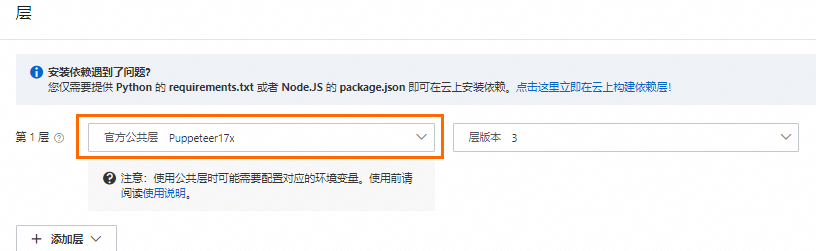
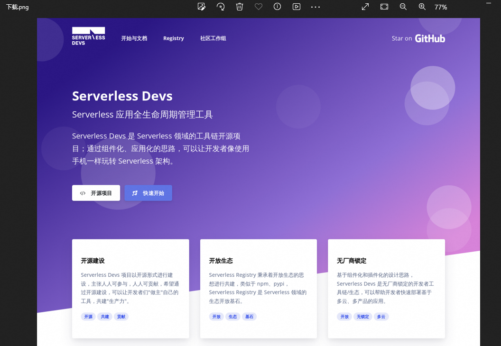
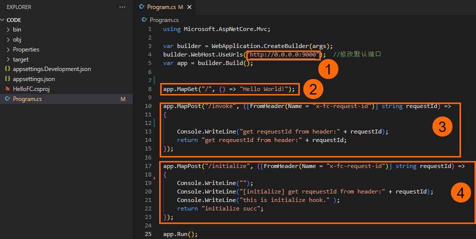
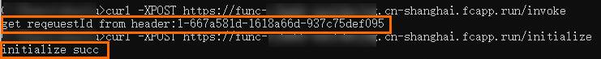

# 官方公共层使用示例

在一些常见场景下，您可以使用函数计算提供的官方公共层减少您的代码包体积。与自定义层相比，函数计算官方公共层更便捷，针对各种编程语言预置了内置运行时环境和常见依赖包，您无需关注底层环境配置，直接选择适用的公共层绑定到函数即可。本文介绍使用官方公共层的典型示例。

## 使用说明

关于官方公共层的最新版本和使用说明，请参见[awesome-layers](https://github.com/awesome-fc/awesome-layers/blob/main/README.md)。

## 示例一：基于Node.js 16和Puppeteer实现网页截图示例程序

Puppeteer可以控制Chrome（或Chromium）实现很多自动化流程，例如网页截图、PDF生成、表单的自动提交、UI自动化测试或键盘输入模拟等。实际上，Puppeteer实现了一个基于Node.js的headless Chrome浏览器。

本示例使用Puppeteer完成一个网页截图示例程序。

1. 创建事件函数。
  
  在**创建函数**页面，设置以下配置项，其余配置项保持默认值即可。具体操作，请参见[创建事件函数](https://help.aliyun.com/zh/functioncompute/fc/user-guide/creating-an-event-function)。
  
  - 函数类型选择**事件函数**。
  - **运行环境**选择**内置运行时**>**Node.js**>**Node.js 16**。
  - **内存规格**选择1024 MB。
2. 编辑函数代码。在函数详情页面，单击**代码**页签，编辑index.js文件中的函数代码，然后单击**部署代码**。
  
  代码示例如下。
  
  ```
  const fs = require('fs'); const puppeteer = require('puppeteer'); function autoScroll(page) { return page.evaluate(() => { return new Promise((resolve, reject) => { var totalHeight = 0; var distance = 100; var timer = setInterval(() => { var scrollHeight = document.body.scrollHeight; window.scrollBy(0, distance); totalHeight += distance; if (totalHeight >= scrollHeight) { clearInterval(timer); resolve(); } }, 100); }) }); } exports.handler = async (event, context, callback) => { console.log('Node version is: ' + process.version); try { const browser = await puppeteer.launch({ headless: true, args: [ '--disable-gpu', '--disable-dev-shm-usage', '--disable-setuid-sandbox', '--no-first-run', '--no-zygote', '--no-sandbox' ] }); let url = 'https://www.serverless-devs.com'; if (event.queryStringParameters && event.queryStringParameters.url) { url = event.queryStringParameters.url; } if (!url.startsWith('https://') && !url.startsWith('http://')) { url = 'http://' + url; } const page = await browser.newPage(); await page.emulateTimezone('Asia/Shanghai'); await page.goto(url, { waitUntil: 'networkidle2' }); await page.setViewport({ width: 1200, height: 800 }); await autoScroll(page); let path = '/tmp/example'; let contentType = 'image/png'; await page.screenshot({ path: path, fullPage: true, type: 'png' }); await browser.close(); const screenshot = fs.readFileSync(path); const response = { statusCode: 200, headers: { 'Content-Type': contentType }, body: screenshot.toString('base64'), isBase64Encoded: true }; callback(null, response); } catch (err) { const errorResponse = { statusCode: 500, headers: { 'Content-Type': 'text/plain' }, body: err.message }; callback(null, errorResponse); } };
  ```
  
  上述示例代码解析如下：
  
  1. 解析query参数获取需要截图的URL地址，如果解析失败则默认使用Serverless Devs官网主页。
  2. 使用Puppeteer对该网页进行截图，并保存到运行实例的/tmp/example文件夹中，然后将该路径作为HTTP请求的返回体直接返回。
3. 为函数配置Puppeteer公共层。
  
  具体操作，请参见[通过控制台配置官方公共层](https://help.aliyun.com/zh/functioncompute/fc/user-guide/configure-common-layers-for-a-function-1#section-8ia-e87-98z)。选择官方公共层Puppeteer17x。
  
  
4. 创建HTTP触发器，在目标触发器**配置信息**列获取**公网访问地址**，在浏览器中使用该测试地址进行测试。
  
  关于创建HTTP触发器的详细操作，请参见[创建触发器](https://help.aliyun.com/zh/functioncompute/fc/configure-an-http-trigger-for-a-function-and-invoke-the-function-by-using-http-requests#section-11e-t95-jq7)。
  
  测试成功后，将Serverless Devs官网进行截图并自动下载该png文件到本地。
  
  

## 示例二：基于公共层快速实现.NET 6自定义运行时

1. 创建Web函数。
  
  在**创建函数**页面，设置以下配置项，其余配置项保持默认值即可。具体操作，请参见[创建Web函数](https://help.aliyun.com/zh/functioncompute/fc/user-guide/creating-a-web-function#section-b9y-zn1-5wr)。
  
  - 函数类型选择**Web函数**。
  - **运行环境**选择**自定义运行时**>**.NET**>**.NET 6.0**。
  
  创建完成后，您可以在Web IDE界面查看示例代码Program.cs。示例代码解析如下：
  
  - ①：该示例监听了`0.0.0.0`的9000端口。自定义运行时启动的服务一定要监听`0.0.0.0:CAPort`或`*:CAPort`端口，不能监听`127.0.0.1`或`localhost`。更多信息，请参见[自定义运行时基本原理](https://help.aliyun.com/zh/functioncompute/fc/user-guide/principles-1)。
  - ②：添加路由/，直接返回字符串`"Hello World!"`。
  - ③：添加路由/invoke，该路由为使用事件请求处理程序的路径。更多信息，请参见[Web函数](https://help.aliyun.com/zh/functioncompute/fc/web-functions)。
  - ④：添加路由/initialize，该路由为函数初始化回调程序对应的路径。该回调程序的方法会在示例初始化时执行一次。更多信息，请参见[函数实例生命周期回调](https://help.aliyun.com/zh/functioncompute/fc/user-guide/lifecycle-hooks-for-function-instances-in-a-custom-runtime)。
2. 测试函数。
  
  1. 在触发器配置信息列，获取**公网访问地址**，然后在浏览器中使用该测试地址进行测试。此时，不添加任何PATH信息。
    
    执行成功后，自动下载附件到本地。
  2. 使用Curl工具，在上一步获取的公网访问地址后添加`/invoke`或`/initialize`路径进行测试。该路由方法为POST，支持直接使用curl -XPOST命令测试。
    
    执行结果如下所示。
    
    
