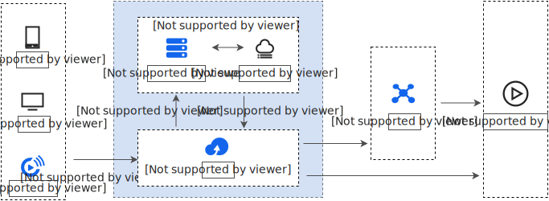
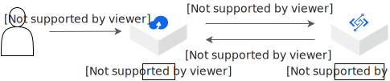
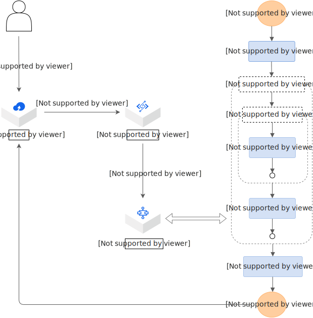
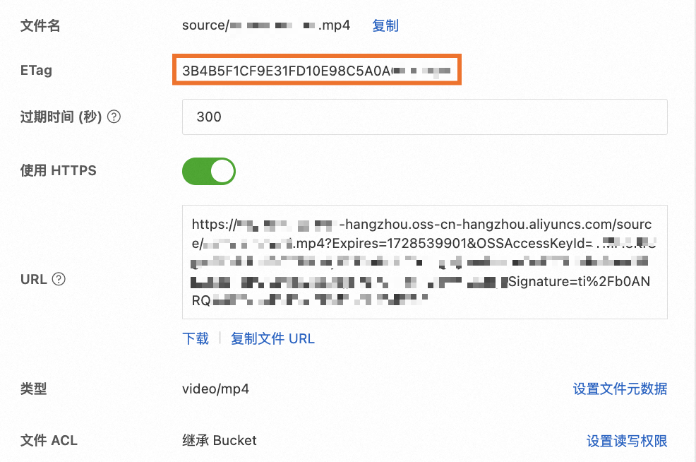
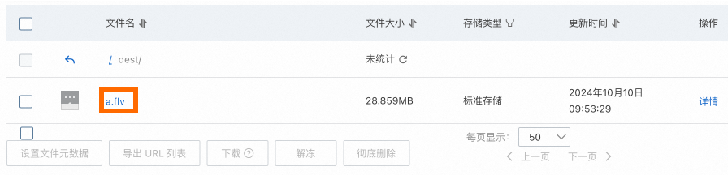
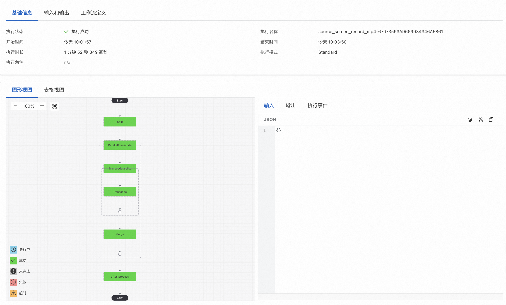

# 构建基于Serverless架构的弹性高可用音视频处理系统

在音视频系统中，音视频转码是比较消耗计算力的一个子系统，您可以通过函数计算和云工作流构建弹性高可用的Serverless音视频处理系统。本文会从工程效率、运维、性能和成本方面介绍Serverless音视频处理系统和传统方案的差异。同时介绍如何搭建并体验Serverless音视频处理系统。

## 背景信息

针对音视频转码，虽然您可以使用云上专门的转码服务，但在以下场景，您仍然会选择自己搭建转码服务。

- 弹性伸缩诉求
  
  - 需要更弹性的视频处理服务。
    
    例如，您已经在虚拟机或容器平台上基于FFmpeg部署了一套视频处理服务，但想在此基础上实现更弹性、更高可用性的服务。
- 工程效率诉求
  
  - 需要并行处理多个视频文件。
  - 需要批量快速处理多个超大的视频。
    
    例如，每周五定时产生几百个4 GB以上1080P的大视频，需要几小时内处理完。
- 自定义处理诉求
  
  - 需要处理更高级的自定义处理需求。
    
    例如，视频转码完成后，需要将转码详情记录到数据库，或自动将热度很高的视频预热到CDN上缓解源站压力。
  - 需要转换音频格式、自定义采样率或音频降噪等。
  - 需要直接读取源文件进行处理。
    
    例如，当您的视频源文件存放在NAS或ECS云盘上时，您需要自建服务直接读取源文件进行处理，而不需要将它们再次迁移至OSS。
  - 需要将视频转换为其他格式，然后在此基础上增加其他新的需求。
    
    例如，将视频进行转码、加水印和生成视频首页的GIF，然后在此基础上增加新的需求，例如调整转码参数、发布新功能时对在线服务无影响。
- 成本诉求
  
  - 需要简单的转码或较轻量的需求时。
    
    例如，获取OSS上视频前几帧的GIF、获取音视频的时长，此时您自己搭建的成本会更低。

针对自己搭建转码服务的方案有传统自建方案和Serverless方案，本文会介绍这两类方案的差异及Serverless方案具体的操作流程。

## **解决方案**

### **传统自建方案**

随着计算机技术和网络的发展，云计算厂商的产品在不断成熟完善。如果想要搭建音视频处理系统，可以直接上云购买ECS服务器部署服务，通过OSS、CDN等技术完成音视频的存储和音视频的播放加速。



### Serverless方案

#### 简单视频处理系统

如果您只需要对视频进行简单的处理，方案架构图如下。



当用户上传一个视频到OSS时，OSS触发器自动触发函数执行，函数调用FFmpeg进行视频转码，并且将转码后的视频保存回OSS。

关于简单视频处理系统的Demo及操作步骤，请参见[简单视频处理系统](#ecd4dcc247wee)。

#### **视频处理工作流系统**

如果您需要加快大视频的转码速度或者完成各种复杂的组合操作，可以通过云工作流编排函数实现功能强大的视频处理系统。方案架构图如下。



当用户上传一个MP4格式的视频到OSS，OSS触发器自动触发函数执行，然后函数调用云工作流进行一种或多种格式的转码。通过该方案可以实现以下需求：

- 一个视频文件可以同时被转码成各种格式，并进行其他自定义处理，例如增加水印或在处理后更新信息到数据库等。
- 当有多个文件同时上传到OSS时，函数计算会自动伸缩，并行处理多个文件，同时将文件并行转码成多种格式。
- 结合NAS和视频切片，可以解决超大视频的转码问题。对于每个视频，都需先进行切片处理，然后并行转码切片，最后合成。通过设置合理的切片时间，可以提高较大视频的转码速度。
  
  **
  
  **说明**
  
  视频切片是指将视频流按指定的时间间隔切分成一系列分片文件，并生成一个索引文件记录分片文件的信息。

关于视频处理工作流系统的Demo及操作步骤，请参见[视频处理工作流系统](#ecd4dcc5473z3)。

## Serverless方案优势

### 提高工程效率

| **对比项** | **Serverless方案** | **传统自建方案** |
| --- | --- | --- |
| 基础设施 | 无 | 需要您采购和管理。 |
| 开发效率 | 只需专注业务逻辑的开发，配合Serverless Devs编排和部署资源。 | 除了必要的业务逻辑开发，还需要您自己建立相同的线上运行环境，包括相关软件的安装、服务配置、安全更新等一系列任务。 |
| 并行和分布式视频处理 | 通过云工作流资源编排即可实现多个视频的并行处理和单个大视频的分布式处理，稳定性和监控交由云平台。 | 需要很强的开发能力和完善的监控系统来保证稳定性。 |
| 学习上手成本 | 会编写对应语言的函数代码和熟悉FFmpeg使用即可。 | 除了编程语言开发能力和熟悉FFmpeg外，可能还需要使用K8s和云服务器ECS，需要了解更多的产品、名词和参数意义。 |
| 项目上线周期 | 预计3人天（开发调试2人天和压测观察1人天）。 | 在具体业务逻辑外耗费大量的时间和人力成本，保守估计大约30人天，包括硬件采购、软件和环境配置、系统开发、测试、监控报警和灰度发布等。 |

### 弹性伸缩免运维

| **内容项** | **Serverless方案** | **传统自建方案** |
| --- | --- | --- |
| 弹性高可用 | 函数计算系统具有毫秒级弹性伸缩，可以快速实现底层扩容以应对峰值压力，免运维，转码性能优异。 | 需要自建负载均衡SLB，弹性伸缩、扩容缩容速度较函数计算慢。 |
| 监控报警查询 | 提供更细粒度云工作流流程执行和函数执行情况。同时，可以查询每次函数执行的Latency和日志等，更加完善的报警监控机制。 | 弹性伸缩或容器级别的Metrics。 |

### 转码性能优势

假设视频为89s的MOV格式的文件，云服务将MOV转为MP4的普通转码需要消耗的时间为188s，将这个参考时间记为T。性能加速百分比计算公式为：`性能加速百分比=T÷函数计算转码耗时`。

| **视频切片时间（s）** | 函数计算**转码耗时（s）** | **性能加速百分比（%）** |
| --- | --- | --- |
| 45 | 160 | 117.5 |
| 25 | 100 | 188 |
| 15 | 70 | 268.6 |
| 10 | 45 | 417.8 |
| 5 | 35 | 537.1 |

**

**说明**

上表中的性能加速百分比仅适用于CPU实例。

### 成本低

在某些实际场景中，函数计算在视频处理上的成本更低。即使和云厂商视频转码服务单价对比，本方案仍有很强的成本竞争力。

下文中选用点播视频中最常用的两个格式MP4和FLV之间进行相互转换，函数内存设置为3 GB，经实验验证，基于该方案MP4与FLV相互转换的费用如下表所示。

成本下降百分比公式为：`成本下降百分比=（某云视频处理费用-函数计算转码费用）÷某云视频处理费用`。

表 1.MP4转FLV

| **分辨率** | **码率** | **帧率** | 函数计算**转码耗费时间** | 函数计算**转码费用** | **某云视频处理费用** | **成本下降百分比** |
| --- | --- | --- | --- | --- | --- | --- |
| 标清640*480 | 889 KB/s | 24 | 11.2s | 0.003732288 | 0.032 | 88.3% |
| 高清1280*720 | 1963 KB/s | 24 | 20.5s | 0.00683142 | 0.065 | 89.5% |
| 超清1920*1080 | 3689 KB/s | 24 | 40s | 0.0133296 | 0.126 | 89.4% |
| 4K 3840*2160 | 11185 KB/s | 24 | 142s | 0.04732008 | 0.556 | 91.5% |

表 2.FLV转MP4

| **分辨率** | **码率** | **帧率** | 函数计算**转码耗费时间** | 函数计算**转码费用** | **某云视频处理费用** | **成本下降百分比** |
| --- | --- | --- | --- | --- | --- | --- |
| 标清640*480 | 712 KB/s | 24 | 34.5s | 0.01149678 | 0.032 | 64.1% |
| 高清1280*720 | 1806 KB/s | 24 | 100.3s | 0.033424 | 0.065 | 48.6% |
| 超清1920*1080 | 3911 KB/s | 24 | 226.4s | 0.0754455 | 0.126 | 40.1% |
| 4K 3840*2160 | 15109 KB/s | 24 | 912s | 0.30391488 | 0.556 | 45.3% |

**

**说明**

某云视频处理计费使用普通转码，转码时长不足一分钟，按照一分钟计算，这里计费采用的是2分钟，即使采用1.5分钟计算，成本下降百分比基本在10%以内浮动。

从上表可以看出，基于函数计算和云工作流的方案在计算资源成本上对于计算复杂度较高的FLV格式转MP4格式还是计算复杂度较低的MP4格式转FLV格式，都具有很强的成本竞争力。根据实际经验，往往成本下降比上表列出来的更加明显，理由如下：

- 测试视频的码率较高，实际上很多场景绝大部分都是标清或流畅视频的转码场景，码率也比测试视频低，此时计算量变小，函数计算执行时间短，费用会降低，但是通用的云转码服务计费是不变的。
- 很多视频分辨率在通用的云转码服务中计费是有很大损失的，例如转码的视频是856*480或1368*768，都会进入云转码服务的下一档计费单价，即856*480进入1280*720高清转码计费档，1368*768进入1920*1080超清转码计费档，单价基本是跨越式上升，但是实际真正的计算量增加可能不到30%，而函数计算则是真正能做到按量付费的。

## 操作部署

本文会介绍Serverless方案中简单视频处理系统和视频处理工作流系统两种场景的部署方案。

## 简单视频处理系统

### **前提条件**

- 函数计算：[开通函数计算服务](https://help.aliyun.com/zh/functioncompute/fc/use-event-functions-to-handle-oss-file-upload-events#p-t79-y7o-68z)。
- 对象存储OSS：[控制台创建存储空间](https://help.aliyun.com/zh/oss/getting-started/create-buckets-6)。

### **操作步骤**

下列步骤演示如何搭建一个Serverless视频转换系统。当视频上传到OSS Bucket的`source`目录时会触发函数。函数将MP4格式的视频文件转为FLV格式，并将FLV格式视频文件保存在OSS Bucket下的`dest`目录。

1. 创建函数。
  
  登录[函数计算控制台](https://fcnext.console.aliyun.com/)，在**创建函数**页面，选择**事件函数**，在**创建事件函数**页面，设置**函数名称**及以下选项，然后单击**创建**。
  
  - **弹性配置**：事件函数仅支持弹性实例，需根据情况设置**规格方案**和**最小实例数**。
    
    由于处理视频文件比较耗时，并且要考虑视频文件的大小，所以本文选择**vCPU**为4核，**内存**为8 GB，**磁盘**为10 GB。
  - **函数代码**：函数的运行环境选择**内置运行时**>**Python**>**Python 3.10**，**代码上传方式**选择**使用示例代码**，**执行超时时间**为7200秒。
  - **高级配置**：在**权限**分类下，**函数角色**请选择`AliyunFcDefaultRole`。
  
  其他配置项使用默认值，关于创建函数的详细配置信息，请参见[创建函数](https://help.aliyun.com/zh/functioncompute/fc/user-guide/function-instance-1/)。
2. 创建OSS触发器。
  
  1. 在函数详情页面，选择**触发器**页签，然后单击**创建触发器**。
  2. 在创建触发器面板，**触发器类型**选择**双向集成触发器**类型中的**对象存储OSS**，设置其余配置项，然后单击**确定**。
    
    | **配置项** | **操作** | **本文示例** |
    | --- | --- | --- |
    | **名称** | 填写自定义的触发器名称。 | oss-trigger |
    | **版本或别名** | 默认值为**LATEST**，如果您需要创建其他版本或别名的触发器，需先在函数详情页的**版本或别名**下拉列表选择该版本。关于版本和别名的简介，请参见[版本管理](https://help.aliyun.com/zh/functioncompute/fc/user-guide/manage-versions)和[别名管理](https://help.aliyun.com/zh/functioncompute/fc/user-guide/manage-aliases)。 | LATEST |
    | **Bucket 名称** | 选择已创建的OSS Bucket。 | testbucket |
    | **文件前缀** | 输入要匹配的文件名称的前缀。建议您配置文件前缀和后缀，避免触发事件嵌套循环触发引起额外费用。此外，一个Bucket的不同触发器如果指定了相同的事件类型，则前缀和后缀不能重复。详细信息，请参见[OSS触发器触发规则](https://help.aliyun.com/zh/functioncompute/fc/user-guide/overview-of-oss-trigger#section-gns-q5a-813)。<br>**<br>**重要**<br>文件前缀不能以`/`开头，否则会导致OSS触发器无法被触发。 | source |
    | **文件后缀** | 输入要匹配的文件名称的后缀。强烈建议您配置前缀和后缀，避免触发事件嵌套循环触发引起额外费用。另外，一个Bucket的不同触发器如果指定了相同的事件类型，则前缀和后缀不能重复。详细信息，请参见[OSS触发器触发规则](https://help.aliyun.com/zh/functioncompute/fc-2-0/user-guide/overview-of-oss-event-triggers#section-gns-q5a-813)。 | mp4 |
    | **触发事件** | 选择一个或多个触发事件。关于对象存储OSS的事件类型，请参见[OSS事件定义](https://help.aliyun.com/zh/functioncompute/fc/user-guide/overview-of-oss-trigger#section-mf3-l4l-1nf)。<br>本示例选择**oss:ObjectCreated:PutObject**。 | `oss:ObjectCreated:PutObject`，`oss:ObjectCreated:PostObject`，`oss:ObjectCreated:CompleteMultipartUpload` |
    | **角色名称** | 选择**AliyunOSSEventNotificationRole**。<br>**<br>**说明**<br>如果您第一次创建该类型的触发器，则需要在单击**确定**后，在弹出的对话框中选择**立即授权**。 | AliyunOSSEventNotificationRole |
    
    **
    
    **重要**
    
    请注意一个 Bucket 的一个前缀下只能支持配置一个OSS触发器，如果配置多个会出现`Cannot specify overlapping prefix and suffix with same event type`的报错。可以选择以下任一方法解决该问题。
    
    - 将**Bucket名称**设置为另一个Bucket名称。
    - 更改前缀名称。
    - 删除冲突的OSS触发器。
3. 编写函数代码。
  
  1. 在函数详情页面，单击**代码**页签，在代码编辑器中编写代码。
    
    本文以Python语言为例，示例代码如下。
    
    ```
    # -*- coding: utf-8 -*- import logging import oss2 import os import json import subprocess import shutil logging.getLogger("oss2.api").setLevel(logging.ERROR) logging.getLogger("oss2.auth").setLevel(logging.ERROR) LOGGER = logging.getLogger() def get_fileNameExt(filename): (_, tempfilename) = os.path.split(filename) (shortname, extension) = os.path.splitext(tempfilename) return shortname, extension def handler(event, context): LOGGER.info(event) evt = json.loads(event) evt = evt["events"] oss_bucket_name = evt[0]["oss"]["bucket"]["name"] object_key = evt[0]["oss"]["object"]["key"] output_dir = "dest" dst_format = "flv" shortname, _ = get_fileNameExt(object_key) creds = context.credentials auth = oss2.StsAuth(creds.accessKeyId, creds.accessKeySecret, creds.securityToken) oss_client = oss2.Bucket(auth, 'oss-%s-internal.aliyuncs.com' % context.region, oss_bucket_name) exist = oss_client.object_exists(object_key) if not exist: raise Exception("object {} is not exist".format(object_key)) input_path = oss_client.sign_url('GET', object_key, 6 * 3600) # m3u8 特殊处理 rid = context.request_id if dst_format == "m3u8": return handle_m3u8(rid, oss_client, input_path, shortname, output_dir) else: return handle_common(rid, oss_client, input_path, shortname, output_dir, dst_format) def handle_m3u8(request_id, oss_client, input_path, shortname, output_dir): ts_dir = '/tmp/ts' if os.path.exists(ts_dir): shutil.rmtree(ts_dir) os.mkdir(ts_dir) transcoded_filepath = os.path.join('/tmp', shortname + '.ts') split_transcoded_filepath = os.path.join( ts_dir, shortname + '_%03d.ts') cmd1 = ['ffmpeg', '-y', '-i', input_path, '-c:v', 'libx264', transcoded_filepath] cmd2 = ['ffmpeg', '-y', '-i', transcoded_filepath, '-c', 'copy', '-map', '0', '-f', 'segment', '-segment_list', os.path.join(ts_dir, 'playlist.m3u8'), '-segment_time', '10', split_transcoded_filepath] try: subprocess.run( cmd1, stdout=subprocess.PIPE, stderr=subprocess.PIPE, check=True) subprocess.run( cmd2, stdout=subprocess.PIPE, stderr=subprocess.PIPE, check=True) for filename in os.listdir(ts_dir): filepath = os.path.join(ts_dir, filename) filekey = os.path.join(output_dir, shortname, filename) oss_client.put_object_from_file(filekey, filepath) os.remove(filepath) print("Uploaded {} to {}".format(filepath, filekey)) except subprocess.CalledProcessError as exc: # if transcode fail，trigger invoke dest-fail function raise Exception(request_id + " transcode failure, detail: " + str(exc)) finally: if os.path.exists(ts_dir): shutil.rmtree(ts_dir) # remove ts 文件 if os.path.exists(transcoded_filepath): os.remove(transcoded_filepath) return {} def handle_common(request_id, oss_client, input_path, shortname, output_dir, dst_format): transcoded_filepath = os.path.join('/tmp', shortname + '.' + dst_format) if os.path.exists(transcoded_filepath): os.remove(transcoded_filepath) cmd = ["ffmpeg", "-y", "-i", input_path, transcoded_filepath] try: subprocess.run( cmd, stdout=subprocess.PIPE, stderr=subprocess.PIPE, check=True) oss_client.put_object_from_file( os.path.join(output_dir, shortname + '.' + dst_format), transcoded_filepath) except subprocess.CalledProcessError as exc: # if transcode fail，trigger invoke dest-fail function raise Exception(request_id + " transcode failure, detail: " + str(exc)) finally: if os.path.exists(transcoded_filepath): os.remove(transcoded_filepath) return {}
    ```
  2. 单击**部署代码**。
4. 测试函数代码。
  
  您可以通过配置函数入口参数模拟OSS事件参数进行测试，验证代码的正确性。在实际操作过程中，当发生OSS事件时，函数会自动被触发执行。
  
  1. 在函数详情页面，单击**代码**页签，然后单击**测试函数**右侧图标，从下拉列表中，选择**配置测试参数**。
  2. 在**配置测试参数**面板，选择**创建新测试事件**或**编辑已有测试事件**页签，填写**事件名称**和事件内容。然后单击**确定**。
    
    本文配置的事件模板如下。请将Bucket名称、ETag、视频文件名替换成实际的值。
    
    ```
    { "events": [ { "eventName": "oss:ObjectCreated:CompleteMultipartUpload", "eventSource": "acs:oss", "eventTime": "2022-08-13T06:45:43.000Z", "eventVersion": "1.0", "oss": { "bucket": { "name": "testbucket" }, "object": { "eTag": "688A7BF4F233DC9C88A80BF985AB****", "key": "source/a.mp4" } }, "region": "cn-hangzhou" } ] }
    ```
    
    **
    
    **说明**
    
    ETag (entity tag) 在每个Object生成的时候被创建，用于标识一个Object的内容。ETag可以在OSS的文件列表中，点击目标对象的详情获取。
    
    
    
    关于event参数具体信息，请参见[配置函数入口参数](https://help.aliyun.com/zh/functioncompute/fc/user-guide/configure-a-native-oss-trigger-1#title-3z4-gii-v0r)。
  3. 单击**测试函数**。函数执行成功后，可以在目标Bucket的`dest/`路径下找到转换后的视频文件。
    
    

## 视频处理工作流系统

### 前提条件

- 开通服务并创建Bucket
  
  - 函数计算：[开通函数计算服务](https://help.aliyun.com/zh/functioncompute/fc/use-event-functions-to-handle-oss-file-upload-events#p-t79-y7o-68z)。
  - 对象存储OSS：[控制台创建存储空间](https://help.aliyun.com/zh/oss/getting-started/create-buckets-6)。
  - 云工作流：[开通云工作流](https://help.aliyun.com/zh/document_detail/2507664.html)。
  - 文件存储 NAS：[开通文件存储服务NAS](https://help.aliyun.com/zh/nas/getting-started/getting-started-overview)。
  - 专有网络 VPC：[开通专有网络VPC](https://help.aliyun.com/zh/vpc/getting-started/getting-started)。
- 配置函数角色
  
  - `AliyunFcDefaultRole`：创建函数时需要配置该角色，同时该角色需要配置权限`AliyunFCInvocationAccess`、`AliyunFnFFullAccess`、`AliyunOSSFullAccess`，用于调用函数、管理工作流和管理对象存储OSS。
  - `AliyunOSSEventNotificationRole`：OSS默认使用此角色发送事件通知。
  - `fnf-execution-default-role`：创建及管理工作流所需要的角色，该角色需要配置权限`AliyunFCInvocationAccess`和`AliyunFnFFullAccess`。
    
    请在该角色的**信任策略**中为工作流服务授予`AssumeRole`权限，如下所示。
    
    ```
    { "Statement": [ { "Action": "sts:AssumeRole", "Effect": "Allow", "Principal": { "Service": [ "fnf.aliyuncs.com" ] } } ], "Version": "1" }
    ```
- Serverless Devs工具安装及配置
  
  [快速入门](https://help.aliyun.com/zh/functioncompute/fc/developer-reference/install-serverless-devs-and-docker)

### **操作步骤**

该方案需要通过云工作流编排函数实现视频处理系统，涉及到多个函数代码和工作流的配置和编写。本文使用Serverless Devs部署该系统。

1. 执行以下命令，初始化应用。
  
  ```
  s init multimedia-process-flow-v3 -d multimedia-process-flow-v3
  ```
  
  在执行过程中，需要配置的信息如下。您可以根据实际情况配置对应内容。
  
  | **配置项** | **示例** |
  | --- | --- |
  | 地域 | cn-hangzhou |
  | 工作流程名称 | multimedia-process-flow-demo |
  | 工作流RAM角色ARN | acs:ram::10343546****:role/fnf-execution-default-role |
  | 函数计算Service RAM角色ARN | acs:ram::10343546****:role/aliyunfcdefaultrole |
  | 对象存储存储桶名 | testBucket |
  | 前缀 | source |
  | 转码后的视频保存目录 | dest |
  | OSS触发器RAM角色ARN | acs:ram::10343546****:role/aliyunosseventnotificationrole |
  | 对视频进行分片处理的分片时间 | 30 |
  | 转码后的视频格式 | mp4, flv, avi |
  | please select credential alias | default |
  
  **
  
  **重要**
  
  Serverless Devs将创建OSS触发器。请注意一个 Bucket 的一个前缀下只能支持配置一个OSS触发器。如果配置多个，在项目部署时会出现`Cannot specify overlapping prefix and suffix with same event type`的报错。
  
  可以选择以下任一方法解决该问题。
  
  - 将**对象存储存储桶名**设置为另一个Bucket名称。
  - 更改前缀名称。
  - 删除冲突的OSS触发器。
2. 执行以下命令，进入项目并进行项目部署。
  
  ```
  cd multimedia-process-flow-v3 && s deploy -y
  ```
  
  部署成功输出内容如下：
  
  ```
  Result for [deploy] of [multimedia-process-flow-v3] ==================== split: region: cn-hangzhou description: functionArn: acs:fc:cn-hangzhou:1327************:functions/multimedia-process-flow-****_split functionName: multimedia-process-flow-****_split handler: index.handler internetAccess: true memorySize: 3072 nasConfig: groupId: 0 mountPoints: - enableTLS: false mountDir: /mnt/multimedia-process-flow-****_split serverAddr: 0d7c******-*****.cn-hangzhou.nas.aliyuncs.com:/multimedia-process-flow-****_split userId: 0 role: acs:ram::1327************:role/aliyunfcdefaultrole runtime: python3 timeout: 600 vpcConfig: securityGroupId: sg-******************** vSwitchIds: - vsw-bp1dc5zwx9egt16ondd2f vpcId: vpc-******************** __component: fc3 transcode: region: cn-hangzhou description: functionArn: acs:fc:cn-hangzhou:1327************:functions/multimedia-process-flow-****_transcode functionName: multimedia-process-flow-****_transcode handler: index.handler internetAccess: true memorySize: 3072 nasConfig: groupId: 0 mountPoints: - enableTLS: false mountDir: /mnt/multimedia-process-flow-****_split serverAddr: 0d7c******-*****.cn-hangzhou.nas.aliyuncs.com:/multimedia-process-flow-****_split userId: 0 role: acs:ram::1327************:role/aliyunfcdefaultrole runtime: python3 timeout: 600 vpcConfig: securityGroupId: sg-******************** vSwitchIds: - vsw-bp1dc5zwx9egt16ondd2f vpcId: vpc-******************** __component: fc3 merge: region: cn-hangzhou description: functionArn: acs:fc:cn-hangzhou:1327************:functions/multimedia-process-flow-****_merge functionName: multimedia-process-flow-****_merge handler: index.handler internetAccess: true memorySize: 3072 nasConfig: groupId: 0 mountPoints: - enableTLS: false mountDir: /mnt/multimedia-process-flow-****_split serverAddr: 0d7c******-*****.cn-hangzhou.nas.aliyuncs.com:/multimedia-process-flow-****_split userId: 0 role: acs:ram::1327************:role/aliyunfcdefaultrole runtime: python3 timeout: 600 vpcConfig: securityGroupId: sg-******************** vSwitchIds: - vsw-bp1dc5zwx9egt16ondd2f vpcId: vpc-******************** __component: fc3 after-process: region: cn-hangzhou cpu: 0.35 description: diskSize: 512 functionArn: acs:fc:cn-hangzhou:1327************:functions/multimedia-process-flow-****_after-process functionName: multimedia-process-flow-****_after-process handler: index.handler internetAccess: true memorySize: 512 nasConfig: groupId: 0 mountPoints: - enableTLS: false mountDir: /mnt/multimedia-process-flow-****_split serverAddr: 0d7c******-*****.cn-hangzhou.nas.aliyuncs.com:/multimedia-process-flow-****_split userId: 0 role: acs:ram::1327************:role/aliyunfcdefaultrole runtime: python3 timeout: 120 vpcConfig: securityGroupId: sg-******************** vSwitchIds: - vsw-bp1dc5zwx9egt16ondd2f vpcId: vpc-******************** __component: fc3 oss-trigger-workflow: region: cn-hangzhou description: environmentVariables: DST_FORMATS: mp4, flv, avi FLOW_NAME: multimedia-process-flow-**** OUTPUT_DST: dest SEG_INTERVAL: 30 functionArn: acs:fc:cn-hangzhou:1327************:functions/multimedia-process-flow-****_oss-trigger-workflow functionName: multimedia-process-flow-****_oss-trigger-workflow handler: index.handler internetAccess: true memorySize: 128 role: acs:ram::1327************:role/aliyunfcdefaultrole runtime: python3 timeout: 120 triggers: - description: invocationRole: acs:ram::1327************:role/aliyunosseventnotificationrole qualifier: LATEST sourceArn: acs:oss:cn-hangzhou:1327************:csy-test-bucket-hz-20241009 triggerConfig: events: - oss:ObjectCreated:PutObject - oss:ObjectCreated:PostObject - oss:ObjectCreated:CompleteMultipartUpload filter: key: prefix: source suffix: triggerName: multimedia-process-flow-**** triggerType: oss __component: fc3 multimedia-process-v3-workflow: region: cn-hangzhou createdTime: 2024-10-09T11:17:50.379Z definition: ... description: Serverless workflow video process executionMode: Standard id: 4b8cd4cb-158c-4e57-8b0e-************ lastModifiedTime: 2024-10-09T11:17:50.379Z name: multimedia-process-flow-**** requestId: a4cfa607-b980-9534-c89e-************ roleArn: acs:ram::1327************:role/fnf-execution-default-role type: FDL __component: flow
  ```
3. 测试项目。
  
  1. 登录[OSS管理控制台](https://oss.console.aliyun.com/)。然后进入目标Bucket的`source`目录，上传一个MP4视频文件。
  2. 登录[云工作流控制台](https://fnf.console.aliyun.com/fnf/cn-hangzhou/flows)，在**工作流列表**页面，单击目标工作流，在**执行记录**页签下，单击目标执行名称，可以查看工作流执行流程及执行状态。
    
    
  3. 当工作执行状态为**执行成功**时，可以进入目标Bucket的`dest/`目录，查看转码后的视频文件。

## 相关文档

- OSS触发器
  
  - [OSS触发器概述](https://help.aliyun.com/zh/functioncompute/fc/user-guide/overview-of-oss-trigger)
  - [配置原生OSS触发器](https://help.aliyun.com/zh/functioncompute/fc/user-guide/configure-a-native-oss-trigger-1)
- Serverless Devs
  
  - [快速入门](https://help.aliyun.com/zh/functioncompute/fc/developer-reference/install-serverless-devs-and-docker)
  - [Serverless Devs常用命令](https://help.aliyun.com/zh/functioncompute/fc/developer-reference/serverless-devs-commands-1)

## 常见问题

- 如果已经在虚拟机或容器平台上基于FFmpeg部署了一套视频处理服务，能否可以在此基础上增加其弹性，拥有更高的可用性？
  
  如本文所示，在虚拟机或容器平台上基于FFmpeg的服务可以轻松切换到函数计算，FFmpeg相关命令可以直接移植到函数计算，改造成本较低，同时，继承函数计算弹性高可用性的特性。
- 有并发处理大量视频的需求时，如何操作？
  
  部署方案，请参见[视频处理工作流系统](#0759fcf047ase)。当有多个文件同时上传到OSS时，函数计算会自动伸缩，并行处理多个文件。更多信息，请参见[视频处理工作流系统压测](https://github.com/awesome-fc/fc-fnf-video-processing/tree/master/test)。
- 有很多超大的视频需要批量快速处理完，例如每周五定期产生几百个4 GB以上的1080P大视频，需要在当天几小时内全部处理完时，如何操作？
  
  可以通过控制分片的大小，使每个大视频都有足够多的计算资源参与转码计算，从而大大提高转码速度。部署方案，请参见[视频处理工作流系统压测](https://github.com/awesome-fc/fc-fnf-video-processing/tree/master/test)。
- 有更高级的自定义处理需求，例如视频转码完成后，需要记录转码详情到数据库，或在转码完成后，自动将热度很高的视频预热到CDN上，从而缓解源站压力时，如何操作？
  
  部署方案，请参见[视频处理工作流系统](#0759fcf047ase)。处理中可以做一些自定义的操作，或基于此流程再做一些额外处理等，例如再增加后续流程，或最开始增加预处理等。
- 自定义视频处理流程中可能会有多种操作组合，例如转码、加水印和生成视频首页GIF。如果需要后续为视频处理系统增加新需求，例如调整转码参数，并且希望新功能发布上线对在线服务无影响时，如何操作？
  
  部署方案，请参见[视频处理工作流系统](#0759fcf047ase)。云工作流只负责编排调用函数，因此只需要更新相应的处理函数即可，同时函数有版本和别名功能，更好地控制灰度上线。更多信息，请参见[版本管理](https://help.aliyun.com/zh/functioncompute/fc/user-guide/manage-versions)。
- 只有简单的转码需求，或是一些极其轻量的需求，如需获取OSS上视频前几帧的GIF、获取音视频的时长，自己搭建成本更低时，如何操作？
  
  函数计算可以解决自定义问题，只需要在代码中快速执行几个FFmpeg的命令即可完成需求。典型示例工程，请参见[fc-oss-ffmpeg](https://github.com/awesome-fc/fc-oss-ffmpeg)。
- 视频源文件存放在NAS或ECS云盘上，希望自建服务可以直接读取源文件处理，而不需要将它们再迁移到OSS时，如何操作？
  
  函数计算可以挂载NAS，直接处理NAS中的文件。更多信息，请参见[配置NAS文件系统](https://help.aliyun.com/zh/functioncompute/fc/configure-a-nas-file-system-for-fc)。
