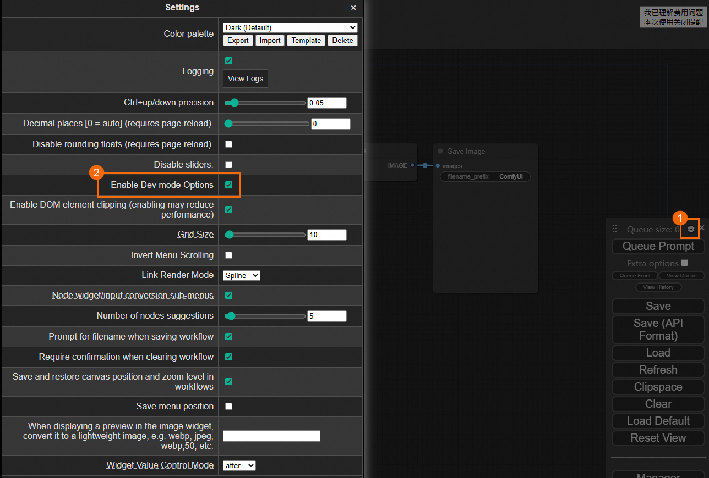
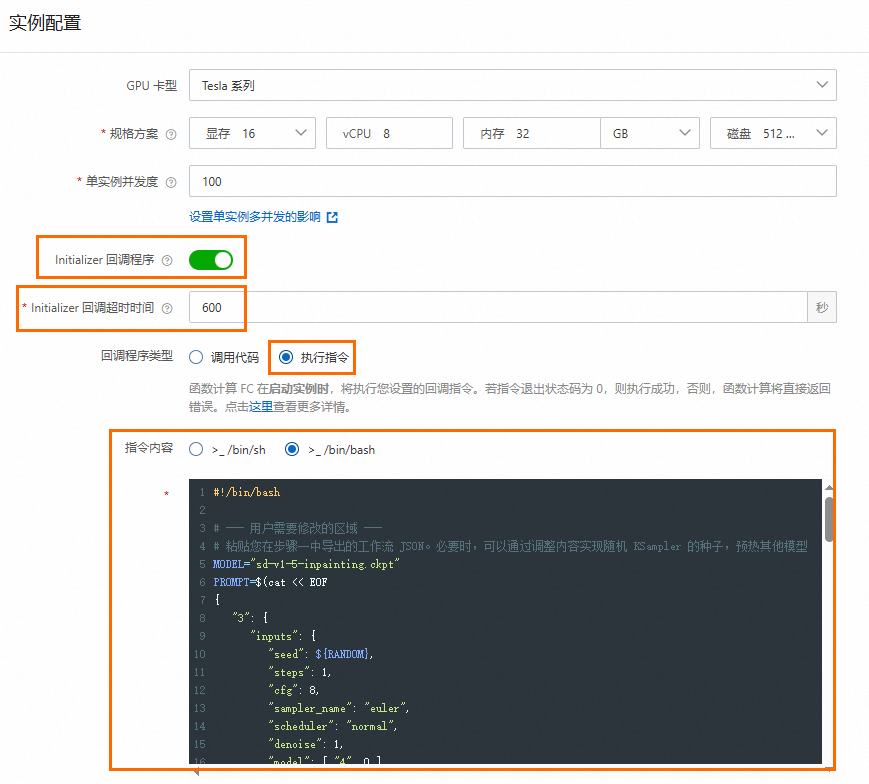
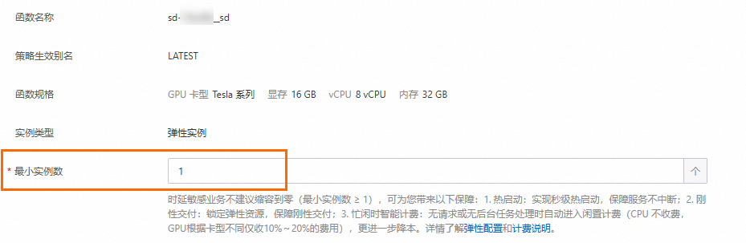

# 模型预热最佳实践

本文介绍在使用函数计算部署AI推理应用时，设置最小实例数≥1后，如何通过在Initializer回调程序中配置预热脚本实现模型预热，解决模型初次请求耗时较长的问题。

## 背景信息

基于最小实例数启动的弹性实例首次处理请求会进行模型加载等初始化操作，造成请求延迟增加，针对该现象，函数计算提供模型预热实现方法，[设置最小实例数](https://help.aliyun.com/zh/functioncompute/fc/configure-launch-snapshot-and-auto-scaling-rules#e5cd40eacddj7)后，会先进行用户自定义的模型预热动作，然后再接受请求，避免首次请求延迟过高。

## Initializer 回调程序

Initializer回调程序会在函数运行时启动后，执行用户配置的回调程序，回调程序分为**调用代码**和**执行指令**两种类型，详情请参见[配置实例生命周期](https://help.aliyun.com/zh/functioncompute/fc/function-instance-lifecycle)。两种类型的Initializer回调程序均可实现模型预热，**调用代码**类型需要改造镜像程序，新增POST`/initialize`路径实现模型预热逻辑，**执行指令**类型无需改造镜像，在函数生命周期中配置预热脚本即可。

## ComfyUI 文生图服务模型预热

**

**说明**

阿里云函数计算Function AI提供了更便捷的图形化预热配置能力。如果您的应用通过Function AI部署，强烈推荐您优先使用其内置的预热功能，操作更简单，详见[如何对模型进行预热避免首次出图请求耗时过长？](https://help.aliyun.com/zh/cap/user-guide/comfyui-faq#e27628b834fzt)。

下文以通过函数计算部署的ComfyUI文生图服务为例，介绍如何通过Initializer回调程序的执行指令，实现零代码改造的模型预热，是一种更底层的预热方法，适用于未使用Function AI或需要更高自定义程度的场景。

### **1.创建ComfyUI文生图服务**

1. 登录[函数计算控制台](https://fcnext.console.aliyun.com/)，在左侧导航栏，选择**更多功能**>**应用**，然后单击**创建应用**。
2. 在**创建应用**页面，选择**通过模板创建应用**，在**人工智能**页签下找到**流程式 AI 图片生成 ComfyUI**，光标移至该卡片，然后单击**立即创建**。
3. 在**创建应用**页面，选择地域和内置模型，单击**创建应用**，在弹出的对话框，仔细阅读应用创建提醒信息，勾选涉及的计费项和**我已经了解上面的内容，并同意上述描述**，然后单击**同意并继续部署**。
  
  本文以**黏土风格**的内置模型为例。

### **2.制作预热脚本**

1. 应用部署成功后，在应用详情页面，选择**环境详情**页签，单击**环境信息**区域的访问域名，打开ComfyUI应用界面。
2. 单击，然后在**settings**对话框，勾选**Enable Dev mode Options**复选框开启开发者模式。
  
  
3. 单击**Save（API Format）**导出工作流JSON文件`workflow_api.json`。
4. 制作模型预热脚本。
  
  **
  
  **重要**
  
  - 对于预热工作流的构造，需要满足以下要求。
    
    - 工作流能正确运行，确保其中所需的模型、插件和自定义节点都已在函数实例中正确安装。
    - 如需预热多个模型，可以在工作流中添加多个模型加载器，或延伸出子工作流。
  - 预热的核心是加载模型到显存，而非生成高质量图片。因此，建议您通过以下方式缩短预热时间。
    
    - 采样器迭代步数steps调整为1。
    - 图像尺寸width/height调整为最小值16 x 16。
  
  示例脚本如下。使用前，请先替换两个EOF之间的内容为上一步导出的工作流JSON，调低关键参数steps和width/height的值以减少预热时间。
  
  ```
  #!/bin/bash # --- 用户需要修改的区域 --- # 粘贴您在步骤一中导出的工作流 JSON。必要时，可以通过调整内容实现随机 KSampler 的种子，预热其他模型 PROMPT=$(cat << EOF { "3": { "inputs": { "seed": 490449184065642, "steps": 1, "cfg": 8, "sampler_name": "euler", "scheduler": "normal", "denoise": 1, "model": [ "4", 0 ], "positive": [ "6", 0 ], "negative": [ "7", 0 ], "latent_image": [ "5", 0 ] }, "class_type": "KSampler", "_meta": { "title": "KSampler" } }, "4": { "inputs": { "ckpt_name": "Anime天空之境SDXL.safetensors" }, "class_type": "CheckpointLoaderSimple", "_meta": { "title": "Load Checkpoint" } }, "5": { "inputs": { "width": 16, "height": 16, "batch_size": 1 }, "class_type": "EmptyLatentImage", "_meta": { "title": "Empty Latent Image" } }, "6": { "inputs": { "text": "beautiful scenery nature glass bottle landscape, , purple galaxy bottle,", "clip": [ "4", 1 ] }, "class_type": "CLIPTextEncode", "_meta": { "title": "CLIP Text Encode (Prompt)" } }, "7": { "inputs": { "text": "text, watermark", "clip": [ "4", 1 ] }, "class_type": "CLIPTextEncode", "_meta": { "title": "CLIP Text Encode (Prompt)" } }, "8": { "inputs": { "samples": [ "3", 0 ], "vae": [ "4", 2 ] }, "class_type": "VAEDecode", "_meta": { "title": "VAE Decode" } }, "9": { "inputs": { "filename_prefix": "ComfyUI", "images": [ "8", 0 ] }, "class_type": "SaveImage", "_meta": { "title": "Save Image" } } } EOF ) # --- 脚本核心逻辑 (无需修改) --- # 解析 JSON function parseJSON() { echo $1 | python3 -c "import json; print(json.loads(input())$2)" 2> /dev/null || echo "" } # 打印包含时间的日志 function Log() { echo "$(date '+%Y-%m-%d %H:%M:%S') - $1" } Log "开始预热 ComfyUI" Log "Prompt: $PROMPT" result=$(curl -XPOST http://127.0.0.1:9000/api/prompt -s -H "Content-Type: application/json" -d "{ \"client_id\": \"prewarm_client\", \"prompt\": ${PROMPT} }") prompt_id=$(parseJSON "$result" '["prompt_id"]') Log "Prompt ID: $prompt_id" if [ -z "$prompt_id" ]; then Log "获取 Prompt ID 失败，预热结束" else while true; do result=$(curl http://127.0.0.1:9000/api/history/${prompt_id} -s) Log "轮询结果: $result" outputs=$(parseJSON "$result" "['$prompt_id']['outputs']") if [ -n "$outputs" ]; then Log "出图结果: $outputs" break fi sleep 1 done Log "ComfyUI 预热结束" fi
  ```

### **3.配置模型预热功能**

1. 在应用详情页面的**资源信息**区域，单击ComfyUI函数`comfyui-****`跳转至函数详情页面。
2. 在函数详情页面，选择**配置**页签，单击**实例配置**区域右侧的**编辑**，在**实例配置**面板，开启Initializer回调程序，设置**超时时间**为600s，选择**执行指令**，然后在代码输入框填写上一步[制作的预热脚本](#97cec55cf9mlh)。
  
  该脚本会发送HTTP请求来生图，将模型加载至显存中，达到预热的效果。
  
  
3. 选择**弹性配置**页签，在下方**弹性策略**区域单击**配置**，在**配置弹性策略**面板，设置**最小实例数**为1，然后单击**确定**。
  
  
  
  等待当前**最小实例数**变为1，此时模型预热已经完成。
4. 返回至ComfyUI WebUI界面，您可以开始体验首次快速出图。

## LLM 服务模型预热

下文介绍如何在LLM服务中使用Initializer回调程序实现模型预热，实现函数实例的优雅上线。

### **准备工作**

请确保您已将本文示例模型Qwen3-8B存储至OSS Bucket，用于通过OSS挂载的方式供函数使用，操作详情请参见[配置OSS对象存储](https://help.aliyun.com/zh/functioncompute/fc/user-guide/configure-an-oss-file-system-1)。

### SGLang

1. 执行以下命令从Docker Hub拉取最新sglang镜像。
  
  ```
  docker pull lmsysorg/sglang:latest
  ```
  
  **
  
  **说明**
  
  由于网络访问限制，国内用户建议通过国内镜像源拉取。
2. 托管上一步获取的sglang镜像至阿里云容器镜像仓库，操作详情请参见[使用个人版实例推送拉取镜像](https://help.aliyun.com/zh/acr/user-guide/use-a-container-registry-personal-edition-instance-to-push-and-pull-images)。
3. 使用ACR中的镜像[创建镜像函数](https://help.aliyun.com/zh/functioncompute/fc/create-a-custom-container-function-in-a-container-runtime)。
4. 配置启动命令，操作详情请参见[创建自定义镜像函数](https://help.aliyun.com/zh/functioncompute/fc/create-a-custom-container-function-in-a-container-runtime)。
  
  ```
  python3 -m sglang.launch_server --model-path /mnt/model/Qwen3-8B --host 0.0.0.0 --port 8000
  ```
5. 配置Initializer回调程序的执行指令，操作详情请参见[步骤2](#490d68c9c9oe4)。
  
  ```
  #!/bin/sh # 定义变量 BASE_URL="http://localhost:8000" REQUEST_PATH="/v1/chat/completions" JSON_DATA='{ "model": "/mnt/model/Qwen3-8B", "messages": [ {"role": "system", "content": "You are a helpful assistant."}, {"role": "user", "content": "Who won the world series in 2020?"} ] }' # 超时时间（秒） TIMEOUT=60 start_time=$(date +%s) # 主循环 while true; do # 发送 HTTP 请求并获取状态码与响应体 http_code=$(curl -s -w "%{http_code}" \ -H "Content-Type: application/json" \ -d "$JSON_DATA" \ -X POST "${BASE_URL}${REQUEST_PATH}" \ -o /dev/stderr) # 检查 HTTP 状态码 if [ "$http_code" -eq 200 ]; then echo "{\"status\": \"success\", \"message\": \"HTTP code $http_code\"}" exit 0 elif [ "$http_code" -eq 404 ]; then echo "{\"status\": \"retrying\", \"message\": \"Received 404, retrying...\"}" >&2 elapsed_time=$(( $(date +%s) - start_time )) if [ "$elapsed_time" -ge "$TIMEOUT" ]; then echo "{\"status\": \"timeout\", \"message\": \"Request timed out after $TIMEOUT seconds\"}" exit 1 fi sleep 1 else echo "{\"status\": \"http_error\", \"code\": $http_code, \"message\": \"Unexpected HTTP status\"}" exit 1 fi done
  ```

### vLLM

1. 执行以下命令从Docker Hub拉取最新vllm镜像。
  
  ```
  docker pull vllm/vllm-openai:latest
  ```
  
  **
  
  **说明**
  
  由于网络访问限制，国内用户建议通过国内镜像源拉取。
2. 托管上一步获取的vllm镜像至阿里云容器镜像仓库，操作详情请参见[使用个人版实例推送拉取镜像](https://help.aliyun.com/zh/acr/user-guide/use-a-container-registry-personal-edition-instance-to-push-and-pull-images)。
3. 使用ACR中的镜像[创建镜像函数](https://help.aliyun.com/zh/functioncompute/fc/create-a-custom-container-function-in-a-container-runtime)。
4. 配置启动命令，操作详情请参见[创建自定义镜像函数](https://help.aliyun.com/zh/functioncompute/fc/create-a-custom-container-function-in-a-container-runtime)。
  
  ```
  python3 -m vllm.entrypoints.openai.api_server --model /mnt/model/Qwen3-8B --served-model-name /mnt/model/Qwen3-8B --max-model-len 8192
  ```
5. 配置Initializer回调程序的执行指令，操作详情请参见[配置实例生命周期回调方法](https://help.aliyun.com/zh/functioncompute/fc/function-instance-lifecycle#147f807035yah)。
  
  ```
  #!/bin/sh # 定义变量 BASE_URL="http://localhost:8000" REQUEST_PATH="/v1/chat/completions" JSON_DATA='{ "model": "/mnt/model/Qwen3-8B", "messages": [ {"role": "system", "content": "You are a helpful assistant."}, {"role": "user", "content": "Who won the world series in 2020?"} ] }' # 超时时间（秒） TIMEOUT=60 start_time=$(date +%s) # 主循环 while true; do # 发送 HTTP 请求并获取状态码与响应体 http_code=$(curl -s -w "%{http_code}" \ -H "Content-Type: application/json" \ -d "$JSON_DATA" \ -X POST "${BASE_URL}${REQUEST_PATH}" \ -o /dev/stderr) # 检查 HTTP 状态码 if [ "$http_code" -eq 200 ]; then echo "{\"status\": \"success\", \"message\": \"HTTP code $http_code\"}" exit 0 elif [ "$http_code" -eq 404 ]; then echo "{\"status\": \"retrying\", \"message\": \"Received 404, retrying...\"}" >&2 elapsed_time=$(( $(date +%s) - start_time )) if [ "$elapsed_time" -ge "$TIMEOUT" ]; then echo "{\"status\": \"timeout\", \"message\": \"Request timed out after $TIMEOUT seconds\"}" exit 1 fi sleep 1 else echo "{\"status\": \"http_error\", \"code\": $http_code, \"message\": \"Unexpected HTTP status\"}" exit 1 fi done
  ```
