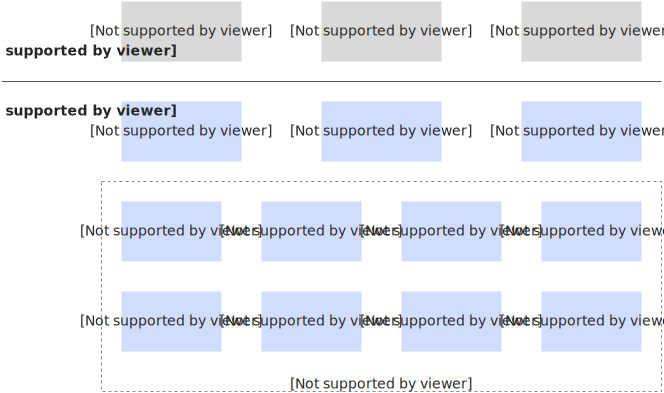
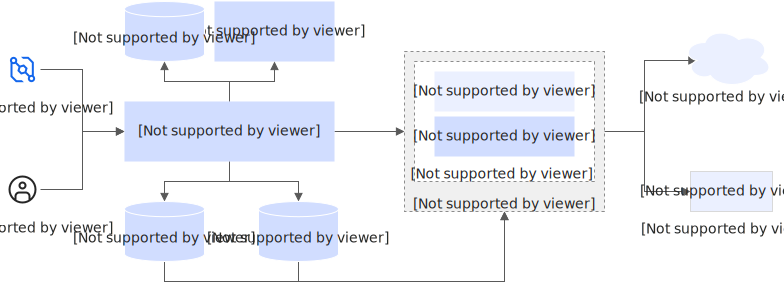

# 概述

本文从数据安全、用户隐私和用户使用角度介绍函数计算如何打造公共、开放和安全的云计算服务平台。

阿里云函数计算是事件驱动的全托管计算服务。通过函数计算，用户无需管理服务器等基础设施，只需编写代码并上传。函数计算会为用户准备好计算资源，以弹性、可靠的方式运行用户的代码，并提供日志查询、性能监控和报警等功能。

数据安全和用户隐私是阿里云最重要的原则。阿里云致力于打造公共、开放、安全的云计算服务平台。函数计算平台基于阿里云基础服务构建，为用户提供函数接入服务，调度服务，运行时环境等并负责这些服务的安全，而用户需要负责身份凭证以及函数代码、层和配置的安全性，如下图所示。

从用户使用角度，函数计算可分为控制面流程及数据面流程，如下图所示。

- 控制面流程
  
  包括函数权限控制、代码及配置的增删改查，主要包括函数元数据、代码、层和镜像缓存等安全传输及存储。
- 数据面流程
  
  函数的调用流程，调用流程包括接入服务、调度服务和计算节点三个模块。
  
  - 接入服务负责接收用户函数调用请求并发起调用。
  - 调度服务负责计算节点和函数实例的生命周期管理以及调用路由。
  - 计算节点包括多个函数实例，函数实例运行时环境负责执行用户代码。

