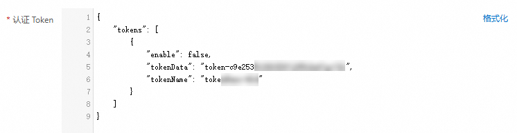

# 为HTTP触发器开启Bearer认证鉴权

在函数计算中，为HTTP触发器配置Bearer认证，让您的函数可以简便、安全的被授权用户访问。

## **背景信息**

函数计算支持为HTTP触发器开启Bearer认证。在Bearer认证中，用户通过在函数计算控制台上配置允许访问函数的token信息，客户端在发起访问时，通过Authorization Header携带有效的token信息，当访问请求中的token数据与触发器上配置的token数据匹配时，即可成功访问函数。

## **前提条件**

已创建函数并完成HTTP触发器的创建。具体操作，请参见[创建函数](https://help.aliyun.com/zh/functioncompute/fc/user-guide/function-instance-1/#662633180dmy3)和[配置HTTP触发器](https://help.aliyun.com/zh/functioncompute/fc/configure-an-http-trigger-for-a-function-and-invoke-the-function-by-using-http-requests#section-11e-t95-jq7)。

## **使用限制**

- 每个Token名称需要在单个触发器内唯一，最大长度为128字符，只能包含字母、数字、 下划线和中划线。不能以数字、中划线开头。
- 每个Token的值长度需要在32字符到128字符之间，并且只允许包含标准 Base64 字符 ‘A-Z’, ‘a-z’, ‘0-9’, ‘+’, ‘/’，‘=’，‘-’, ‘~’, ‘.’ 。
- 每个HTTP触发器允许配置的Token数量在1到20之间。
- 不同触发器的Token以及同一个触发器内的Token值应当不同，并且尽可能不要使用常见的排列组合作为Token的值，以免Token数据过于简单导致的安全问题。
- Bearer认证请在生产环境使用HTTPS协议，HTTP协议仅用于开发测试，因使用HTTP协议导致的Token泄漏，FC不承担安全责任。
- 函数计算仅负责存储和校验您配置的Token信息，Token的管理需要您自己负责。请及时轮换已经泄漏的Token和已经被证明是不安全的Token，Token使用时间较长时，也请主动轮换。

## **操作步骤**

### **步骤一：配置Bearer认证**

1. 登录[函数计算控制台](https://fcnext.console.aliyun.com)，在左侧导航栏，选择**函数管理**>**函数列表**。
2. 在顶部菜单栏，选择地域，然后在**函数列表**页面，单击目标函数。
3. 在函数详情页面，单击**触发器**页签，然后单击HTTP触发器**操作**列的**编辑**。
4. 在编辑触发器面板，设置以下配置项，然后单击**确定**。
  
  **认证方式**选择**Bearer认证**，**Token类型**选择Opaque，**认证Token**中`tokenData`的值配置为您自己的Token值。
  
  如果要禁用对应的Token，只需要将`enable`字段设置为`false`。
  
  
  
  如果需要配置多个Token，格式如下：
  
  ```
  { "tokens": [ { "enable": true, "tokenData": "token-8g7f2a2c9fc23hid82593421g995", "tokenName": "tokenName-20i" }, { "enable": true, "tokenData": "token-8g7f2a2c9fc23hid82593421g995", "tokenName": "tokenName-20i" } ] }
  ```

### **步骤二：操作验证**

通过curl工具，携带Authorization Header发起验证。

```
curl --data 您的数据 -X 访问方式 -H "Authorization: Bearer 您的Token数据" https://您的http触发器地址
```

示例值如下：

```
curl -X POST -H "Authorization: Bearer token-c9e25351******" https://******.cn-hangzhou.fcapp.run
```

## 常见问题

- **为什么开启Bearer认证后，访问域名提示：Authorization header is expected but missing。**
  
  该提示说明访问HTTP触发器未携带Authorization头，请在请求中增加Authorization信息。
- **为什么开启Bearer认证后，访问域名提示：access denied due to invalid bearer token。**
  
  该提示说明访问HTTP触发器未携带有效的Token信息，请检查Token数据是否传递正确，Token的数据来自于tokenData的值。
- **开启Bearer认证后，是否会产生额外的费用？**
  
  不会。函数计算默认提供的网关相关的功能计费都是在**函数调用次数**中进行收费，所以不管您是否开启Bearer认证，都不会产生额外的费用。
