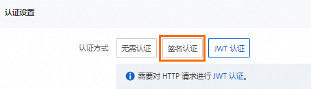
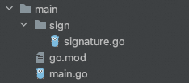

# 为自定义域名配置签名认证

函数计算支持为自定义配置签名认证，当请求消息到达函数计算网关后，网关会对开启签名认证的自定义域名上的请求进行认证，您的函数无需再次对请求签名进行认证，只需关注业务逻辑即可。本文介绍如何通过控制台为自定义域名配置签名认证。

## **前提条件**

[创建自定义域名](https://help.aliyun.com/zh/functioncompute/fc/configure-custom-domain-names#section-4yb-ztm-q9v)

## **操作步骤**

1. 登录[函数计算控制台](https://fcnext.console.aliyun.com)，在左侧导航栏，选择**函数管理**>**域名管理**。
2. 在顶部菜单栏，选择地域，然后在**域名管理**页面，单击目标域名。
3. 单击右上角的**编辑**，在编辑自定义域名页面的**认证设置**区域，**认证方式**设置为**签名认证**，然后单击**保存**。
  
  

## 结果验证

在本地编写代码并执行代码，代码目录结构如下。



代码示例如下。

- signature.go
  
  ```
  package sign import ( "bytes" "crypto/hmac" "crypto/sha1" "encoding/base64" "hash" "io" "net/http" "sort" "strings" ) // GetPOPAuthStr ... GetAuthStr get signature strings // // @param accessKeyID // @param accessKeySecret // @param req // @return string func GetPOPAuthStr(accessKeyID string, accessKeySecret string, req *http.Request) string { return "acs " + accessKeyID + ":" + GetPOPSignature(accessKeySecret, req) } // GetPOPSignature ... ... // // @param akSecret // @param req // @return string func GetPOPSignature(akSecret string, req *http.Request) string { stringToSign := getStringToSign(req) // fmt.Printf("stringToSign: %s\n", stringToSign) return GetROASignature(stringToSign, akSecret) } // GetROASignature ... ... // // @param stringToSign // @param secret // @return string func GetROASignature(stringToSign string, secret string) string { h := hmac.New(func() hash.Hash { return sha1.New() }, []byte(secret)) io.WriteString(h, stringToSign) signedStr := base64.StdEncoding.EncodeToString(h.Sum(nil)) return signedStr } // getStringToSign ... func getStringToSign(req *http.Request) string { queryParams := make(map[string]string) for k, v := range req.URL.Query() { queryParams[k] = v[0] } // sort QueryParams by key var queryKeys []string for key := range queryParams { queryKeys = append(queryKeys, key) } sort.Strings(queryKeys) tmp := "" for i := 0; i < len(queryKeys); i++ { queryKey := queryKeys[i] v := queryParams[queryKey] if v != "" { tmp = tmp + "&" + queryKey + "=" + v } else { tmp = tmp + "&" + queryKey } } resource := req.URL.EscapedPath() if tmp != "" { tmp = strings.TrimLeft(tmp, "&") resource = resource + "?" + tmp } return getSignedStr(req, resource) } func getSignedStr(req *http.Request, canonicalizedResource string) string { temp := make(map[string]string) for k, v := range req.Header { if strings.HasPrefix(strings.ToLower(k), "x-acs-") { temp[strings.ToLower(k)] = v[0] } } hs := newSorter(temp) // Sort the temp by the ascending order hs.Sort() // Get the canonicalizedOSSHeaders canonicalizedOSSHeaders := "" for i := range hs.Keys { canonicalizedOSSHeaders += hs.Keys[i] + ":" + hs.Vals[i] + "\n" } // Give other parameters values // when sign URL, date is expires date := req.Header.Get("Date") accept := req.Header.Get("Accept") contentType := req.Header.Get("Content-Type") contentMd5 := req.Header.Get("Content-MD5") signStr := req.Method + "\n" + accept + "\n" + contentMd5 + "\n" + contentType + "\n" + date + "\n" + canonicalizedOSSHeaders + canonicalizedResource return signStr } // Sorter ... type Sorter struct { Keys []string Vals []string } func newSorter(m map[string]string) *Sorter { hs := &Sorter{ Keys: make([]string, 0, len(m)), Vals: make([]string, 0, len(m)), } for k, v := range m { hs.Keys = append(hs.Keys, k) hs.Vals = append(hs.Vals, v) } return hs } // Sort is an additional function for function SignHeader. func (hs *Sorter) Sort() { sort.Sort(hs) } // Len is an additional function for function SignHeader. func (hs *Sorter) Len() int { return len(hs.Vals) } // Less is an additional function for function SignHeader. func (hs *Sorter) Less(i, j int) bool { return bytes.Compare([]byte(hs.Keys[i]), []byte(hs.Keys[j])) < 0 } // Swap is an additional function for function SignHeader. func (hs *Sorter) Swap(i, j int) { hs.Vals[i], hs.Vals[j] = hs.Vals[j], hs.Vals[i] hs.Keys[i], hs.Keys[j] = hs.Keys[j], hs.Keys[i] }
  ```
- go.mod
  
  ```
  module auth.fc.aliyun.com go 1.17
  ```
- main.go
  
  以下代码示例使用环境变量获取AccessKey的方式进行调用，仅供参考，建议使用更安全的STS方式。更多信息，请参见[创建AccessKey](https://help.aliyun.com/zh/ram/user-guide/create-an-accesskey-pair)和[管理访问凭证](https://help.aliyun.com/zh/sdk/developer-reference/v2-manage-go-access-credentials)。
  
  ```
  package main import ( "bytes" "encoding/json" "fmt" "io/ioutil" "net/http" "os" "time" "auth.fc.aliyun.com/sign" ) func main() { // 请求的URL，请根据实际修改 url := "您的自定义域名或者 HTTP 触发器地址" // 本示例将AccessKey ID和AccessKey Secret保存在环境变量中实现身份认证为例。 // 请确保代码运行环境设置了环境变量 ALIBABA_CLOUD_ACCESS_KEY_ID 和 ALIBABA_CLOUD_ACCESS_KEY_SECRET。 // 工程代码泄露可能会导致 AccessKey 泄露，并威胁账号下所有资源的安全性。 ak := os.Getenv("ALIBABA_CLOUD_ACCESS_KEY_ID") sk := os.Getenv("ALIBABA_CLOUD_ACCESS_KEY_SECRET") // 创建要发送的数据 data := map[string]interface{}{ "user": "FC 3.0", } jsonData, err := json.Marshal(data) if err != nil { fmt.Printf("Error encoding JSON: %s\n", err) return } // 创建请求实例 request, err := http.NewRequest("POST", url, bytes.NewBuffer(jsonData)) if err != nil { fmt.Printf("Error creating request: %s\n", err) return } // 添加请求头信息 request.Header.Set("Content-Type", "application/json") addAuthInfo(request, ak, sk) // 创建http.Client并发送请求 client := &http.Client{} response, err := client.Do(request) if err != nil { fmt.Printf("Error sending request to server: %s\n", err) return } defer response.Body.Close() // 读取响应内容 body, err := ioutil.ReadAll(response.Body) if err != nil { fmt.Printf("Error reading response body: %s\n", err) return } // 打印响应内容 fmt.Printf("Response Status: %s\n", response.Status) fmt.Printf("Response Body: %s\n", string(body)) } func addAuthInfo(req *http.Request, ak, sk string) { if req.Header.Get("Date") == "" { req.Header.Set("Date", time.Now().UTC().Format(http.TimeFormat)) } // copy from lambda-go-sdk sign-url-request if req.URL.Path == "" { req.URL.Path = "/" } authHeader := sign.GetPOPAuthStr(ak, sk, req) req.Header.Set("Authorization", authHeader) }
  ```

执行成功后结果如下，表示已成功地获取函数的Response。

```
Response Status: 200 OK Response Body: Hello World!
```

## **常见问题**

### **为什么自定义域名开启签名认证之后，通过自定义域名访问函数提示：required HTTP header Date was not specified？**

该提示说明认证失败，可能原因如下：

1. 没有在请求中进行签名。
2. 在请求中做了签名，但是没有提供Date这个Header。

### **为什么自定义域名开启签名认证之后，通过自定义域名访问函数提示：the difference between the request time 'Thu, 04 Jan 2024 01:33:13 GMT' and the current time 'Thu, 04 Jan 2024 08:34:58 GMT' is too large？**

该提示说明签名过期，请您重新使用当前时间进行签名。

### **为什么自定义域名开启签名认证之后，通过自定义域名访问函数提示：The request signature we calculated does not match the signature you provided. Check your access key and signing method？**

请求中的签名与函数计算计算得到的签名不一致，认证失败。
