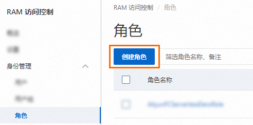
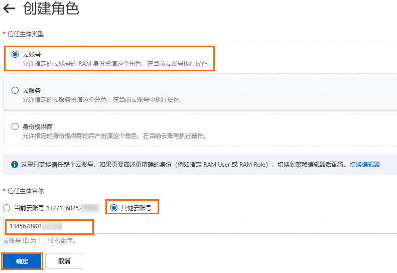
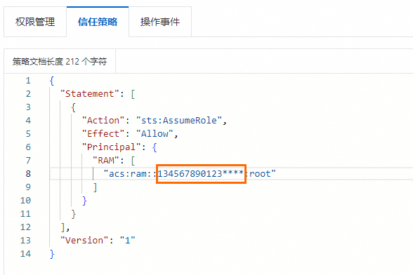
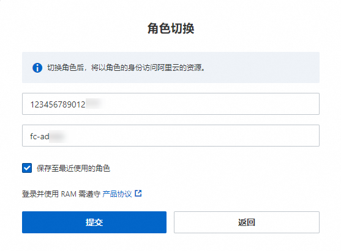

# 通过RAM角色实现跨云账号授权

您可以使用RAM控制台和SDK获取阿里云临时安全令牌STS（Security Token Service）并实现跨账号授权查看或管理函数计算的资源。

## 使用示例

企业A开通了函数计算服务，该企业需要企业B代为操作函数计算的资源。同时企业A有如下诉求：

- 希望能专注于业务系统，仅作为函数计算的所有者，同时，可以授权企业B操作部分业务，例如创建函数等。
- 当企业B的员工加入或离职时，无需做任何权限变更。企业B可以进一步将企业A的资源访问权限分配给企业B的RAM用户，并可以精细控制其RAM用户对资源的访问或操作权限。
- 如果双方合同终止，企业A随时可以撤销对企业B的授权。

## 使用控制台的操作步骤

假如企业A需要授权企业B的员工访问函数计算的所有函数。企业A和企业B下分别有一个阿里云账号A和阿里云账号B：

- 企业A的阿里云账号A，账号ID为`123456789012****`，账号别名（企业别名）为`company-a`。
- 企业B的阿里云账号B，账号ID为`134567890123****`，账号别名（企业别名）为`company-b`。

### **步骤一：阿里云账号A创建RAM角色**

使用阿里云账号A创建一个RAM角色，并为RAM角色授予适当的权限，允许阿里云账号B使用该角色，即**其他云账号**选择阿里云账号B。

1. 使用阿里云账号A登录[RAM控制台](https://ram.console.aliyun.com/)。
2. 在左侧导航栏，选择**身份管理**>**角色**。
3. 在**角色**页面，单击**创建角色**。
  
  
4. 在**创建角色**页面，选择**信任主体类型**为**云账号**，**信任主体名称**选择**其他云账号**，并填写阿里云账号B账号ID，最后单击**确定**。
  
  
5. 在**创建角色**对话框，输入**角色名称**，然后单击**确定**。
6. 在阿里云账号A下，为创建的RAM角色添加AliyunFCReadOnlyAccess权限。关于如何为RAM角色授权，请参见[为RAM角色授权](https://help.aliyun.com/zh/ram/user-guide/grant-permissions-to-a-ram-role#task-187801)。
7. 单击创建的RAM角色，在角色详情页面，选择**信任策略**页签，编辑RAM角色的信任策略，允许阿里云账号B下的RAM用户来扮演该RAM角色。
  
  将`accountid`部分修改为阿里云账号B的账号ID。修改后的策略表示仅允许阿里云账号B下的RAM用户来扮演该RAM角色。
  
  

### **步骤二：阿里云账号B创建RAM用户**

1. 使用阿里云账号B为其员工创建RAM用户。关于如何创建RAM用户，请参见[创建RAM用户](https://help.aliyun.com/zh/ram/user-guide/create-a-ram-user#task-187540)。
2. 使用阿里云账号B为创建好的RAM用户添加AliyunSTSAssumeRoleAccess权限，即允许RAM用户扮演RAM角色。关于如何为RAM用户添加权限，请参见[为RAM用户授权](https://help.aliyun.com/zh/ram/user-guide/grant-permissions-to-the-ram-user#task-187800)。

### **步骤三：切换身份登录**

当阿里云账号B下的某个员工（RAM用户）需要访问阿里云账号A下的资源时，阿里云账号B可以自主进行授权控制。即阿里云账号B下的RAM用户扮演阿里云账号A下的RAM角色访问阿里云账号A下的资源。具体操作如下：

1. 使用阿里云账号B的RAM用户登录[RAM控制台](https://ram.console.aliyun.com/)。
  
  关于RAM用户登录控制台的详细信息，请参见[RAM用户登录阿里云控制台](https://help.aliyun.com/zh/ram/user-guide/log-on-to-the-alibaba-cloud-management-console-as-a-ram-user#task-2170094)。
2. 将鼠标悬停在右上角头像的位置，单击**切换身份**，在弹出的**角色切换**对话框填写以下内容，然后单击**提交**。
  
  - 输入RAM角色对应的企业别名A（账号别名）、默认域名或归属的阿里云账号A（主账号）ID，三者取其一即可。更多信息，请参见[查看和修改默认域名](https://help.aliyun.com/zh/ram/user-guide/view-and-modify-the-default-domain-name#task-221524)。
  - 输入在企业A阿里云账号下创建的RAM角色名称。更多信息，请参见[查看RAM角色](https://help.aliyun.com/zh/ram/user-guide/view-the-information-about-a-ram-role#task-188120)。
  
  
  
  更多信息，请参见[扮演RAM角色](https://help.aliyun.com/zh/ram/user-guide/assume-a-ram-role#task-221553)。

修改后，使用阿里云账号B的RAM用户登录[函数计算控制台](https://fcnext.console.aliyun.com/overview)，可以看到阿里云账号A下的所有资源。

### **（可选）撤消授权**

如果企业A与企业B的合作终止了，企业A只需要撤销阿里云账号B对RAM角色的使用即可。可以直接删除为企业B使用而创建的RAM角色，此时阿里云账号B下的所有RAM用户对RAM角色的使用权限将被撤销。具体操作如下：

1. 阿里云账号A登录[RAM控制台](https://ram.console.aliyun.com/)。
2. 在左侧导航栏，选择**身份管理**>**角色**。
3. 在**角色**页面，单击目标RAM角色**操作**列的**删除角色**。
4. 在**删除角色**对话框，输入RAM角色名称，然后单击**删除角色**。

**

**说明**

在删除RAM角色前，请先为RAM角色移除权限。具体操作，请参见[为RAM角色移除权限](https://help.aliyun.com/zh/ram/remove-permissions-from-a-ram-role#task-188178)。

## 使用SDK的操作步骤

函数计算可以通过STS进行临时授权访问。STS是为云计算使用者提供临时访问令牌的Web服务。以下示例展示，阿里云账号B如何获取查看阿里云账号A下所有服务的权限。

### **前提条件**

[创建函数](https://help.aliyun.com/zh/functioncompute/fc/user-guide/creating-a-web-function#section-b9y-zn1-5wr)

### **操作步骤**

1. 使用阿里云账号A创建RAM角色，并选择信任的云账号为阿里云账号B。
  
  具体操作，请参见[创建可信实体为阿里云账号的RAM角色](https://help.aliyun.com/zh/ram/user-guide/create-a-ram-role-for-a-trusted-alibaba-cloud-account#task-xvr-ftf-xdb)。
2. 使用阿里云账号B创建RAM用户，并为其授予扮演RAM角色的权限。
  
  具体操作，请参见[创建RAM用户](https://help.aliyun.com/zh/ram/user-guide/create-a-ram-user#task-187540)和[为RAM用户授权](https://help.aliyun.com/zh/ram/user-guide/grant-permissions-to-the-ram-user#task-187800)。
3. 在阿里云账号B的函数中，输入以下示例代码，获取临时访问凭证。更多信息，请参见[STS SDK概览](https://help.aliyun.com/zh/ram/developer-reference/sts-sdk-overview#reference-w5t-25v-xdb)和[AssumeRole](https://help.aliyun.com/zh/ram/api-assumerole#reference-clc-3sv-xdb)。
  
  Node.js
  
  ```
  const Core = require('@alicloud/pop-core'); //构建一个阿里云客户端, 用于发起请求。 /* 阿里云账号AccessKey拥有所有API的访问权限，建议您使用RAM用户进行API访问或日常运维。 建议不要把AccessKey ID和AccessKey Secret保存到工程代码里，否则可能导致AccessKey泄露，威胁您账号下所有资源的安全。 本示例以将AccessKey ID和AccessKey Secret保存在环境变量中实现身份验证为例。 在运行本示例前请先在本地环境中设置环境变量ALIBABA_CLOUD_ACCESS_KEY_ID和ALIBABA_CLOUD_ACCESS_KEY_SECRET。 在FC Runtime运行环境下，配置执行权限后，ALIBABA_CLOUD_ACCESS_KEY_ID和ALIBABA_CLOUD_ACCESS_KEY_SECRET环境变量会自动被设置。 */ var client = new Core({ accessKeyId: process.env['ALIBABA_CLOUD_ACCESS_KEY_ID'], accessKeySecret: process.env['ALIBABA_CLOUD_ACCESS_KEY_SECRET'], endpoint: 'https://sts.aliyuncs.com', apiVersion: '2015-04-01' }); //设置参数。 var params = { "RegionId": "cn-hangzhou", "RoleArn": "<RoleARN>", "RoleSessionName": "<RoleSessionName>" } var requestOption = { method: 'POST' }; //发起请求，并得到响应。 client.request('AssumeRole', params, requestOption).then((result) => { console.log(JSON.stringify(result)); }, (ex) => { console.log(ex); })
  ```
  
  Python
  
  ```
  # -*- coding: utf-8 -*- from alibabacloud_tea_openapi.models import Config from alibabacloud_sts20150401.client import Client from alibabacloud_sts20150401.models import AssumeRoleRequest def main(): # 输入用户临时密钥，包括临时Token # 阿里云账号AccessKey拥有所有API的访问权限，建议您使用RAM用户进行API访问或日常运维。 # 建议不要把AccessKey ID和AccessKey Secret保存到工程代码里，否则可能导致AccessKey泄露，威胁您账号下所有资源的安全。 # 本示例以将AccessKey ID和AccessKey Secret保存在环境变量中实现身份验证为例。 # 运行本示例前请先在本地环境中设置环境变量ALIBABA_CLOUD_ACCESS_KEY_ID和ALIBABA_CLOUD_ACCESS_KEY_SECRET。 # 在FC Runtime运行环境下，配置执行权限后，ALIBABA_CLOUD_ACCESS_KEY_ID和ALIBABA_CLOUD_ACCESS_KEY_SECRET环境变量会自动被设置。 AccessKeySecret=os.getenv('ALIBABA_CLOUD_ACCESS_KEY_SECRET')) AccessKeyId=os.getenv('ALIBABA_CLOUD_ACCESS_KEY_ID') regionId ='cn-hangzhou' config = Config( access_key_id='<ACCESS-KEY-ID>', access_key_secret='<ACCESS-KEY-SECRET>', region_id='cn-hangzhou' ) client = Client(config) assume_role_request = AssumeRoleRequest( duration_seconds=3600, role_arn='<RoleARN>', role_session_name='fc-python-sdk' ) response = client.assume_role(assume_role_request) response_json = json.loads(str(response.body).replace("'", "\"")) result = json.dumps(response_json) print(result) if __name__ == "__main__": main()
  ```
  
  预期输出。
  
  ```
  { "RequestId": "964E0EC5-575B-4FF5-8FD0-D4BD8025602A", "AssumedRoleUser": { "Arn": "acs:ram::****:role/wss/wss", "AssumedRoleId": "***********:wss" }, "Credentials": { "SecurityToken": "*************", "AccessKeyId": "STS.*************", "AccessKeySecret": "*************", "Expiration": "2023-05-28T11:23:19Z" } }
  ```
  
  **
  
  **说明**
  
  获取`SecurityToken`时，可能遇到的常见问题，请参见[RAM角色和STS Token常见问题](https://help.aliyun.com/zh/ram/support/faq-about-ram-roles-and-sts-tokens#concept-wsg-bsx-ydb)。
4. 修改阿里云账号B的函数代码，使其RAM用户具有查看阿里云账号A下函数计算的所有服务的权限。
  
  示例如下：
  
  ```
  const FC = require('@alicloud/fc2'); // 构建客户端。 // 设置密钥信息为获取的临时密钥信息。/* 阿里云账号AccessKey拥有所有API的访问权限，建议您使用RAM用户进行API访问或日常运维。 建议不要把AccessKey ID和AccessKey Secret保存到工程代码里，否则可能导致AccessKey泄露，威胁您账号下所有资源的安全。 本示例以将AccessKey ID和AccessKey Secret保存在环境变量中实现身份验证为例。 运行本示例前请先在本地环境中设置环境变量ALIBABA_CLOUD_ACCESS_KEY_ID、ALIBABA_CLOUD_ACCESS_KEY_SECRET和ALIBABA_CLOUD_SECURITY_TOKEN。 在FC Runtime运行环境下，配置执行权限后，ALIBABA_CLOUD_ACCESS_KEY_ID、ALIBABA_CLOUD_ACCESS_KEY_SECRET和ALIBABA_CLOUD_SECURITY_TOKEN环境变量会自动被设置。 */ const client = new FC('<accountID>', { region: '<yourRegionID>', accessKeyID: process.env['ALIBABA_CLOUD_ACCESS_KEY_ID'], securityToken: process.env['ALIBABA_CLOUD_SECURITY_TOKEN'], accessKeySecret: process.env['ALIBABA_CLOUD_ACCESS_KEY_SECRET'], }); // 获取服务列表。 client.listServices().then(res => { console.log(JSON.stringify(res, null, ' ')) }).catch(ex=> console.log(ex))
  ```
  
  **
  
  **重要**
  
  请确保临时密钥的授权角色，即阿里云账号A创建的角色具有获取服务列表的权限。
