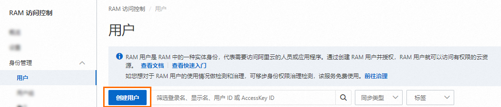
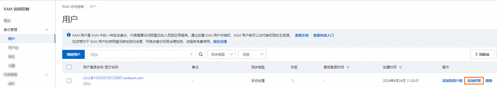

# 通过阿里云账号给RAM用户授权

借助访问控制的RAM用户，您可以实现阿里云账号和RAM用户的权限分割，避免因暴露阿里云账号密钥，造成安全风险。按需为RAM用户赋予权限后，您可以限定拥有指定权限的RAM用户在函数计算控制台访问或管理资源。本文介绍如何通过阿里云账号创建并授权RAM用户，以及授权后的RAM用户如何管理资源。

## 应用场景

企业A开通了函数计算服务，该企业需要员工操作函数计算的相关资源，例如创建函数和删除函数等。由于每个员工的工作职责不一样，所以需要的权限也不一样。企业A的需求如下：

- 出于安全或信任的考虑，不希望将阿里云账号密钥直接透露给员工，希望给员工创建相应的RAM用户账号。
- RAM用户账号只能在授权的前提下操作资源，不需要对RAM用户账号进行独立的计量计费，所有开销都计入企业的阿里云账号名下。
- 随时可以撤销RAM用户账号的权限，也可以随时删除其创建的RAM用户账号。

## 步骤一：使用企业A的阿里云账号为员工创建RAM用户

### 操作步骤

1. 使用阿里云账号（主账号）或RAM管理员登录[RAM控制台](https://ram.console.aliyun.com/)。
2. 在左侧导航栏，选择**身份管理**>**用户**。
3. 在**用户**页面，单击**创建用户**。
  
  
4. 在**创建用户**页面的**用户账号信息**区域，设置用户基本信息。
  
  - **登录名称**：可包含英文字母、数字、半角句号（.）、短划线（-）和下划线（_），最多64个字符。
  - **显示名称**：最多包含128个字符或汉字。
  - **标签**：单击，然后输入标签键和标签值。为RAM用户绑定标签，便于后续基于标签的用户管理。
  
  **
  
  **说明**
  
  单击**添加用户**，可以批量创建多个RAM用户。
5. 在**访问方式**区域，选择访问方式，然后设置对应参数。
  
  为了账号安全，建议您只选择以下访问方式中的一种，将人员用户和应用程序用户分离，避免混用。
  
  - **控制台访问**
    
    如果RAM用户代表人员，建议启用控制台访问，使用用户名和登录密码访问阿里云。您需要设置以下参数：
    
    - 控制台登录密码：选择自动生成密码或者自定义密码。自定义登录密码时，密码必须满足密码复杂度规则。更多信息，请参见[设置RAM用户密码强度](https://help.aliyun.com/zh/ram/user-guide/configure-a-password-policy-for-ram-users#task-188785)。
    - 密码重置策略：选择RAM用户在下次登录时是否需要重置密码。
    - 多因素认证（MFA）策略：选择是否为当前RAM用户启用MFA。启用MFA后，还需要绑定MFA设备。更多信息，请参见[为RAM用户绑定MFA设备](https://help.aliyun.com/zh/ram/user-guide/ram-users-bind-mfa-devices-by-themselves#task-268585)。
  - **使用永久AccessKey访问**
    
    如果RAM用户代表应用程序，您可以使用永久访问密钥（AccessKey）访问阿里云。启用后，系统会自动为RAM用户生成一个AccessKey ID和AccessKey Secret。更多信息，请参见[创建AccessKey](https://help.aliyun.com/zh/ram/user-guide/create-an-accesskey-pair#task-2245479)。
    
    **
    
    **重要**
    
    - RAM用户的AccessKey Secret只在创建时显示，不支持查看，请妥善保管。
    - 访问密钥（AccessKey）是一种长期有效的程序访问凭证。AccessKey泄露会威胁该账号下所有资源的安全。建议优先采用STS Token临时凭证方案，降低凭证泄露的风险。更多信息，请参见[使用访问凭据访问阿里云OpenAPI最佳实践](https://help.aliyun.com/zh/ram/use-cases/best-practices-for-programmatic-access-to-alibaba-cloud)。
6. 单击**确定**。
7. 根据界面提示，完成安全验证。

## 步骤二：为RAM用户授权

1. 使用RAM管理员登录[RAM控制台](https://ram.console.aliyun.com/)。
2. 在左侧导航栏，选择**身份管理**>**用户**。
3. 在**用户**页面，单击目标RAM用户**操作**列的**添加权限**。
  
  
  
  您也可以选中多个RAM用户，单击用户列表下方的**添加权限**，为RAM用户批量授权。
4. 在**新增授权**面板，为RAM用户添加权限。
  
  1. 选择资源范围。
    
    - **账号级别**：权限在当前阿里云账号内生效。
    - **资源组级别**：权限在指定的资源组内生效。
      
      **
      
      **重要**
      
      指定资源组授权生效的前提是该云服务及资源类型已支持资源组，详情请参见[支持资源组的云服务](https://help.aliyun.com/zh/resource-management/resource-group/product-overview/services-that-work-with-resource-group#concept-flc-p3m-4fb)。资源组授权示例，请参见[使用资源组限制RAM用户管理指定的ECS实例](https://help.aliyun.com/zh/ram/use-cases/use-a-resource-group-to-manage-an-ecs-instance)。
  2. 选择授权主体。
    
    授权主体即需要添加权限的RAM用户。系统会自动选择当前的RAM用户。
  3. 选择权限策略。
    
    权限策略是一组访问权限的集合，分为以下两种。支持批量选中多条权限策略。
    
    - 系统策略：由阿里云创建，策略的版本更新由阿里云维护，用户只能使用不能修改。更多信息，请参见[支持RAM的云服务](https://help.aliyun.com/zh/ram/product-overview/services-that-work-with-ram)。
      
      **
      
      **说明**
      
      系统会自动标识出高风险系统策略（例如：AdministratorAccess、AliyunRAMFullAccess等），授权时，尽量避免授予不必要的高风险权限策略。
    - 自定义策略：由用户管理，策略的版本更新由用户维护。用户可以自主创建、更新和删除自定义策略。更多信息，请参见[创建自定义权限策略](https://help.aliyun.com/zh/ram/create-a-custom-policy)。
  4. 单击**确认新增授权**。
5. 单击**关闭**。

**

**说明**

以上为RAM用户授权操作中，选择的权限策略可以为系统策略，也可以为自定义策略。具体信息，请参见[权限策略及示例](https://help.aliyun.com/zh/functioncompute/fc/policies-and-sample-policies)。您可以自主创建、更新和删除自定义策略。具体操作步骤，请参见[创建自定义权限策略](https://help.aliyun.com/zh/ram/create-a-custom-policy#task-2149286)。

## 后续步骤

使用阿里云账号创建RAM用户后，企业A即可将已创建的RAM用户的登录用户名、密码或AccessKey信息分发给使用者。使用者可以使用RAM用户登录阿里云控制台或调用API。

- 登录阿里云控制台
  
  具体操作步骤，请参见[RAM用户登录阿里云控制台](https://help.aliyun.com/zh/ram/user-guide/log-on-to-the-alibaba-cloud-management-console-as-a-ram-user#task-2170094)。
- 调用API
  
  您可以在代码中使用RAM用户的AccessKey ID和AccessKey Secret调用API，访问函数计算。
