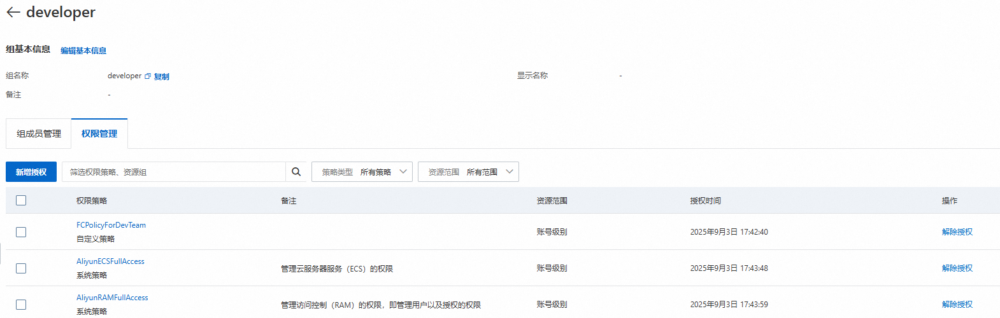
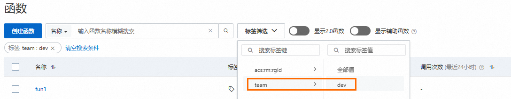

# 授予不同RAM用户不同分组函数的操作权限

函数计算支持通过标签Tag对函数进行多维分类管理，便于快速检索资源，也可以通过标签实现精细化权限管控，通过为不同RAM用户或用户组授予不同的权限，实现RAM用户间资源隔离，提升安全管理效率。

## **应用场景**

某企业的阿里云主账号创建了多个函数，需要按业务分组将不同的函数授权给不同的团队，企业希望每个团队只能查看和管理被授权的函数，未被授权的函数不允许查看和管理。

例如：

- 开发团队：只能管理开发环境相关的函数
- 运维团队：只能管理生产环境相关的函数

## **注意事项**

- 为遵循最小授权原则，请不要为RAM用户授予权限策略`AliyunFCFullAccess`或`AliyunFCReadOnlyAccess`等权限级别过高的策略，否则将不能使用本文介绍的通过函数标签分组管理函数。
- RAM用户必须使用标签筛选才能查看和管理对应授权的函数，否则，RAM用户无法查看任何函数。
- 确保RAM用户操作时选择的地域与资源组内函数所在地域一致。
- RAM用户组中的RAM用户自动继承RAM用户组的权限。
- 函数下的子资源与配置，包括别名、触发器、函数异步配置、函数并发配置、实例、VPC绑定、异步任务等，都将遵循函数的权限控制，只能被有对应标签的RAM用户管理。

## **流程概览**

1. 按标签标识不同团队的函数
  
  规划两个标签，分别用来标识developer团队和operator团队。
2. 将RAM用户分组
  
  规划两个RAM用户，分别对应developer团队和operator团队，将对应团队的RAM用户加入到对应的RAM用户组。
3. 基于标签鉴权对RAM用户组进行授权
  
  规划两个自定义权限策略，使用标签鉴权Condition确定资源范围。然后，将不同的权限策略授权给不同的RAM用户组，RAM用户组中的RAM用户将继承RAM用户组的权限。

详细规划见下表：

| **团队** | **RAM用户组** | **RAM权限策略** | **标签** |
| --- | --- | --- | --- |
| developer团队 | developer | FCPolicyForDevTeam | - 标签键：team<br>- 标签值：dev |
| operator团队 | operator | FCPolicyForOpsTeam | - 标签键：team<br>- 标签值：ops |

## **操作步骤**

1. 创建函数并绑定标签。
  
  使用阿里云主账号登录[函数计算控制台](https://fcnext.console.aliyun.com/)，[创建函数](https://help.aliyun.com/zh/functioncompute/fc/user-guide/function-instance-1/)，并为部分函数绑定标签`team:dev`，部分函数绑定标签`team:ops`。关于绑定标签的具体操作，请参见[标签管理](https://help.aliyun.com/zh/functioncompute/fc/user-guide/function-tags-management#section-npa-jen-09l)。
2. 创建RAM用户。
  
  使用阿里云主账号登录[RAM控制台](https://ram.console.aliyun.com/)创建两个RAM用户。具体操作，请参见[创建RAM用户](https://help.aliyun.com/zh/ram/user-guide/create-a-ram-user#task-187540)。
3. 创建RAM用户组并绑定RAM用户。绑定后RAM用户将继承对应RAM用户组的权限。
  
  使用阿里云主账号登录[RAM控制台](https://ram.console.aliyun.com/)创建developer和operator两个用户组，将已创建的两个RAM用户分别添加到用户组developer和operator下。具体操作，请参见[创建RAM用户组](https://help.aliyun.com/zh/ram/user-guide/create-a-user-group#task-187540)和[为RAM用户组添加RAM用户](https://help.aliyun.com/zh/ram/user-guide/add-a-ram-user-to-a-ram-user-group#task-187540)。
4. 创建自定义权限策略。
  
  权限策略分为系统权限策略和自定义权限策略，根据实际场景选择合适的权限策略。本文以为用户组授予自定义权限策略为例进行介绍。
  
  使用阿里云主账号登录[RAM控制台](https://ram.console.aliyun.com/)，[创建自定义权限策略](https://help.aliyun.com/zh/ram/create-a-custom-policy#task-glf-vwf-xdb)。
  
  - 假设给developer团队创建的自定义策略名称为FCPolicyForDevTeam，策略示例如下。
    
    ```
    { "Version": "1", "Statement": [ { "Effect": "Allow", "Action": "fc:*", "Resource": "*", "Condition": { "StringEquals": { "acs:RequestTag/team": [ "dev" ] } } }, { "Effect": "Allow", "Action": "fc:*", "Resource": "*", "Condition": { "StringEquals": { "acs:ResourceTag/team": [ "dev" ] } } }, { "Effect": "Allow", "Action": [ "fc:ListTaggedResources", "tag:ListTagKeys", "fc:GetAccountSettings" ], "Resource": "*" }, { "Effect": "Deny", "Action": [ "fc:UntagResources", "fc:TagResources" ], "Resource": "*" } ] }
    ```
  - 假设给operator团队创建的自定义策略名称为FCPolicyForOpsTeam，策略示例如下。
    
    ```
    { "Version": "1", "Statement": [ { "Effect": "Allow", "Action": "fc:*", "Resource": "*", "Condition": { "StringEquals": { "acs:RequestTag/team": [ "ops" ] } } }, { "Effect": "Allow", "Action": "fc:*", "Resource": "*", "Condition": { "StringEquals": { "acs:ResourceTag/team": [ "ops" ] } } }, { "Effect": "Allow", "Action": [ "fc:ListTaggedResources", "tag:ListTagKeys", "fc:GetAccountSettings" ], "Resource": "*" }, { "Effect": "Deny", "Action": [ "fc:UntagResources", "fc:TagResources" ], "Resource": "*" } ] }
    ```
  
  **展开查看可选策略**
  
  为了避免日常使用函数计算时出现权限不足的问题，可以添加以下可选策略。
  
  ```
  { "Effect": "Allow", "Action": [ "log:Get*", "log:List*", "log:Query*", "log:CreateProject", "log:CreateLogStore", "log:CreateIndex" ], "Resource": "*" }, { "Effect": "Allow", "Action": [ "fc:GetLayerVersionByArn", "fc:ListLayers", "fc:PutLayerACL", "fc:ListLayerVersions", "fc:CreateLayerVersion", "fc:DeleteLayerVersion", "fc:GetLayerVersion" ], "Resource": "*" }, { "Effect": "Allow", "Action": [ "fc:ListCustomDomains", "fc:GetCustomDomain", "fc:DeleteCustomDomain", "fc:UpdateCustomDomain", "fc:CreateCustomDomain" ], "Resource": "*" }, { "Effect": "Allow", "Action": "ram:ListRoles", "Resource": "*" }
  ```
  
  权限策略说明如下：
  
  | **策略内容** | **策略说明** |
  | --- | --- |
  | ```<br>{ "Effect": "Allow", "Action": "fc:*", "Resource": "*", "Condition": { "StringEquals": { "acs:RequestTag/team": [ "dev" ] } } }<br>``` | 允许RAM用户通过标签`team:dev`筛选函数，以及控制RAM用户创建函数时，必须同时指定标签`team:dev`。 |
  | ```<br>{ "Effect": "Allow", "Action": "fc:*", "Resource": "*", "Condition": { "StringEquals": { "acs:ResourceTag/team": [ "dev" ] } } }<br>``` | 限制RAM用户只能对绑定了标签`team:dev`的函数进行管理操作。 |
  | ```<br>{ "Effect": "Allow", "Action": [ "fc:ListTaggedResources", "tag:ListTagKeys", "fc:GetAccountSettings" ], "Resource": "*" },<br>``` | 允许查看FC函数的所有标签列表、获取自身账户信息。 |
  | ```<br>{ "Effect": "Deny", "Action": [ "fc:UntagResources", "fc:TagResources" ], "Resource": "*" },<br>``` | 不允许解绑、绑定标签。<br>避免RAM用户因修改标签破坏权限隔离。 |
  | ```<br>{ "Effect": "Allow", "Action": [ "log:Get*", "log:List*", "log:Query*", "log:CreateProject", "log:CreateLogStore", "log:CreateIndex" ], "Resource": "*" },<br>``` | 允许函数计算创建与读取日志。 |
  | ```<br>{ "Effect": "Allow", "Action": [ "fc:GetLayerVersionByArn", "fc:ListLayers", "fc:PutLayerACL", "fc:ListLayerVersions", "fc:CreateLayerVersion", "fc:DeleteLayerVersion", "fc:GetLayerVersion" ], "Resource": "*" },<br>``` | 允许使用层相关功能。 |
  | ```<br>{ "Effect": "Allow", "Action": [ "fc:ListCustomDomains", "fc:GetCustomDomain", "fc:DeleteCustomDomain", "fc:UpdateCustomDomain", "fc:CreateCustomDomain" ], "Resource": "*" },<br>``` | 允许使用自定义域名相关功能。 |
  | ```<br>{ "Effect": "Allow", "Action": [ "ram:ListRoles" ], "Resource": "*" },<br>``` | 在配置“函数角色”时，允许查询角色列表。 |
  
  **
  
  **说明**
  
  如果您需要在FC中配置使用OSS、NAS、VPC等产品，您还需要单独添加对应产品的相关权限。具体策略内容请参见[权限策略及示例](https://help.aliyun.com/zh/functioncompute/fc/policies-and-sample-policies#section-gwn-ep0-3jg)。
5. 为RAM用户组授权。
  
  1. 分别为用户组developer和operator授予自定义权限策略FCPolicyForDevTeam和FCPolicyForOpsTeam*。*
  2. 为用户组developer和operator授予系统权限策略AliyunRAMFullAccess和AliyunECSFullAccess。授权后，该RAM用户组内的RAM用户可以创建指定标签的函数，创建RAM用户、用户组以及创建和绑定权限策略等。
  
  关于为用户组授权的具体操作，请参见[为RAM用户组授权](https://help.aliyun.com/zh/ram/user-guide/grant-permissions-to-a-ram-user-group#task-187800)。
  
  以用户组developer为例，建议授权的策略如下所示：
  
  

## **结果验证**

1. 分别使用两个RAM用户登录[函数计算控制台](https://fcnext.console.aliyun.com/)，在左侧导航栏，选择**函数管理**>**函数列表**。
  
  关于使用RAM用户登录控制台的操作步骤，请参见[RAM用户登录阿里云控制台](https://help.aliyun.com/zh/ram/user-guide/log-on-to-the-alibaba-cloud-management-console-as-a-ram-user)。
2. 在顶部菜单栏，选择地域，然后在**函数**页面，单击**标签筛选**，筛选对应的**标签键**和**标签值**，查询和管理已授权函数。
  
  仅当RAM用户选择了对应用户组已授权策略中包含的标签时，该RAM用户才能查看和管理绑定了对应标签的函数，否则，RAM用户无法查看任何函数。
  
  以RAM用户组developer下的RAM用户为例，可以通过标签`team：dev`筛选被授权函数。
  
  

## **相关文档**

- [创建RAM用户](https://help.aliyun.com/zh/ram/user-guide/create-a-ram-user)
- [创建资源组](https://help.aliyun.com/zh/resource-management/resource-group/user-guide/create-a-resource-group)
- [为RAM用户组授权](https://help.aliyun.com/zh/ram/user-guide/grant-permissions-to-a-ram-user-group#task-187800)
- [函数计算权限策略及示例](https://help.aliyun.com/zh/functioncompute/fc/policies-and-sample-policies#section-gwn-ep0-3jg)
- [资源组](https://help.aliyun.com/zh/functioncompute/fc/resource-group)
