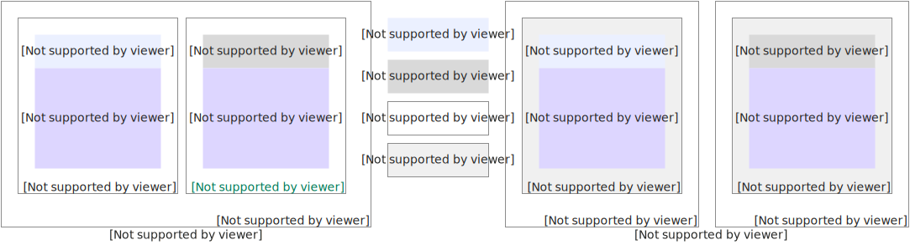

# 数据面安全性

与用户通信时，函数计算使用TLS 1.2及以上协议加密传输调用请求及回包，内部通信使用私有协议防止信息泄露及篡改。本页面分模块阐述数据面安全性保障。

## 接入服务安全性保障

在数据面内部流程中，接入服务主要负责函数的调用。

作为函数调用的入口，接入服务通过使用[负载均衡](https://help.aliyun.com/zh/slb/product-overview/slb-overview)实现负载均衡及网络安全防护。

函数默认只允许公网访问，用户可配置只允许从特定的VPC访问函数，两者之间互斥。

从调用模式角度区分，函数调用可分为同步调用、异步调用和异步任务：

- 同步调用
  
  一来一回（request-response）调用模式，不会缓存调用请求信息，不会对函数执行错误重试。
- 异步调用
  
  在接受到调用请求后，会缓存至轻量消息队列（原 MNS），缓存成功后立即返回响应。随后函数计算异步从轻量消息队列（原 MNS）中获取请求执行，函数计算保证请求至少执行一次。
  
  - 不同用户使用的轻量消息队列（原 MNS）队列至少使用账号级别隔离，对于调用量大的函数，可以使用函数级别隔离。
  - 调用失败时，对于函数执行错误，函数计算会默认重试3次，对于其它错误，如限流和系统错误等，会采用二进制退避方式重试，用户可配置重试次数及最大消息存活时间。
  - 异步调用执行完成时，函数计算支持配置[结果回调](https://help.aliyun.com/zh/functioncompute/result-callback)，用户可以使用结果回调保存调用事件及校验调用结果等。
- 异步任务
  
  对比异步调用，异步任务提供更丰富的任务控制及可观测能力，用户可以选择终止执行异步任务。具体信息，请参见[异步任务](https://help.aliyun.com/zh/functioncompute/fc/user-guide/asynchronous-task)。

## 调度服务安全性保障

在数据面内部流程中，调度服务主要负责计算节点、函数实例的生命周期管理及调用路由。

### **计算节点**

函数计算混合使用ECS神龙裸金属服务器及ECS虚拟机两种机型，可实现用户级动态迁移。

调度服务为每用户默认提供折算总共50~600 CPU逻辑核和100~1200 GB内存的计算节点，通过池化提供一半核和内存突发能力，资源池耗尽时，调度服务以不超过360核/分钟的速度为用户扩容，扩容速度超限时会产生限流错误。详情请参见[单账号各地域计算节点限制](https://help.aliyun.com/zh/functioncompute/fc/product-overview/limits-of-usage#ea99bbe93f7zj)。

计算节点最大存活时长不超过120小时，当调度服务检测到计算节点异常时，会提前重建计算节点。

### **函数实例**

函数实例分为按量实例及预留实例两种类型：

- **按量实例：**由函数调用触发动态创建，浅休眠（原闲置）时可能被保留一段时间，但不保证保留时长，最长不超过5分钟，平台可能提前回收；
- **预留实例：**由用户配置初始值及自动扩缩容策略创建，浅休眠（原闲置）时不会释放。

调度服务为每用户默认提供300函数实例突发能力，超过此限制时，以不超过300实例/分钟的速度为用户扩容，扩容速度超限时会产生限流错误，用户可通过加入钉钉用户群（钉钉群号**64970014484**）申请扩充函数实例突发上限。

函数实例最大存活时长为不超过36小时，当函数代码或配置发生变化、函数超时、内存超限或客户端主动终止错误时，调度服务会重建容器实例，另外可能由于均衡负载等原因，提前重建函数实例。

### **调用路由**

调用服务使用`bin-pack`算法实现调用路由，同一个函数实例可能被多次函数调用复用，来自同一客户端的调用请求，可能被分发至不同的函数实例执行，用户不可假设函数实例资源，比如全局变量及文件写入或者在不同调用间共享或不共享等。

调度服务会根据用户函数超时配置限制每次函数调用请求占用函数实例的时间，超时后会主动回收函数实例。

## 计算节点安全性保障

计算节点负责执行用户函数代码，函数计算使用神龙裸金属及ECS虚拟机两种类型的计算节点，如下图所示。本节由外向内分别阐述各层的安全措施。

### **计算节点层提供阿里云标准的安全防护能力**

计算节点提供以下阿里云标准的安全防护能力。具体信息，请参见[阿里云安全白皮书](https://developer.aliyun.com/article/719700)。

- 多可用容灾：一个地域的计算节点分布于多个可用区，具备可用区容灾能力。
- 隔离的VPC环境：计算节点位于隔离的VPC环境内，用户不可以直接访问计算节点。
- 云盾安全防护：函数计算节点使用阿里云[云盾服务](https://www.aliyun.com/activity/security/securitybigsell)提供漏洞检测，安全防御及对入侵的快速响应与处置能力。
- 漏洞修复或安全升级：函数计算负责计算节点的漏洞修复及安全升级，且升级过程对用户透明。

### **函数实例提供用户或函数级别的隔离能力**

- 虚拟化级别安全隔离
  
  神龙裸金属计算节点可运行来自不同用户的函数实例，使用阿里云[安全沙箱](https://help.aliyun.com/zh/ack/ack-managed-and-ack-dedicated/user-guide/overview-10/)提供函数级别虚拟化及容器隔离，ECS虚拟机只允许运行同用户的函数实例，借助ECS隔离提供用户级别虚拟化隔离，使用[Runc](https://github.com/opencontainers/runc)等容器技术实现函数级别的容器隔离。
- 函数实例网络访问受限，用户决定网络外访权限
  
  函数实例配置私有IP地址，用户不可直接访问，且实例间网络不可达，网络隔离使用open vSwitch、iptables和routing tables实现。用户可配置4种外部网络访问模式：
  
  - 仅允许函数访问公网：函数实例只能访问公网，此模式为默认模式。
  - 仅允许函数访问VPC：函数实例只能访问配置的VPC网络，比如RDS、NAS和ECS的私有IP地址等。
  - 允许函数既能访问公网，也能访问VPC：函数实例既能访问公网，也能访问配置的VPC网络。
  - 既不允许函数访问公网，也不允许访问VPC：函数实例完全无访问外部网络的权限。
- 函数实例资源受限
  
  CPU算力根据内存大小配置成比例分配，但函数实例冷启动期间，允许临时突破限制以加速冷启动，最长持续20s。函数实例默认配置512 MB文件系统容量及1 Gbps网络带宽，如果用户选择性能实例，可最大提供10 GB文件系统容量及5 Gbps网络带宽。
- 函数实例闲时冻结
  
  当不执行函数请求时，函数实例将被冻结，在下次请求执行前解冻。
- 函数实例允许登录
  
  通过鉴权的用户可登录名下函数实例，便于线上问题定位。
- 漏洞修复及安全升级
  
  函数计算负责函数实例沙箱容器的漏洞修复及安全升级，且升级过程对用户透明。

### **运行时环境辅助用户提升安全能力**

- 提供临时身份凭证
  
  函数计算为用户配置的执行角色申请临时身份凭证，这些凭证将通过环境变量注入运行时环境，且调用时通过输入参数传递至用户代码，用户可通过临时身份凭证访问外部阿里云服务。
- 收集函数执行异常信息
  
  运行时环境将为用户收集函数执行异常信息及日志，辅助用户识别是否有异常发生。
- 提供生命周期回调提供扩展能力
  
  运行时环境为用户提供初始化（Initializer）和停止前（PreStop）等回调，辅助用户按需扩展安全能力。
- 非持久化环境
  
  运行时环境提供的文件系统及内存，在函数实例释放时随之释放，用户不可使用函数实例的本地文件系统及内存持久化数据，如果用户需要持久化，可以配置阿里云[文件存储NAS](https://www.aliyun.com/product/nas)或持久化保存至[对象存储OSS](https://www.aliyun.com/product/oss)。
- 不可变代码及层（Layer）
  
  用户对代码目录/code及层目录/opt的修改，只对本实例生效，不会改写同函数其它实例的代码及库。
- 漏洞修复及安全升级
  
  运行时环境的漏洞修复及库升级，如果涉及用户兼容性，会通过站内信、短信等方式提前知会用户，对于自定义运行时或自定义容器镜像，运行时的安全保障由用户自行负责。另外对于Java、C#或Golang等编译型语言，函数计算提供的SDK安全漏洞的修复需要用户自行更新依赖并重新编译上传。
- 运行时环境版本支持时间与社区同步
  
  由于社区对各种运行时环境版本有明确的支持时间，社区不再支持的运行时版本，函数计算会同步给出支持截止时间，会按照禁止新增函数、禁止修改存量函数和禁止函数运行的顺序逐渐停止支持，函数计算不保障停止支持的运行时版本可以一直正常的执行。
