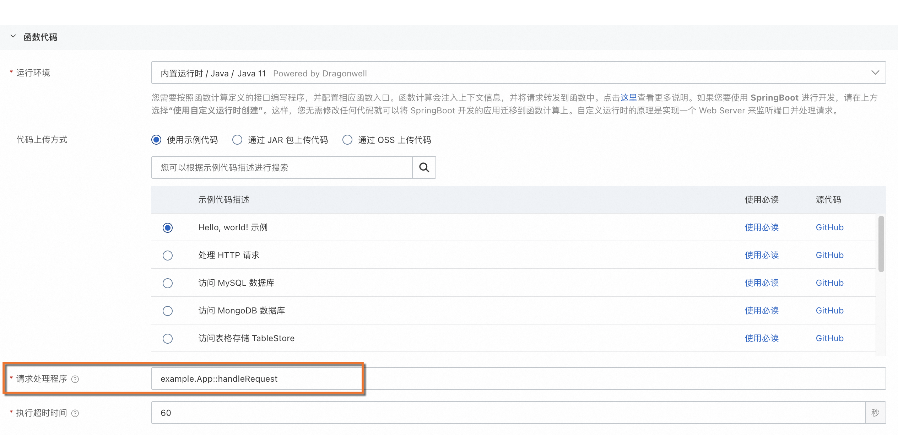

# Java Runtime如何配置函数入口？

在函数计算中使用Java编程语言时，需要定义一个函数入口，即请求处理程序。函数计算将从这个函数入口开始执行函数。本文介绍如何通过控制台配置Java函数的请求处理程序。

## 操作步骤

1. 登录[函数计算控制台](https://fcnext.console.aliyun.com)，在左侧导航栏，单击**函数**。
2. 在顶部菜单栏，选择地域，然后在**函数**页面，单击**创建函数**。
3. 在**创建函数**页面，选择**事件函数**方式，在函数代码界面，运行环境选择**内置运行时**>**Java**，指定相应代码上传方式，并设置**请求处理程序**。
  
  对于Java语言的函数，您的请求处理程序需配置为`[包名].[类名]::[方法名]`。例如，您的包名为example，类型为HelloFC，方法名为handleRequest，则请求处理程序需配置为`example.HelloFC::handleRequest`。
  
  
