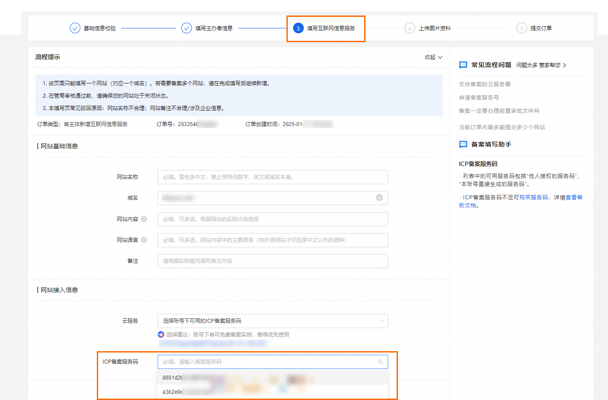

# 如何使用资源包的服务码进行备案？

购买函数计算任意一款CU资源包即可获得免费的ICP备案服务码。

- 如果产品购买账号与备案账号相同，请在备案流程中直接选择云产品实例，系统将会自动显示服务码，无需提前申请。具体操作，请参见[ICP代备案管理系统](https://beian.aliyun.com/pcContainer/myorder)界面提示。
  
  
- 如果产品购买账号与备案账号不相同，请参见[授权其他账号备案（可选）](https://help.aliyun.com/zh/icp-filing/basic-icp-service/user-guide/apply-for-service-identification-numbers-for-free)。

## **常见问题**

如果在备案流程中，ICP备案服务码为空，请按照以下流程排查解决：

- 若是新购买的资源包，可能存在信息未及时同步导致，请耐心等待一段时间刷新页面后重新尝试。
- 若非新购买的资源包，则需先确认所选**云服务**是否准确。并登录[备案控制台](https://bsn.console.aliyun.com/?spm=a2c4g.11186623.0.0.547d5dfbS6qlly#/bsnApply/fc)，查看备案情况了解该云服务是否已达到免费备案数量的上限。
  
  - 已达到免费备案数量上限，您可以使用[收费ICP备案服务码](https://help.aliyun.com/zh/icp-filing/apply-for-icp-registration-service-code)绑定同账号下资源包以继续使用。
  - 未达到免费备案数量上限，列表中仍然没有需备案的实例，请尝试使用搜索功能，输入实例名称进行精确查找。
