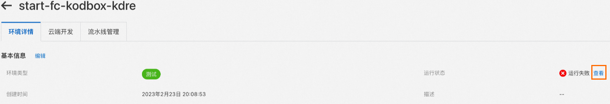
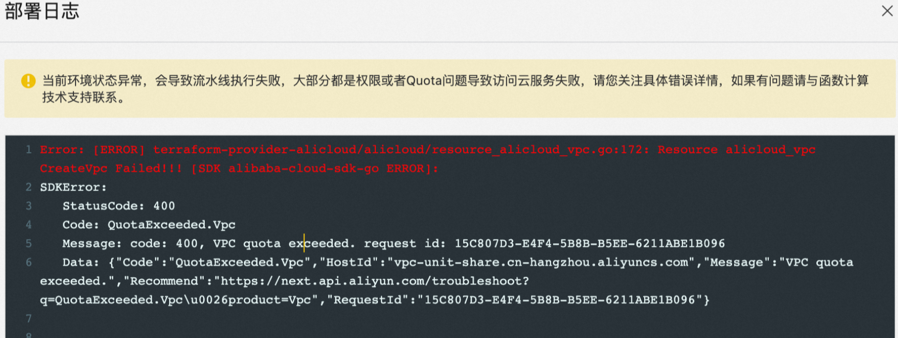
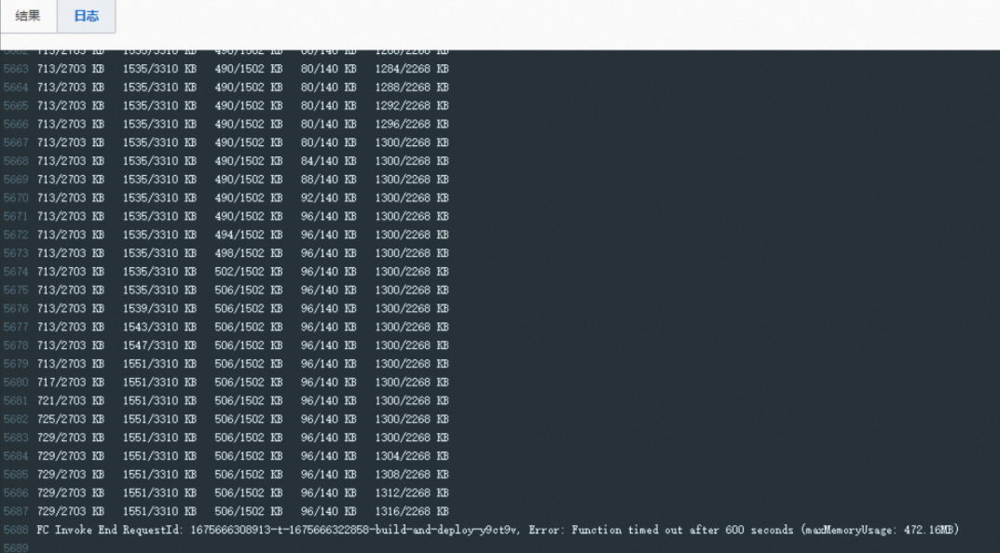
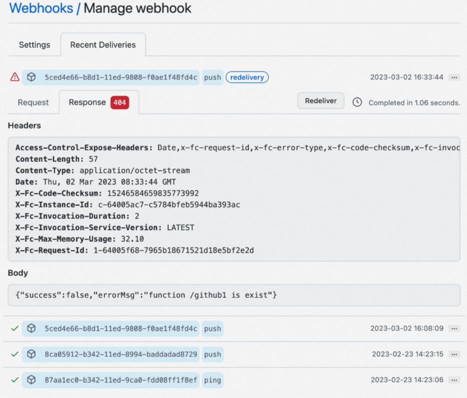

# 应用中心FAQ

本文介绍使用Serverless应用中心部署应用过程中，可能遇到的问题及解决方案。

- [环境运行状态异常](#section-1le-egs-ro6)
- [流水线构建阶段超时](#section-cit-s7k-133)
- [代码提交后未触发流水线执行](#section-g5q-plq-vvl)
- [多个环境关联同一个代码分支，代码提交后只有一个环境流水线执行](#section-sgn-znp-kj0)
- [为什么每次应用中心的应用部署之后，对应函数的配置都变更了？](#section-hoo-2lq-cyz)
- [为什么我的应用不能通过域名访问了？](#8252022219yol)

## 环境运行状态异常

可以查看运行状态来定位环境失败原因，通常情况下都是权限问题或者配额不足导致。



## 流水线构建阶段超时

部署流水线失败时，您可以通过查看日志信息来排查具体问题。如果遇到`Error：Function timed out after 600 seconds`，通常是由于部署过程中下载依赖过慢导致的超时。



默认流水线支持中国内地和海外两个构建环境，其中Gitee、Codeup、GitLab的构建环境在华东1（杭州），GitHub的构建环境在新加坡。构建超时时间是10分钟，如果在中国内地构建环境，但是安装依赖访问海外Registry时下载速度会比较慢导致超时。此时，有两种方式可以解决超时问题。

- 方式一：
  
  安装依赖时使用中国内地源或代理，例如：
  
  - 使用清华源安装Python依赖
    
    ```
    pip install some-package -i https://pypi.tuna.tsinghua.edu.cn/simple
    ```
  - 使用淘宝源安装Node.js依赖
    
    ```
    npm install some-package --registry https://registry.npmmirror.com
    ```
  - 使用七牛代理安装Golang
    
    ```
    GOPROXY=https://goproxy.cn
    ```
- 方式二：
  
  采用自定义流水线，将构建环境部署在中国香港，或者自定义构建超时时间。使用自定义流水线会产生函数调用费用，具体信息，请参见[计费概述](https://help.aliyun.com/zh/functioncompute/fc-2-0/product-overview/billing-overview#concept-2557114)。

## 代码提交后未触发流水线执行

查看代码仓库的Webhook执行历史，如果遇到500错误，请加入钉钉用户群（钉钉群号：**64970014484**），联系函数计算工程师即时沟通处理。



## 多个环境关联同一个代码分支，代码提交后只有一个环境流水线执行

多个环境关联同一个代码分支时，由于使用相同代码版本部署多个环境可能会导致不同环境的函数相互覆盖，因此应用中心只允许一个环境的流水线被执行。如果您在使用中确实需要同时触发多个环境，请加入钉钉用户群（钉钉群号：**64970014484**）获取技术支持。

## 为什么每次应用中心的应用部署之后，对应函数的配置都变更了？

部署应用时，会按照代码库里的s.yaml文件配置来更新函数，因此，应用部署完成后您在控制台上修改的配置均会被覆盖。

为了避免您的函数配置被覆盖，建议在代码库的s.yaml文件中修改配置。具体操作，请参见[Service字段](https://docs.serverless-devs.com/user-guide/aliyun/fc/yaml/service/)。

为了更方便地使用，您还可以在通过控制台修改完函数配置后，在函数详情页的右上角，单击**导出函数**，然后选择**导出配置**导出s.yaml文件。您可以以此s.yaml文件为参考，更新代码库中的s.yaml文件。

## **为什么我的应用不能通过域名访问了？**

***.devsapp.net域名是CNCF SandBox项目Serverless Devs社区所提供，仅供学习和测试使用，不可用于任何生产使用。社区会对该域名进行不定期拨测，并在域名下发1天后进行回收，建议您及时为应用[绑定自定义域名](https://help.aliyun.com/zh/functioncompute/fc/configure-custom-domain-names#title-v5p-8zy-vdy)，以获得更好的使用体验。

如果应用未绑定自定义域名，且部署的时间超过1天，应用将无法正常访问，此时需要重新部署一次应用，应用域名即可正常访问。
