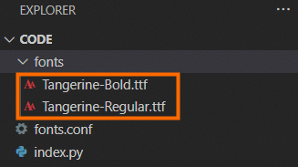
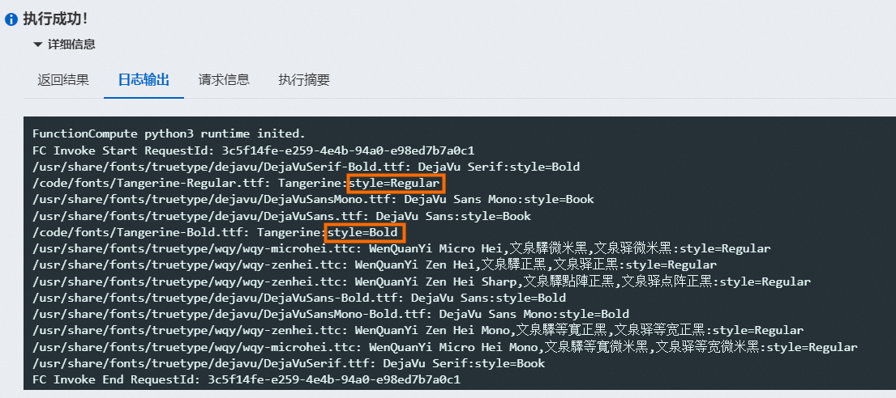

# 函数计算如何使用自定义字体？

如果函数计算运行环境中内置的一些常用字体无法满足需求，您可以为您的应用自定义字体。本文介绍如何通过函数计算控制台安装自定义字体。

## 前提条件

- 已创建函数。
  
  具体操作，请参见[创建函数](https://help.aliyun.com/zh/functioncompute/fc/user-guide/creating-a-web-function#section-b9y-zn1-5wr)。
- 已下载使用自定义字体的示例代码。
  
  本文以Python函数为例进行介绍。Python Runtime的示例代码，请参见[Python示例](https://images.devsapp.cn/fc-faq/fc-font-example.zip)。

## 操作步骤

1. 登录[函数计算控制台](https://fcnext.console.aliyun.com)，在左侧导航栏，单击**函数**。
2. 在顶部菜单栏，选择地域，然后在**函数**页面，单击目标函数。
3. 在函数详情页面，单击**上传代码**，选择上传方式并上传已下载的示例代码。
  
  上传完成后，代码目录结构如下所示。其中，`Tangerine-xxx.ttf`为自定义字体文件，您可以根据需求增加其他自定义字体文件。
4. 为函数安装环境变量`FONTCONFIG_FILE = /code/fonts.conf`。
  
  `fonts.conf`为字体配置文件，安装此环境变量后，函数运行时能够正确的读取到自定义字体目录。
5. 在函数详情页面的**代码**页签，单击**测试函数**执行函数安装字体。
  
  执行成功后查看日志，`style=Regular`和`style=Bold`表示安装的字体已生效。
