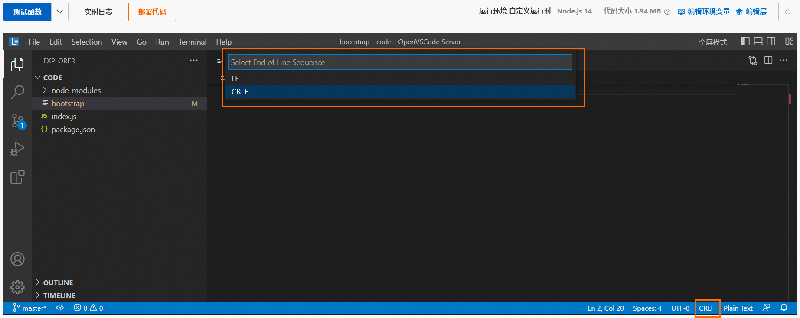

# 如何使用函数计算的WebIDE转换文件格式？

您可以使用函数计算的WebIDE实现文件的格式转换。本文以修改启动文件bootstrap的格式为例，介绍具体操作步骤。

1. 登录[函数计算控制台](https://fcnext.console.aliyun.com)，在左侧导航栏，选择**函数管理**>**函数列表**。
2. 在顶部菜单栏，选择地域，然后在**函数列表**页面，单击目标函数。
3. 在函数详情页面，单击代码页签，在左侧导航栏，单击选中待修改文件，在右下角确认该文件的格式并单击，然后在下拉列表选择目标格式。
  
  CRLF代表Windows格式；LF代表Unix格式。操作区域参照下图。
4. 单击**部署代码**。
