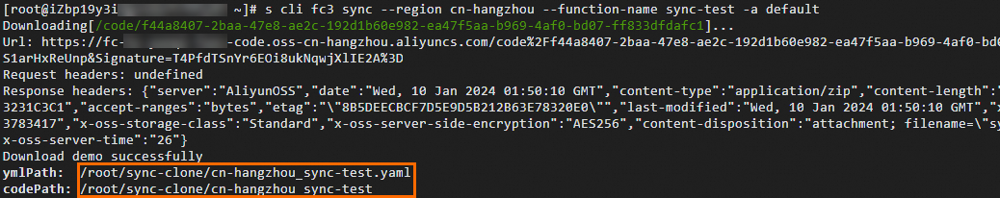
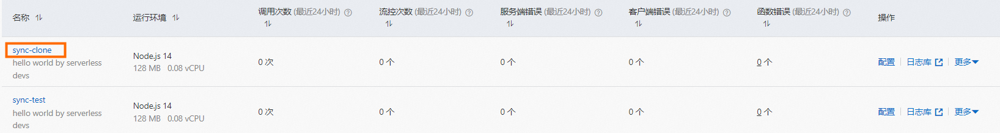

# 如何克隆函数计算的函数？

本文介绍如何通过Serverless Devs工具克隆函数。

## 前提条件

- 已安装并配置Serverless Devs工具。具体操作，请参见[安装Serverless Devs](https://help.aliyun.com/zh/functioncompute/fc/developer-reference/install-serverless-devs-and-docker#section-0rz-d9z-m1l)和[配置Serverless Devs](https://help.aliyun.com/zh/functioncompute/fc-3-0/developer-reference/configure-serverless-devs-1)。
- 已创建函数。函数名称为`sync-test`，所在地域为华东1（杭州）。具体操作，请参见[创建函数](https://help.aliyun.com/zh/functioncompute/fc-2-0/user-guide/manage-functions#section-b9y-zn1-5wr)。

## 操作步骤

1. 执行以下命令克隆测试函数`sync-test`。
  
  ```
  sudo s cli fc3 sync --region cn-hangzhou --function-name sync-test -a default
  ```
  
  克隆完成后，您可以看到函数已被克隆到本地当前目录。
  
  
2. 修改工作目录下的`cn-hangzhou_sync-test.yaml`文件，函数名称修改为`sync-clone`，然后在代码目录下执行以下命令部署函数。
  
  ```
  sudo s deploy -t cn-hangzhou_sync-test.yaml
  ```
  
  执行完成后，您可以登录[函数计算控制台](https://fcnext.console.aliyun.com)查看已克隆的函数。
