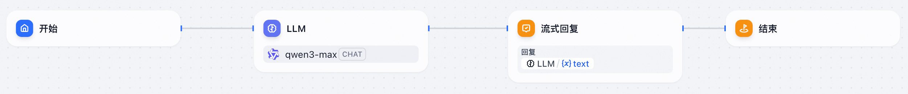

# 低代码创建Agent快速入门

低代码 Agent 创建功能提供所见即所得的流程画布，通过拖拽节点、连接流程即可完成 Agent 配置，大幅降低开发门槛。

## 工作原理

低代码 Agent 创建基于流程画布（Flow）模式，采用可视化编排方式构建 Agent 工作流。流程画布支持多种节点类型，包括开始节点、LLM 节点、MCP服务节点、代码执行节点等。通过连接节点构建完整的工作流，系统会自动将画布配置转换为可执行的流程定义。流程支持对话模式和工作流模式两种执行方式。

主要能力包括：

- **模型编排**：支持千问系列及 OpenAI 兼容模型
- **工具支持**：支持编排基于 OpenAPI 规范和 MCP 协议的工具
- **Agent 编排**：支持编排 agentrun agent 及内置的 function calling agent
- **知识库集成**：支持对接百炼知识库
- **自定义代码执行**：内置代码执行节点，同时支持编排函数计算节点
- **完备的流程控制结构**：分支、循环、迭代、并行
- **多客户端协议集成**：OpenAI、dify workflow、dify chatflow
- **版本管理与灰度发布**：便于在逐步优化的过程中控制上线范围

## **核心概念**

在使用Flow创建 Agent 前，建议先了解如下核心概念，如已经提前了解，可以直接进入Agent创建：

| 核心概念 | 说明 |
| --- | --- |
| ### **模型** | Agent 可以直接使用在 AgentRun 平台配置的千问及 OpenAI 协议兼容的模型，包括： - **API 直连模型**：通过标准 API 接入的第三方大模型； - **FunModel 托管模型**：托管在 AgentRun / 函数计算环境中的自建或开源模型； - **LiteLLM 模型治理**：通过 LiteLLM 方式接入并治理的模型服务。 |
| ### **Agent** | 使用Flow创建的 Agent 支持在流程 Agent 节点中添加在AgentRun平台通过其他方式创建的Agent： - [快速创建Agent（无代码）](https://help.aliyun.com/zh/functioncompute/fc/quickly-create-agent-no-code) - [通过代码创建Agent（高代码）](https://help.aliyun.com/zh/functioncompute/fc/create-agent-by-code-high-code) |
| ### 对话模式/工作流模式 | - 对话模式下支持会话变量概念，同时支持为流程执行传入 conversation id，相同 conversation id 的流程可以共享会话变量的访问。 - 工作流模式在执行时不指定 sys.conversation_id，适用于无需在多次执行间共享会话变量的场景。 |
| ### **环境变量** | 使用环境变量来存储您的应用特定的敏感信息，如 API 密钥、数据库密钥等。支持在流程维度配置环境变量，流程中的节点可以访问流程的环境变量。 |
| ### 版本与灰度 | 快速创建的 Agent 支持版本管理与灰度发布： - 可以为 Agent 创建多个版本，每个版本对应一组模型、提示词、工具等配置； - 可以按一定比例或策略将请求流量灰度路由到新版本，用于逐步验证新配置的稳定性和效果。 |

## **适用范围**

使用低代码 Agent 创建功能需要具备以下权限：

| **权限策略** | **说明** |
| --- | --- |
| AliyunFCInvocationAccess | 流程中调用函数节点需要此权限 |
| AliyunDevsReadOnlyAccess | 流程中调用 MCP、工具需要此权限 |
| AliyunBailianDataFullAccess | 流程中调用百炼知识检索需要此权限 |
| AliyunAgentRunReadOnlyAccess | 流程中调用 agentrun agent 需要此权限 |
| AliyunEventBridgePutEventsPolicy | 流程中调用 EventBridge 需要此权限（功能目前不支持，未来可能开放） |
| AliyunFnFFullAccess | 流程中调用其他流程需要此权限（功能目前不支持，未来可能开放） |

前置条件：

- 确保已配置模型。在[模型管理页面](https://functionai.console.aliyun.com/cn-hangzhou/agent/models/llm)配置千问或 OpenAI 兼容模型。当前支持千问和 OpenAI 模型。

## 通过Flow创建Agent

通过流程画布创建 Agent，配置模型、工具等节点，完成一个可运行的 Agent。

### 操作步骤

1. 登录[AgentRun 控制台](https://functionai.console.aliyun.com/cn-hangzhou/agent/runtime/agent-list)，在**Agent 运行时**页面点击**创建Agent**。
2. 选择**通过Flow创建**，进入 Flow Agent 创建页面。
3. 配置基本信息：
  
  - **Flow名称**：输入有意义的名称，便于后续管理和识别（如：`agent-flow-0RUvK`）
  - **功能描述**（可选）：详细描述 Flow 的功能、用途和特点
4. 配置执行角色：
  
  - 从下拉列表中选择执行角色（如：`AliyunFnFExecutionRole`）
  - 如果角色缺少权限策略，点击**一键授权**完成授权
  - 执行角色用于授予工作流服务访问其他阿里云服务的权限，需要以下权限：AliyunFCInvocationAccess、AliyunDevsReadOnlyAccess、AliyunFnFFullAccess、AliyunAgentRunReadOnlyAccess、AliyunEventBridgePutEventsPolicy、AliyunBailianDataFullAccess
5. 配置访问凭证：
  
  - **入站：访问凭证**：选择匿名访问或添加凭证（推荐使用凭证以保障安全）
6. 点击**下一步**，进入流程画布页面。
7. 在流程画布中配置流程：
  
  - 画布默认包含**开始**节点和**结束**节点
  - 在开始节点和结束节点之间添加节点（如 LLM 节点、流式回复节点等），一个基础的流程示例如下：
  - 点击开始节点，在右侧配置面板的**下一步**区域添加节点
  - 或直接在画布上右键点击，选择**添加节点**，然后选择节点类型
8. 配置节点：
  
  - 点击节点打开配置面板
  - 对于 LLM 节点：
    
    - 选择模型：点击模型选择区域，从下拉列表中选择已配置的模型（如：`qwen3-model`的`qwen3-max`），并配置模型其他参数（如温度、最大标记等，可选）
    - 配置提示词：在 SYSTEM 消息中编写提示词，在USER中配置参数（必填）
  - 对于流式回复节点：配置流式回复相关参数
  - 连接节点：确保开始节点连接到中间节点，中间节点连接到结束节点
9. 点击**创建Agent**，等待创建完成。

创建成功后，页面显示**Flow 创建成功**提示，并跳转到 Agent 详情页。

### 测试运行

在 Agent 详情页，使用测试运行功能验证 Agent 是否正常工作。

1. 在画布工具栏点击**测试运行**按钮。
2. 在测试运行面板中：
  
  - 选择执行模式：**工作流模式**或**对话模式**
  - 填写输入参数：
    
    - **sys.query**（选填）：输入测试问题，如"你好，请介绍一下你自己"
    - **sys.conversation_id**（选填）：会话 ID，用于会话变量共享
    - **sys.user_id**（选填）：用户 ID
3. 点击**开始运行**，等待运行完成。
4. 查看运行结果

## 发布版本

为 Agent 发布版本，用于版本管理和灰度发布。

只有流程有新的变更的情况下才能发布新的版本。

#### **操作步骤**

1. 在 Agent 详情页，点击左侧导航栏的**版本与灰度**。
2. 在版本管理区域，点击**发布版本**。
3. 填写版本描述（可选），如"初始版本，包含基本的 LLM 对话流程"。
4. 点击**发布版本**，等待发布完成。

发布成功后，版本列表中显示新发布的版本，包含版本号、描述和发布时间。

## 通过 API 调用

使用 curl 命令调用 API，您可以在Agent详情页里的页面查看相关调用示例。

## 发布为聊天框

将 Agent 发布为聊天框，提供 Web 界面供用户交互。

#### **操作步骤**

1. 在 Agent 详情页，点击左侧导航栏的**集成与发布**。
2. 在集成模板区域，选择集成方式和风格模板：
  
  - **集成方式**：全屏嵌入、浮窗聊天、侧边栏、自定义
  - **风格模板**：简约风格、商务风格、科技风格、温馨风格
3. 点击**开始集成**，打开 API 绑定配置对话框。
4. 配置 API 绑定：
  
  - 选择执行角色（如：`AliyunAgentRunDefaultRole`）
  - 选择 Endpoint（如：`Default (ACTIVE)`）
  - 点击**下一步**
5. 等待集成资源部署完成。

部署完成后，页面显示**部署完成！**提示。可以在**已部署的集成资源**区域查看聊天框 URL。

## 查看流程 trace

查看 Agent 流程执行的 trace 信息，用于调试和监控。

#### **操作步骤**

1. 在 Agent 详情页，点击左侧导航栏的**可观测性**。
2. 查看流程执行记录和 trace 信息：
  
  - **基础监控**：查看执行次数、执行耗时、执行错误次数、LLM 调用次数、Token 使用情况、执行成功率等统计信息
  - **LLM 监控**：查看 LLM 调用相关的监控信息
  - **链路追踪**：查看详细的执行链路信息（需要先开启链路追踪功能）

基础监控页面显示的信息包括：

- 执行次数
- 执行耗时平均值（毫秒）
- 执行耗时最大值（毫秒）
- 执行错误次数
- LLM 调用次数
- Token 输入
- Token输出
- 执行成功率
- 节点执行总耗时（毫秒）
