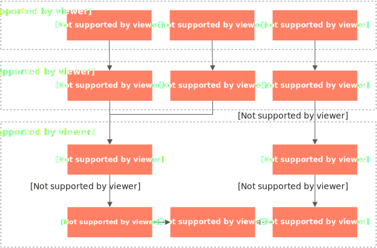

# BrowserTool浏览器

BrowserTool 是一款基于 Go 语言构建的高性能、云原生无头浏览器沙箱服务。它允许您通过标准的 Chrome DevTools Protocol (CDP) over WebSocket，远程控制一个运行在云端隔离容器中的无头浏览器实例，并原生兼容 Puppeteer、Playwright 等主流自动化框架。

**主要用途：**

- **AI Agent 集成**：作为大模型的“眼睛”和“手”，赋予其执行网页浏览、信息提取、在线操作等复杂任务的能力。
- **自动化测试**：在云端按需运行端到端（E2E）测试和视觉回归测试，无需维护本地测试环境。
- **数据采集**：稳定、高效地进行网页抓取，轻松应对动态加载和反爬虫挑战。
- **内容生成**：将动态网页或数据看板自动化生成为 PDF 或截图，用于制作报告和归档。

**核心价值：**

- **免运维**：您无需在自己的服务器或本地机器上安装、配置和维护 Chrome 浏览器及其复杂的依赖。
- **Serverless 架构**：服务按实际使用量计费，具备优秀的弹性伸缩能力，有效控制成本。
- **原生兼容**：通常无需修改您现有的 Puppeteer/Playwright 脚本即可平滑迁移。

## **快速入门**

本指南将引导您完成从创建服务到成功运行第一个自动化脚本的全过程。

### **第一步：创建BrowserTool服务**

1. 登录[AgentRun 控制台](https://functionai.console.aliyun.com/cn-hangzhou/agent/runtime/agent-list)。
2. 首次使用时，系统会提示您为阿里云账号授予 AgentRun 的服务关联角色（`AliyunServiceRoleForAgentRun`）。请根据页面指导完成授权，这是服务正常运行所必需。
3. 在**运行时与沙箱**页签下选择**Sandbox沙箱**，**创建沙箱模板**选择**浏览器**，**立即创建**BrowserTool服务。

您也可以通过 OpenAPI 或 SDK 进行创建：

- OpenAPI 文档：[CreateBrowser API](https://api.aliyun.com/api/AgentRun/2025-09-10/CreateBrowser)
- 多语言 SDK：[AgentRun SDK 中心](https://api.aliyun.com/api-tools/sdk/AgentRun?version=2025-09-10)

### **第二步：获取连接端点 (Endpoint)**

1. 服务创建成功后，在控制台服务列表中找到您的 BrowserTool 服务，单击进入**详情**页。
2. 在详情页的**VNC调试**标签页下**新建沙箱**。
3. 创建成功后，您将获得一个用于自动化连接的 WebSocket 端点 (CDP Endpoint)，您可以直接从控制台复制使用。其格式示例如下：
  
  ```
  wss://1234567890.agentrun-data.cn-hangzhou.aliyuncs.com/sandboxes/br-abcdef123456/ws/automation?tenantId=1234567890
  ```

### 第三步：连接并执行自动化脚本

将上一步获取的完整连接端点 URL 传入您熟悉的自动化框架脚本中，即可连接到 BrowserTool 并执行任务。

#### Puppeteer 连接示例

```
const puppeteer = require('puppeteer-core'); // 从BrowserTool服务详情页获取此端点 const BROWSERTOOL_CDP_ENDPOINT = 'wss://{accountID}.agentrun-data.cn-hangzhou.aliyuncs.com/sandboxes/{sandboxID}/ws/automation?tenantId={accountID}'; async function main() { const browser = await puppeteer.connect({ browserWSEndpoint: BROWSERTOOL_CDP_ENDPOINT, }); const page = await browser.newPage(); await page.goto('https://example.com'); await page.screenshot({ path: 'example.png' }); console.log('Screenshot taken!'); await browser.close(); } main();
```

#### Playwright 连接示例

```
const { chromium } = require('playwright-core'); // 从BrowserTool 服务详情页获取此端点 const BROWSERTOOL_CDP_ENDPOINT = 'wss://{accountID}.agentrun-data.cn-hangzhou.aliyuncs.com/sandboxes/{sandboxId}/ws/automation?tenantId={accountID}'; async function main() { const browser = await chromium.connectOverCDP({ endpointURL: BROWSERTOOL_CDP_ENDPOINT, }); const page = await browser.newPage(); await page.goto('https://example.com'); await page.screenshot({ path: 'example.png' }); console.log('Screenshot taken!'); await browser.close(); } main();
```

## **功能指南**

### **WebSocket自动化端点**

BrowserTool 提供了两个主要的 WebSocket 端点，用于不同的自动化场景。

1. **CDP 自动化端点 (/ws/automation)**
  
  用于浏览器自动化，与Puppeteer和Playwright兼容。端点格式如下**：**
  
  ```
  wss://{accountID}.agentrun-data.cn-hangzhou.aliyuncs.com/sandboxes/{sandboxId}/ws/automation?tenantId={accountID}
  ```
  
  可使用`wscat`工具直接与 CDP 端点交互，发送原始 CDP 命令进行调试。
  
  ```
  # 安装wscat npm install -g wscat # 连接到CDP代理 wscat -c "wss://{accountID}.agentrun-data.cn-hangzhou.aliyuncs.com/sandboxes/{sandboxID}/ws/automation/?tenantId={accountID}" # 发送CDP命令 {"id":1,"method":"Runtime.evaluate","params":{"expression":"navigator.userAgent"}}
  ```
2. **VNC实时流端点（/ws/livestream）**
  
  用于实时查看浏览器桌面环境的WebSocket端点，支持通过NoVNC客户端查看，详细参考[实时查看浏览器界面（VNC调试）](#5994afc7addr0)。端点格式如下：
  
  ```
  wss://{accountID}.agentrun-data.cn-hangzhou.aliyuncs.com/sandboxes/{sandboxID}/ws/livestream?tenantId={accountID}
  ```

### **实时查看浏览器界面（VNC调试）**

BrowserTool 支持通过 VNC 实时查看远程浏览器的桌面环境，方便在开发和调试阶段监控自动化任务的执行情况。

#### **推荐方案：使用在线 noVNC 客户端**

1. 访问 noVNC 官方提供的在线客户端：[https://novnc.com/noVNC/vnc.html](https://novnc.com/noVNC/vnc.html)
2. 在连接设置中，中填入以下连接信息
  
  - **主机**：`{accountID}.agentrun-data.cn-hangzhou.aliyuncs.com`
  - **端口**：`443`
  - **路径**：`sandboxes/{sandboxID}/ws/livestream?tenantId={accountID}`
3. 点击**连接****，**即可看到浏览器界面。

如果想要自定义前端集成，允许完全控制 VNC 视图的展现形式和交互逻辑。需要引入 noVNC 的核心 JS 库，并在前端代码中进行初始化。示例地址：[https://github.com/novnc/noVNC/blob/master/vnc_lite.html](https://github.com/novnc/noVNC/blob/master/vnc_lite.html)

#### **备选方案：使用Docker镜像**

如果您需要在本地或离线环境中使用，可以运行我们预置的 noVNC Docker 镜像。

1. 在本地终端运行 Docker 命令启动 noVNC 客户端容器：
  
  ```
  docker run -p 8184:80 -d --rm registry.cn-shanghai.aliyuncs.com/fc-demo2/custom-container-repository:browsertool-sandbox-vnc-client_v0.3.1
  ```
2. 打开浏览器访问`http://localhost:8184`。
3. 在连接设置中，中填入以下连接信息：
  
  - **主机**：`{accountID}.agentrun-data.cn-hangzhou.aliyuncs.com`
  - **端口**：`80`
  - **路径**：`sandboxes/{sandboxID}/ws/livestream?tenantId={accountID}`
  
  点击**连接**，即可看到浏览器界面。

**

**说明**

连接成功后，初始界面可能为黑屏或灰屏。这是正常现象，因为浏览器正在等待指令。当您的自动化脚本执行`page.goto()`等操作后，界面才会显示相应内容。

### **框架集成示例**

BrowserTool 可以与多种编程语言的 AI Agent 框架或自动化库轻松集成。

- **BrowserUse 操作示例：**
  
  ```
  from browser_use import Agent, BrowserSession from browser_use.llm import ChatDeepSeek from browser_use.browser import BrowserProfile from dotenv import load_dotenv import os import asyncio load_dotenv() async def main(): # 填入CDP URL browser_session_wss_url = "wss://{accountID}.agentrun-data.cn-hangzhou.aliyuncs.com/sandboxes/{sandboxID}/ws/automation?tenantId={accountID}" browser_session = BrowserSession( cdp_url=browser_session_wss_url, browser_profile=BrowserProfile( headless=False, user_agent="Mozilla/5.0 (Macintosh; Intel Mac OS X 10_15_7) AppleWebKit/537.36 (KHTML, like Gecko) Chrome/117.0.X.X Safari/537.36", timeout=3000000, keep_alive=True, ) ) # 需要填入DeepSeek的api_key，如果使用其他模型，请自行修改 llm = ChatDeepSeek(api_key="sk-your-deepseek-sk") agent = Agent( task="请访问 https://www.aliyun.com/product/list 并分析一下阿里云目前都提供了哪些产品", llm=llm, browser_session=browser_session, use_vision=True ) result = await agent.run() print(result) if __name__ == "__main__": asyncio.run(main())
  ```
- **Puppeteer 连接示例**
  
  ```
  const puppeteer = require('puppeteer-core'); const browser = await puppeteer.connect({ browserWSEndpoint: 'wss://{accountID}.agentrun-data.cn-hangzhou.aliyuncs.com/sandboxes/{sandboxID}/ws/automation?tenantId={accountID}' }); const page = await browser.newPage(); await page.goto('https://example.com'); await page.screenshot({ path: 'screenshot.png' }); await browser.close();
  ```

## **操作录制**

### **1、列出所有录制文件**

获取系统中所有 VNC 录制文件的列表，支持分页查询。

#### 基本信息

- **端点**:`GET /recordings/`
- **功能**: 返回 VNC 录制文件列表
- **标签**: 录制管理

#### **请求参数**

| **参数名** | **位置** | **类型** | **必填** | **默认值** | **说明** |
| --- | --- | --- | --- | --- | --- |
| `page` | query | integer | 否 | 1 | 页码（从 1 开始） |
| `page_size` | query | integer | 否 | 20 | 每页数量（最大 100，最小 1） |

#### 功能特性

- 支持分页查询
- 自动识别录制状态（正在录制/已完成）
- 按创建时间降序排列（最新的在前）
- 返回文件详细信息（文件名、大小、创建时间等）

#### **响应格式**

成功响应（200 OK）

```
{ "recordings": [ { "filename": "vnc_global_20251116_103022_seg000.mkv", "sessionId": "vnc_global_20251116_103022", "segment": 0, "size": 15728640, "createdAt": "2025-11-16T10:30:22+08:00", "format": "mkv", "downloadUrl": "/recordings/vnc_global_20251116_103022_seg000.mkv", "recordingType": "vnc", "status": "completed" } ], "total": 1, "page": 1, "pageSize": 20 }
```

响应字段说明

| **字段名** | **类型** | **说明** |
| --- | --- | --- |
| `recordings` | array | 录制文件列表（按创建时间降序排列） |
| `recordings[].filename` | string | 文件名 |
| `recordings[].sessionId` | string | 会话 ID |
| `recordings[].segment` | integer | 段索引（从 0 开始，分段录制时使用） |
| `recordings[].size` | integer | 文件大小（字节） |
| `recordings[].createdAt` | string | 文件创建时间（ISO 8601 格式） |
| `recordings[].format` | string | 文件格式（固定为`mkv`） |
| `recordings[].downloadUrl` | string | 下载 URL（MKV 支持流式写入，所有文件都可以下载） |
| `recordings[].recordingType` | string | 录制类型（固定为`vnc`） |
| `recordings[].status` | string | 录制状态（MKV 支持流式写入，所有文件状态为`completed`，可在录制过程中播放） |
| `total` | integer | 录制文件总数（不考虑分页） |
| `page` | integer | 当前页码（仅在分页查询时返回） |
| `pageSize` | integer | 每页数量（仅在分页查询时返回） |

错误响应

- **400 Bad Request**: 无效请求（参数错误）
- **500 Internal Server Error**: 内部服务器错误

#### **请求示例**

```
# 获取第一页，每页 20 条记录（默认） curl -X GET "http://localhost:3000/recordings/" # 获取第二页，每页 10 条记录 curl -X GET "http://localhost:3000/recordings/?page=2&page_size=10" # 获取所有录制文件（设置较大的 page_size） curl -X GET "http://localhost:3000/recordings/?page_size=100"
```

### **2、下载录制文件**

下载指定的 VNC 录制文件。

#### 基本信息

- **端点**:`GET /recordings/{filename}`
- **功能**: 下载指定的录制文件
- **标签**: 录制管理

#### 请求参数

| 参数名 | 位置 | 类型 | 必填 | 说明 |
| --- | --- | --- | --- | --- |
| `filename` | path | string | 是 | 录制文件名（必须是 .mkv 文件） |

#### 功能特性

- MKV 格式支持流式写入
- 文件可以在录制过程中下载和播放
- 只允许下载`.mkv`文件
- 自动设置正确的 Content-Type (`video/x-matroska`)

#### 响应格式

**成功响应**(200 OK)

- **Content-Type**:`video/x-matroska`
- **Body**: 二进制视频数据

**错误响应**

- **400 Bad Request**: 无效请求
  
  ```
  { "error": "Invalid filename" }
  ```
  
  - 文件名无效
  - 不是MKV文件
- **404 Not Found**: 文件未找到
- **500 Internal Server Error**: 内部服务器错误

#### **请求示例**

```
# 下载录制文件 curl -X GET "http://localhost:3000/recordings/vnc_global_20251116_103022_seg000.mkv" \ -o vnc_global_20251116_103022_seg000.mkv # 在浏览器中直接访问 http://localhost:3000/recordings/vnc_global_20251116_103022_seg000.mkv
```

#### **注意事项**

1. **文件格式限制**: 只允许下载`.mkv`文件
2. **流式支持**: MKV 格式支持流式写入，可以在录制过程中下载
3. **播放器兼容**: MKV 文件可以使用 VLC、Chrome、Firefox 等主流播放器播放

### **3、删除录制文件**

删除指定的 VNC 录制文件。

#### 基本信息

- **端点**:`DELETE /recordings/{filename}`
- **功能**: 删除指定的录制文件
- **标签**: 录制管理

#### 请求参数

| **参数名** | **位置** | **类型** | **必填** | **说明** |
| --- | --- | --- | --- | --- |
| `filename` | path | string | 是 | 录制文件名（必须是 .mkv 文件） |

#### 功能特性

- 支持删除`.mkv`文件
- MKV 支持流式写入，文件可以在录制过程中删除
- 在 VNC 目录中查找文件
- 删除正在录制的文件时需谨慎，确保录制已停止

#### 响应格式

**成功响应**(200 OK)

```
{ "message": "Recording file deleted successfully", "filename": "vnc_global_20251116_103022_seg000.mkv" }
```

**响应字段说明**

| **字段名** | **类型** | **说明** |
| --- | --- | --- |
| `message` | string | 操作结果消息 |
| `filename` | string | 被删除的文件名 |

**错误响应**

- **400 Bad Request**: 无效请求
  
  - 文件名无效
  - 不是支持的文件类型
- **404 Not Found**: 文件未找到
- **500 Internal Server Error**: 内部服务器错误

#### 请求示例

```
# 删除指定的录制文件 curl -X DELETE "http://localhost:3000/recordings/vnc_global_20251116_103022_seg000.mkv" # 使用 jq 格式化输出 curl -X DELETE "http://localhost:3000/recordings/vnc_global_20251116_103022_seg000.mkv" | jq
```

#### 注意事项

1. **不可恢复**: 删除操作不可恢复，请谨慎操作
2. **录制中的文件**: 删除正在录制的文件时需确保录制已停止
3. **文件格式限制**: 只支持删除`.mkv`文件

## **数据模型**

### RecordingInfo

录制文件信息对象

```
interface RecordingInfo { filename: string; // 文件名 sessionId: string; // 会话 ID segment: number; // 段索引（从 0 开始，分段录制时使用） size: number; // 文件大小（字节） createdAt: string; // 文件创建时间（ISO 8601 格式） format: "mkv"; // 文件格式（固定为 mkv） downloadUrl: string; // 下载 URL recordingType: "vnc"; // 录制类型（固定为 vnc） status: "completed"; // 录制状态（固定为 completed） }
```

### RecordingListResponse

录制文件列表响应对象

```
interface RecordingListResponse { recordings: RecordingInfo[]; // 录制文件列表（按创建时间降序排列） total: number; // 录制文件总数（不考虑分页） page?: number; // 当前页码（仅在分页查询时返回） pageSize?: number; // 每页数量（仅在分页查询时返回） }
```

### RecordingDeleteResponse

录制文件删除响应对象

```
interface RecordingDeleteResponse { message: string; // 操作结果消息 filename: string; // 被删除的文件名 }
```

## 服务说明

### 使用限制

- **会话生命周期**：单个沙箱会话的默认最长生命周期为 6 小时。到期后会自动销毁。
- **浅休眠（原闲置）超时**：您可以在创建服务时通过`sandboxIdleTimeoutSeconds`参数设置会话的浅休眠（原闲置）超时时长。若会话在此期间无任何操作，将被提前终止以节约成本。
- **浏览器支持**：目前服务内置并支持 Chromium/Chrome 浏览器。未来计划支持 Firefox 及 Edge。

### 安全说明

- **环境隔离**：每个浏览器沙箱实例都运行在独立的容器环境中，确保了任务之间、用户之间的文件系统和进程空间完全隔离，保障任务安全性。
- **权限管理**：遵循最小权限原则，通过服务关联角色 (`AliyunServiceRoleForAgentRun`) 确保服务仅能访问必要的云资源
- **传输加密**：所有数据面访问端点（CDP 和 VNC）均使用 WSS (WebSocket Secure) 协议，确保您的指令和浏览器返回的数据在传输过程中全程加密。

### **错误处理**

#### **通用错误响应格式**

```
{ "code": 1001, "error": "invalid request" }
```

#### **常见错误码**

| **HTTP 状态码** | **错误场景** | **处理建议** |
| --- | --- | --- |
| 400 | 参数错误、文件格式不支持 | 检查请求参数和文件名 |
| 404 | 文件未找到 | 确认文件是否存在 |
| 500 | 服务器内部错误 | 检查服务器日志，联系技术支持 |

### 计费说明

BrowserTool 采用 Serverless 计费模式，按需使用，按量付费。主要根据沙箱实例的运行时长进行计费，没有实例运行时不产生费用。

详细的计费规则和价格，请参考[函数计算计费概述](https://help.aliyun.com/zh/functioncompute/fc/product-overview/billing-overview-of-fc)。

## **技术架构**

BrowserTool 采用分层架构，确保了系统的高性能、高稳定性和易于扩展。

### **整体架构图**



### **核心组件**

- **协议代理层 (Go)**
  
  - **CDP WebSocket 代理**：作为客户端与浏览器沙箱之间的桥梁，它负责安全地转发来自 Puppeteer/Playwright 的 CDP 命令，并处理鉴权和会话管理。核心服务基于 Go 语言和 goroutine 构建，相比传统的 Node.js 实现，优化了内存占用和并发连接处理能力。
  - **VNC WebSocket 代理**：将`TigerVNC`产生的原生 VNC 流实时转码为 WebSocket 流，从而允许 noVNC 等标准 Web客户端直接在网页上渲染远程桌面，提供实时视图。
- **浏览器运行时**
  
  - **容器化方案**：利用 Docker 多阶段构建技术生成轻量级运行镜像，加快部署与启动速度。镜像中已预装所有必要依赖和浏览器驱动。
  - **VNC 远程桌面服务**：在容器内，通过组合`Xvfb`(虚拟屏幕)、`Openbox`(极简窗口管理器) 和`TigerVNC`(VNC服务)，为无头浏览器提供了一个可被远程查看的图形化界面。
