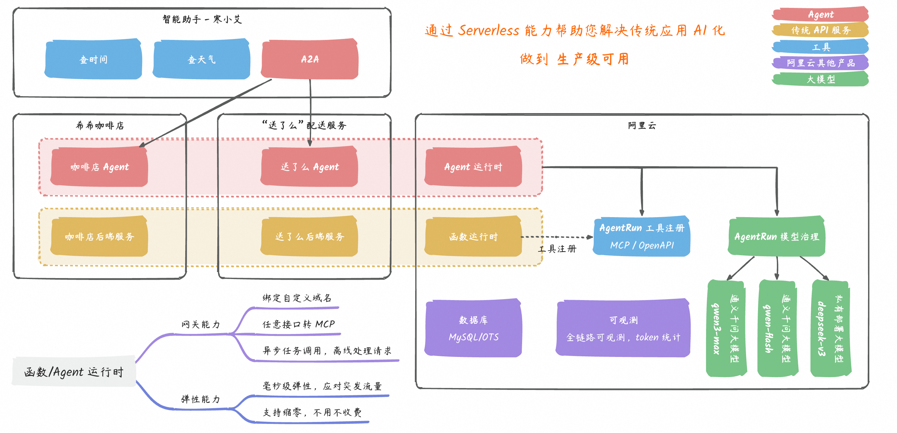

# 使用AgentRun构建“希希咖啡店”多智能体应用

随着大语言模型（LLM）能力的飞速提升，AI 应用正在从单一的“对话机器人”向复杂的“智能体（Agent）”演进。然而，如何构建一个能够处理复杂业务流程、具备高可维护性和扩展性的企业级 Agent 系统，依然是行业面临的巨大挑战。本文以开源项目“希希咖啡店”为例，基于函数计算的AgentRun服务和A2A（Agent-to-Agent）协议，构建一个分工明确、协作高效的多智能体系统。

## **开始体验**

### **准备工作**

在开始之前，请确保您已完成以下准备工作：

1. 开通云服务并完成授权：
  
  - 确保您已拥有一个可用的[阿里云账号](https://account.aliyun.com/register/qr_register.htm)。
  - 访问并开通以下服务。首次访问时，请根据页面引导完成服务开通和RAM角色授权。
    
    - [函数计算 FC 服务](https://fcnext.console.aliyun.com/)
    - [AgentRun 服务](https://functionai.console.aliyun.com/welcome)
2. 获取模型访问凭证 (API-KEY)：
  
  - 本应用依赖大语言模型进行对话理解。请登录[百炼控制台](https://bailian.console.aliyun.com/?tab=demohouse#/authority)，在**密钥管理**页面创建或复制一个API-KEY，后续步骤将使用此密钥。
3. 通过模型管理创建LLM模型
  
  下文以配置百炼中的`qwen3-max`模型为例，如果您想配置其他模型或自定义模型，请参见：[大语言模型](https://help.aliyun.com/zh/functioncompute/fc/large-language-model)。
  
  - 进入[模型管理](https://functionai.console.aliyun.com/cn-hangzhou/agent/models/llm)页面，点击**添加模型**。
  - 选择**API模型**，并配置以下参数：
    
    - **名称**：`qwen3-model`；
    - **服务提供商**：从下拉框中选择**阿里云**；
    - **API端点**：保持默认；
    - **配置具体模型**：搜索并选择**qwen3-max**；
    - **凭证管理**：选择**API密钥**，并粘贴[准备工作](#4b4e60a83csf3)步骤2中获取的百炼API Key；您也可以选择**使用已有凭证**，并从下拉框中选择您提前配置好的凭证，详情可参见：[凭证管理](https://help.aliyun.com/zh/functioncompute/fc/voucher-management)。

### **选择模板并部署**

1. 在[AgentRun控制台](https://functionai.console.aliyun.com/cn-hangzhou/agent/runtime/agent-list)上方点击**Agent 模板**按钮，在热门Agent项目模板中点击**希希咖啡店**，点击**快速部署**。
2. 在部署页面，请参考以下说明配置参数：
  
  - **应用名称**：为您的应用设置一个易于识别的名称，便于后续管理和识别，如：`buy-me-a-coffee`。
  - **输入Agent描述****（可选）**：简要描述应用的功能，如：`基于希希咖啡店模板创建的Agent`。
  - **权限配置**：为AgentRun应用授权，以便其能访问模型、工具等云资源。
    
    - （推荐）点击**快速创建**，系统将引导您创建一个名为`AliyunAgentRunDefaultRole`的默认角色，该角色已包含所需权限；
    - 如需自定义权限，您也可以点击下拉框右侧的添加按钮，通过**创建角色**手动配置，并为其添加相应的权限策略，详情可参见[按需配置执行角色](https://help.aliyun.com/zh/functioncompute/fc/create-agent-by-code-high-code#a570e95c9ewni)。
  - **大语言模型**：从下拉框中选择您刚刚配置的**qwen3-model**，并选择**qwen3-max**模型。如果您未提前配置，可点击下拉框右侧的添加按钮，参考[准备工作](#4b4e60a83csf3)步骤3进行配置。
  - 点击**确认创建**，等待应用部署完成。
  - 部署成功后，页面会显示应用的访问链接。点击链接即可进入WebUI体验页面。

### **应用体验**

1. 进入WebUI页面后，请留意左下角的状态提示：
  
  - 无A2A服务/正在加载A2A服务：表示前端正在搜索已部署的 Agent。请稍作等待。
  - 2个A2A服务运行中：表示“订单”和“配送”这两个业务 Agent 已成功加载，可点击卡片查看详情或进行交互。总控 Agent 作为前端的调用入口，不在此处显示。
2. 通过文字进行对话：
  
  - **查看菜单**：输入或点击**看菜单**。
  - **下单**
    
    示例输入：给小明点一杯焦糖玛奇朵，去冰，全糖。配送到阿里云谷园区1号楼，手机号是1234567。
  - **标记订单**
  - **查询订单**
  - **配送**

### **查看应用详情**

应用部署成功后，您可以在[AgentRun控制台](https://functionai.console.aliyun.com/cn-hangzhou/agent/runtime/agent-list)对应用进行全方位的管理和运维。在应用列表中找到您创建的应用，点击进入**详情**页面，左侧导航栏提供了以下核心功能：

- 概览与配置：快速查看应用的基本信息、运行时配置（如模型、内存规格），并在此管理环境变量。
- 代码与调试：支持在线查看、编辑和调试，并进行在线二次开发。
- 版本与灰度：提供版本管理能力，支持通过灰度发布将少量流量切换到新版本进行测试，验证通过后再全量上线。每个版本都有一个临时域名供测试使用。
- 集成与发布：可参考[Agent集成与发布](https://help.aliyun.com/zh/functioncompute/fc/agent-integration)，将开发的Agent快速集成到您的前端网页、后端应用等。
- 弹性与实例：查看当前正在运行的实例列表和状态，并配置灵活的[弹性伸缩策略](https://help.aliyun.com/zh/functioncompute/fc/user-guide/instance-scaling-restrictions-and-rules)，让应用根据业务负载自动增减实例。
- 可观测性：通过集成阿里云应用实时监控服务（ARMS），可以获得代码级的性能诊断、请求追踪、异常监控和告警能力，保障应用的稳定运行。

### **删除资源**

为避免产生不必要的费用，体验结束后，请及时清理资源。

在[AgentRun控制台](https://functionai.console.aliyun.com/cn-hangzhou/agent/runtime/agent-list)的应用列表中，找到您创建的“希希咖啡店”相关应用。由于该模板会创建多个Agent应用（总控、订单、配送），请将它们逐一删除，以完成所有资源的清理。

## **计费说明**

部署“希希咖啡店”应用将创建并使用以下阿里云付费服务。最终费用以您的阿里云账单为准。

- **Agent 服务 / 函数计算 (FC)**
  
  - 说明：应用中的三个 Agent 实例将部署在阿里云函数计算之上。函数计算根据您的实际调用次数和资源使用量进行计费。
  - 计费文档：[函数计算计费概述](https://help.aliyun.com/zh/functioncompute/fc/product-overview/billing-overview-of-fc)。
- **大语言模型 / 阿里云百炼**
  
  - 说明：应用依赖的大语言模型服务由阿里云百炼平台提供。模型调用将根据输入和输出的 Token 数量进行计费。
  - 计费文档：[百炼模型调用计费说明](https://bailian.console.aliyun.com/?spm=5176.cap.0.0.361c68fdzlECD8&tab=doc#/doc/?type=model&url=2987148)。
- **日志与监控 / 日志服务 (SLS) & 应用实时监控服务 (ARMS)**
  
  - 说明：为便于应用运维，系统将自动为您开通日志服务（SLS）和应用实时监控服务（ARMS）。这两项服务均提供免费额度，超出免费额度的部分将按量计费。
  - 计费文档：[SLS计费概述](https://help.aliyun.com/zh/sls/billing-overview)｜[ARMS产品计费](https://help.aliyun.com/zh/arms/product-overview/product-billing)。

**成本管理提示**：建议您在部署前详细阅读各服务的计费文档，并根据业务需求在阿里云控制台设置消费预警，以有效管理成本。

## **应用架构解析**

### **1. 业务挑战**

在复杂的交互场景中，一个简单的用户指令背后往往需要跨领域的任务协作。

例如，对于指令：“`来一杯热拿铁，全糖，送到阿里云云谷园区。`”

系统需要依次完成：

- 意图识别： 理解用户需要“购买商品”。
- 商品处理： 查询商品信息，解析规格。
- 订单生成： 创建包含商品、规格、价格的订单。
- 物流调度： 解析地址，调用配送服务。
- 状态同步： 向用户反馈流程中的关键状态。

传统的单体应用难以有效处理此类跨域工作流。我们的解决方案采用多智能体（Multi-Agent）架构，将复杂任务解耦，交由一组各司其职的智能体协作完成。

### **2. 架构设计**

在“希希咖啡店”这个示例中，我们将业务流程拆解为三个独立的 Agent，它们通过标准化的 A2A (Agent-to-Agent) 协议进行通信。下图分别展示了“希希咖啡店”的用户交互界面（左侧）与 AgentRun 的应用管理控制台（右侧）。

左侧顾客端为**寒小艾智能助手**聊天界面，作为主Agent模拟用户手机助手，提供**看菜单**、**查订单**、**叫配送**等快捷操作；右侧为**商家后台·订单管理系统**，含咖啡订单和配送订单Tab页签，可操作制作与配送进度以测试Agent效果。底部状态栏显示**咖啡Agent**和**配送Agent**两个A2A服务运行中，技术栈为AgentRun + Google ADK + A2A Protocol + AGUI + CopilotKit。

该应用示例背后的技术架构如下，它展示了各个智能体如何与底层服务协同工作：

### **3. 智能体角色与职责**

#### **寒小艾（Root Agent）：总控入口与任务路由器**

作为系统的统一入口，负责解析用户意图，并将任务分发给下游的专业 Agent。它不执行具体业务，而是扮演“调度中心”的角色。

- 核心职责：
  
  - 意图识别： 判断用户指令的业务类型（如购物、查询、闲聊）。
  - 任务路由： 根据意图，将任务精准路由至对应的业务 Agent（如 Coffee Agent）。
  - 上下文管理： 在多轮对话中维护和传递上下文信息。

#### **希希（Coffee Agent）： 领域业务智能体**

封装了特定业务领域（此例中为咖啡销售）的所有逻辑和能力。

- 核心职责：
  
  - 提供商品菜单查询（`get_menu`）。
  - 处理商品语义搜索（`search_product`）。
  - 创建和管理订单（`create_order`）。
- 设计原则：
  
  - 通过 API 提供标准服务，实现业务逻辑的封装与数据隔离。

#### **小骑手（Delivery Agent）：通用服务 Agent**

提供独立的、与具体业务无关的通用能力（如此处的物流配送）。

- 核心职责：
  
  - 接收配送请求，调度运力（`create_delivery`）。
  - 提供配送状态的实时查询（`query_delivery`）。
- 设计原则：
  
  - 高度解耦与复用： 该 Agent 不关心配送的具体商品，只处理“取货地”和“送货地”。因此，它可以被无缝复用于任何需要配送服务的业务场景（如鲜花、外卖等）。
