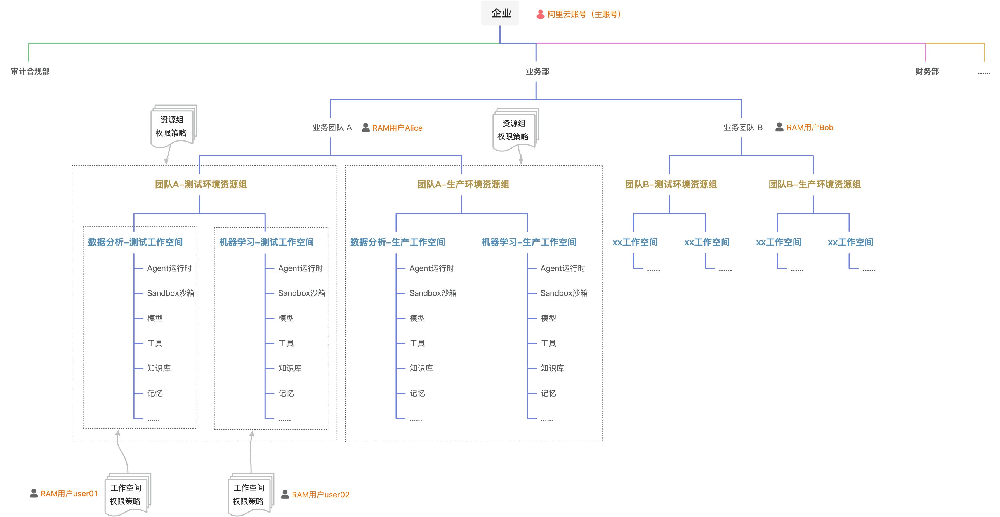

# 资源组和工作空间最佳实践

本文以多团队企业场景为例，介绍如何通过资源组和工作空间的合理规划，在 AgentRun 中实现团队间资源隔离与精细化访问控制。

**适用场景：**单主账号下存在多个业务团队，每个团队有多个项目，需要在测试与生产环境之间、不同团队之间实现资源隔离，且一线开发人员只能访问本项目的资源。

**架构图：**



## 实践背景

某公司有两个业务团队—团队 A 和团队 B，各自负责独立业务系统。每个业务系统下有若干项目（如数据分析、机器学习），并部署了测试和生产双环境。随着 AgentRun 资源增多，公司面临以下两类诉求：

**资源隔离与归属清晰**：不同团队、不同环境的资源完全隔离，能快速检索某资源的归属业务系统。

**精细化访问控制**：一线开发人员只能访问本项目资源；业务系统管理员可统一管理本团队资源，但不能越界访问其他团队。

## 方案设计

### **设计思路**

针对上述诉求，推荐采用“业务团队 × 环境”维度划分资源组、“项目”维度划分工作空间的两层架构：

| **层级** | **划分维度** | **授权对象** |
| --- | --- | --- |
| **资源组** | 业务团队 × 环境（n 团队 × m 环境 = n×m 个资源组） | 业务系统管理员，管辖本团队资源组 |
| **工作空间** | 项目（挂载在对应资源组下） | 一线开发人员，访问本项目工作空间 |

### **账号和角色规划**

本方案使用 1 个阿里云账号（主账号），通过 RAM 用户承载多团队权限分离：

| **角色** | **RAM 用户** | **权限范围** |
| --- | --- | --- |
| 主账号管理员 | 阿里云账号（主账号） | 所有资源的完全控制权 |
| 团队 A 管理员 | Alice | 团队 A 所有资源组和工作空间 |
| 团队 B 管理员 | Bob | 团队 B 所有资源组和工作空间 |
| 团队 A 数据分析项目开发 | user01 | 数据分析-测试工作空间内的资源 |
| 团队 A 机器学习项目开发 | user02 | 机器学习-测试工作空间内的资源 |

### **资源组和工作空间规划**

本示例创建**4个资源组**和**6个工作空间**（团队 B 的工作空间数量根据实际项目自行扩展）：

| **资源组** | **绑定的工作空间** | **管理员** |
| --- | --- | --- |
| 团队A-测试环境 | 数据分析-测试工作空间、机器学习-测试工作空间 | Alice |
| 团队A-生产环境 | 数据分析-生产工作空间、机器学习-生产工作空间 | Alice |
| 团队B-测试环境 | 团队B项目-测试工作空间 | Bob |
| 团队B-生产环境 | 团队B项目-生产工作空间 | Bob |

## 操作步骤

### **步骤一：创建RAM用户**

在 RAM 控制台为各业务系统管理员和一线开发人员创建对应的 RAM 用户。

本示例创建以下 RAM 用户：

| **RAM 用户**<br>**** | **角色定位**<br>**** |
| --- | --- |
| Alice | 业务系统 A 管理员 |
| Bob | 业务系统 B 管理员 |
| user01 | 团队 A 数据分析项目开发 |
| user02 | 团队 A 机器学习项目开发 |

**操作入口**：登录[RAM控制台](https://ram.console.aliyun.com)，在**身份管理**中点击**用户**>**创建新用户，**详细创建步骤，请参见：[创建RAM用户](https://help.aliyun.com/zh/ram/user-guide/create-a-ram-user)。

**

**说明**

命名建议：按照"姓名缩写"或"角色+编号"规则命名（如 alice、bob、dev-team-a-001），便于授权时快速识别身份。

### **步骤二：创建资源组**

在资源管理（Resource Manager）控制台创建与业务团队和环境对应的资源组。

本示例创建以下 4 个资源组：

- 团队A-测试环境
- 团队A-生产环境
- 团队B-测试环境
- 团队B-生产环境

**操作入口：**登录[资源管理控制台](https://resourcemanager.console.aliyun.com)>**资源组**>**创建资源组**，详细创建步骤，请参见：[什么是资源管理](https://help.aliyun.com/zh/resource-management/product-overview/what-is-resource-management)。

**

**说明**

命名建议：资源组名称建议体现团队和环境信息，如"teamA-test"、"teamA-prod"，方便在控制台列表中快速识别归属。

### **步骤三：为RAM用户授权资源组权限**

使用阿里云账号（主账号）为各业务系统管理员分别授权，确保其只能管理本团队的资源组。

**授权范围示例：**

| **RAM 用户**<br>**** | **授权的资源组**<br>**** | **授予的权限策略**<br>**** |
| --- | --- | --- |
| Alice | 团队A-测试环境、团队A-生产环境 | AdministratorAccess |
| Bob | 团队B-测试环境、团队B-生产环境 | AdministratorAccess |

**两种授权方式可选：**

- **在资源组控制台授权**：进入资源组详情页，选择对应 RAM 用户并授予权限策略
- **在 RAM 控制台授权**：进入 RAM 用户详情页，指定资源组范围和权限策略

**

**说明**

最小权限原则：如果团队管理员只需要管理 AgentRun 相关资源，建议授予 AgentRun 相关精细化权限策略，而非 AdministratorAccess。本示例使用 AdministratorAccess 以简化演示，实际生产环境请按需调整。

以下为仅授权 AgentRun 操作、限定在指定资源组内的自定义权限策略示例：

```
{ "Version": "1", "Statement": [ { "Effect": "Allow", "Action": "agentrun:*", "Resource": "*", "Condition": { "StringEquals": { "acs:ResourceGroupId": [ "rg-xxxx1", "rg-xxxx2" ] } } } ] }
```

**

**说明**

将**rg-xxxx1**、**rg-xxxx2**替换为实际资源组 ID（可在[资源管理控制台](https://resourcemanager.console.aliyun.com)的资源组列表中查看）。**agentrun:***表示授予全部 AgentRun 操作权限；如需进一步收窄，可替换为具体 Action，例如 agentrun:GetWorkspace、agentrun:ListWorkspace 等。

### **步骤四：在AgentRun中创建工作空间并绑定资源组**

由业务系统管理员（如 Alice）登录 AgentRun 控制台，创建本团队各项目对应的工作空间，并将每个工作空间绑定到对应的资源组。

**Alice 需要创建以下 4 个工作空间：**

| **工作空间名称**<br>**** | **绑定的资源组**<br>**** |
| --- | --- |
| 数据分析-测试工作空间 | 团队A-测试环境 |
| 机器学习-测试工作空间 | 团队A-测试环境 |
| 数据分析-生产工作空间 | 团队A-生产环境 |
| 机器学习-生产工作空间 | 团队A-生产环境 |

**操作入口**：登录[AgentRun控制台](https://functionai.console.aliyun.com/cn-hangzhou/agent/runtime/agent-list)，点击控制台左上角的工作空间下拉菜单，选择**创建工作空间**，在创建表单中填写名称并选择对应的资源组。

**

**说明**

注意：工作空间与资源组的绑定关系在创建时确定，创建后不支持变更。请在创建前规划好对应关系。

### **步骤五：为一线开发人员授予工作空间权限**

一线开发人员只需访问和操作本项目的工作空间，需要进行分层授权。以下以"为 user01 授予数据分析-测试工作空间权限"为例，说明 4 个子步骤。

**

**说明**

**前提：完成**[步骤三](#ca3a146adcmop)**和**[步骤四](#163ed58a5cf70)**后，由 Alice（团队 A 管理员）执行以下授权操作。**

#### **授予资源组维度的工作空间查询权限**

user01 需要能看到"团队A-测试环境"资源组下的工作空间列表，才能进入对应工作空间。

在 RAM 控制台为 user01 授予以下权限，授权范围限定在"团队A-测试环境"资源组：

- **权限策略：**包含 AgentRun操作的权限策略
- **授权范围：**仅限"团队A-测试环境"资源组

```
{ "Version": "1", "Statement": [ { "Effect": "Allow", "Action": "agentrun:ListWorkspaces", "Resource": "*" } ] }
```

完成此步骤后，user01 可在工作空间列表中看到该资源组下的所有工作空间（数据分析-测试工作空间、机器学习-测试工作空间），但尚未获得具体资源的操作权限。

#### **授予指定工作空间内的 AgentRun 资源操作权限**

在 AgentRun 控制台，将"数据分析-测试工作空间"的操作权限授予 user01，包括该工作空间内的以下资源类型：

- Agent 运行时
- 沙箱（Sandbox）
- 模型
- 工具
- 知识库
- 记忆
- 凭证
- 监控大盘

```
{ "Version": "1", "Statement": [ { "Effect": "Allow", "Action": [ "agentrun:GetAccessToken", "agentrun:GetAgentDiscoveryResult", "agentrun:GetAgentRuntime", "agentrun:GetAgentRuntimeEndpoint", "agentrun:GetApigLLMModel", "agentrun:GetBrowser", "agentrun:GetBrowserSession", "agentrun:GetCodeInterpreter", "agentrun:GetCodeInterpreterSession", "agentrun:GetCredential", "agentrun:GetKnowledgeBase", "agentrun:GetMemoryCollection", "agentrun:GetModelProxy", "agentrun:GetModelService", "agentrun:GetSandbox", "agentrun:GetTemplate", "agentrun:ActivateTemplateMCP", "agentrun:CreateAgentRuntime", "agentrun:CreateAgentRuntimeEndpoint", "agentrun:CreateApigLLMModel", "agentrun:CreateBrowser", "agentrun:CreateCodeInterpreter", "agentrun:CreateCredential", "agentrun:CreateKnowledgeBase", "agentrun:CreateMemoryCollection", "agentrun:CreateModelProxy", "agentrun:CreateModelService", "agentrun:CreateSandbox", "agentrun:CreateTemplate", "agentrun:CreateWorkspace", "agentrun:DeleteAgentRuntime", "agentrun:DeleteAgentRuntimeEndpoint", "agentrun:DeleteApigLLMModels", "agentrun:DeleteBrowser", "agentrun:DeleteCodeInterpreter", "agentrun:DeleteCredential", "agentrun:DeleteKnowledgeBase", "agentrun:DeleteMemoryCollection", "agentrun:DeleteModelProxy", "agentrun:DeleteModelService", "agentrun:DeleteSandbox", "agentrun:DeleteTemplate", "agentrun:DeregisterExternalService", "agentrun:PublishRuntimeVersion", "agentrun:RegisterExternalService", "agentrun:StartBrowserSession", "agentrun:StartCodeInterpreterSession", "agentrun:StopSandbox", "agentrun:UpdateAgentRuntime", "agentrun:UpdateAgentRuntimeEndpoint", "agentrun:UpdateApigLLMModel", "agentrun:UpdateCredential", "agentrun:UpdateKnowledgeBase", "agentrun:UpdateMemoryCollection", "agentrun:UpdateModelProxy", "agentrun:UpdateModelService", "agentrun:UpdateTemplate", "agentrun:ListAgentRuntimeEndpoints", "agentrun:ListAgentRuntimes", "agentrun:ListAgentRuntimeVersions", "agentrun:ListApigLLMModels", "agentrun:ListBrowsers", "agentrun:ListBrowserSessions", "agentrun:ListCodeInterpreters", "agentrun:ListCodeInterpreterSessions", "agentrun:ListCredentials", "agentrun:ListKnowledgeBases", "agentrun:ListMemoryCollections", "agentrun:ListModelProviders", "agentrun:ListModelProxies", "agentrun:ListModelServices", "agentrun:ListSandboxes", "agentrun:ListTemplates", "agentrun:ListTools", "agentrun:GetTool", "agentrun:CreateTool", "agentrun:DeleteTool", "agentrun:UpdateTool" ], "Resource": "acs:agentrun:*:<your-account-id>:workspaces/DataAnalysis-Test/*" } ] }
```

**操作入口：**进入[AgentRun控制台](https://functionai.console.aliyun.com/cn-hangzhou/agent/runtime/agent-list)>**数据分析-测试工作空间**>**成员管理**>**添加成员**，选择 user01 并分配对应角色（如开发者角色）。

完成此步骤后，user01 可在数据分析-测试工作空间内创建、查看和管理上述资源，但无法操作机器学习-测试工作空间内的任何资源。

#### **授权账号维度的全局资源权限**

部分 AgentRun 资源属于账号级别的全局资源，不归属于特定工作空间，需要在账号维度单独授权。

**自定义域名**是典型的账号级全局资源。如果 user01 需要配置或查看自定义域名，在 RAM 控制台为其授予账号级别的相关权限策略（授权范围选择"整个云账号"）。

```
{ "Version": "1", "Statement": [ { "Effect": "Allow", "Action": [ "agentrun:*CustomDomain*" ], "Resource": "*" } ] }
```

**

**说明**

并非所有用户都需要此权限。如果 user01 不需要管理自定义域名，可跳过此子步骤。

#### **按需授权其他依赖云产品权限**

AgentRun 资源运行时可能依赖其他阿里云产品（如对象存储 OSS、函数计算 FC 等）。常见的依赖权限示例：

| **依赖场景**<br>**** | **需授权的云产品**<br>**** | **建议的权限策略**<br>**** |
| --- | --- | --- |
| 知识库数据存储 | 对象存储 OSS | OSS 指定 Bucket 的读写权限 |
| Agent 运行时底层计算 | 函数计算 FC | FC 相关只读或调用权限 |
| 日志与监控查询 | 日志服务 SLS | SLS 指定 Logstore 的读权限 |

**

**说明**

最小权限原则：按一线开发的实际业务需求授权，优先使用资源级权限策略，限定到具体的 Bucket、Logstore 等资源范围。

### **步骤六：将 AgentRun 资源划分到对应的工作空间**

完成权限配置后，确保各类 AgentRun 资源归属在正确的工作空间中。

**新建资源**：在创建 AgentRun 资源的表单中，直接选择对应的工作空间，资源自动归属到该工作空间所在的资源组。

**存量资源迁移**：如果已有 AgentRun 资源尚未划分到工作空间，通过资源转移功能迁移。

**操作入口**：进入[AgentRun控制台](https://functionai.console.aliyun.com/cn-hangzhou/agent/runtime/agent-list)对应资源的管理页面，找到目标资源，选择目标工作空间后确认。

**

**说明**

资源转移操作可能影响正在运行中的任务，建议在业务低峰期操作，并提前通知相关开发人员。

## 实践效果

完成上述配置后，各角色的权限隔离效果如下：

| **身份** | **可见的资源组** | **可操作的工作空间** | **资源操作范围** |
| --- | --- | --- | --- |
| 阿里云账号（主账号） | 所有资源组 | 所有工作空间 | 无限制 |
| Alice | 团队A-测试环境、团队A-生产环境 | 团队 A 下全部工作空间 | 团队 A 所有工作空间的所有资源 |
| Bob | 团队B-测试环境、团队B-生产环境 | 团队 B 下全部工作空间 | 团队 B 所有工作空间的所有资源 |
| user01 | 团队A-测试环境（列表可见） | 数据分析-测试工作空间 | 该工作空间内的所有资源类型 |
| user02 | 团队A-测试环境（列表可见） | 机器学习-测试工作空间 | 该工作空间内的所有资源类型 |

user01 和 user02 都能在工作空间列表中看到"团队A-测试环境"下的所有工作空间，但各自只能操作被授权的那个工作空间内的资源。团队 A 与团队 B 之间、测试环境与生产环境之间完全隔离。

## 常见误区

| **误区** | **问题** | **建议做法** |
| --- | --- | --- |
| 所有项目共用一个工作空间 | 无法实现项目级权限隔离，开发人员可以互相看到对方的资源 | 每个项目对应一个独立工作空间 |
| 在账号维度直接授予 AdministratorAccess | 开发人员获得超出职责范围的权限，存在误操作风险 | 在工作空间维度按角色精细化授权 |
| 测试和生产环境共用同一资源组 | 开发人员可能误操作生产资源 | 测试和生产环境分别创建独立资源组 |
| 先创建工作空间再规划资源组 | 工作空间与资源组的绑定关系创建后不可更改，规划不当会导致后续无法调整 | 先完成资源组规划，再创建工作空间并绑定 |
