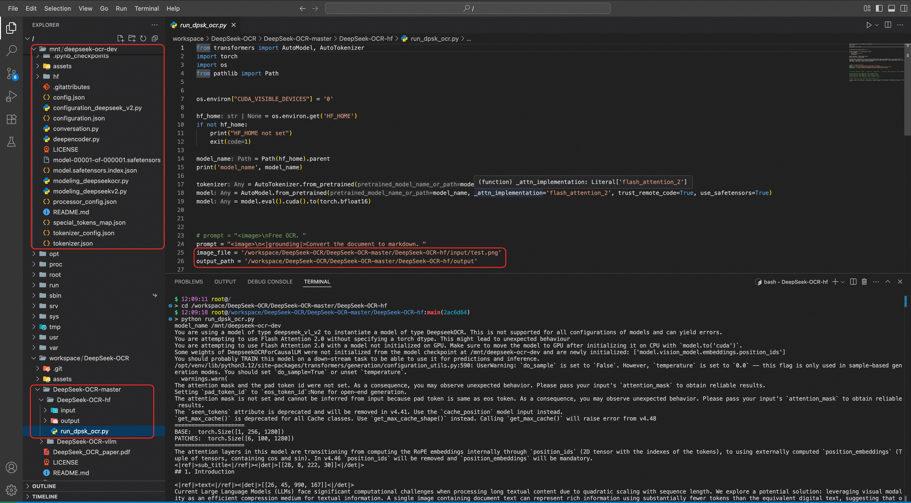

# DeepSeek-OCR快速开始指南

本文介绍如何使用FunModel的DevPod功能，快速启动一个预置了DeepSeek-OCR 模型、相关依赖和示例代码的云端GPU开发环境。您可以在此环境中进行模型的功能验证、二次开发或性能测试。

## **准备工作**

在开始之前，请确保您已拥有一个可用的阿里云账号，并已登录到[FunModel控制台](https://functionai.console.aliyun.com/cn-hangzhou/fun-model/model-market)。

1. 切换至新版控制台：如果当前为旧版，请单击页面右上角的**新版控制台**。
2. 完成授权：首次登录时，请根据页面指引完成RAM角色授权等配置。

## **创建DevPod开发环境**

1. 在FunModel控制台，点击**自定义开发****，**并选择**自定义环境**；
2. **配置并启动开发参数：**
  
  - **容器镜像**：
    
    - 国内地域：`serverless-registry.cn-hangzhou.cr.aliyuncs.com/functionai/devpod-presets:deepseek-ocr-v1`
    - 海外地域：`serverless-registry.ap-southeast-1.cr.aliyuncs.com/functionai/devpod-presets:deepseek-ocr-v1`
  - **模型名称**：为此开发环境命名，例如`deepseek-ocr-dev`。此名称将作为您的工作空间名称，并决定了模型文件在 NAS 上的存储路径 （`/mnt/deepseek-ocr-dev`）。
  - **模型来源**>**模型ID**：`deepseek-ai/DeepSeek-OCR`。
  - **启动命令**和**监听端口**：保持默认即可。
  - **实例规格**：选择**弹性实例**>**GPU性能型**。
    
    - **决策建议**：为确保模型能稳定运行，请选择显存不低于 16GB 的 GPU 实例。
    - **成本说明**：DevPod 运行期间将按量对 GPU 实例计费，费用较高。为节省成本，请在不使用时及时关闭开发环境。
  - **角色名称**：选择**AliyunFCDefaultRole**。
3. 启动开发环境：
  
  点击**DevPod开发调试**。

## **配置与测试**

环境启动成功后，会自动进入VS Code WebIDE界面，您可在此界面上传测试图片，并运行示例脚本进行推理。

### **验证环境**

- 在 IDE 底部的终端中执行以下命令，检查环境是否就绪。
  
  ```
  # 1. 检查 GPU 是否可用，应能看到 GPU 信息列表 nvidia-smi # 2. 查看模型文件是否已下载到 NAS # 将 deepseek-ocr-dev 替换为您在步骤一中设置的模型名称 ls -l /mnt/deepseek-ocr-dev
  ```
  
  模型文件被预先下载到 NAS 盘，并固定存储在`/mnt/{name}`路径下，其中`{name}`是您创建时填写的**模型名称**。

### **Hugging Face示例**

1. 打开终端，进入HF示例目录：
  
  ```
  cd /workspace/DeepSeek-OCR/DeepSeek-OCR-master/DeepSeek-OCR-hf
  ```
2. （可选）上传自己的测试图片，替换 input/test.png。
3. 执行推理：
  
  ```
  python run_dpsk_ocr.py
  ```
4. 终端会直接打印识别文本，并将结果文件保存在`output/`目录下。
  
  

### **vLLM示例**

vLLM 提供了针对图片、PDF 和批量处理等不同任务的优化脚本。所有任务均通过`config.py`文件进行配置。

操作总览：

1. **进入目录**：首先进入 vLLM 示例文件夹。
  
  ```
  cd /workspace/DeepSeek-OCR/DeepSeek-OCR-master/DeepSeek-OCR-vllm
  ```
2. **确认配置**：打开`config.py`，配置任务对应的路径或直接使用代码中的示例路径。
3. **执行脚本**：运行任务对应的`.py`文件。

以下是每个任务的具体配置与命令。

#### **单图推理**

示例路径：

```
INPUT_PATH = '/workspace/DeepSeek-OCR/DeepSeek-OCR-master/DeepSeek-OCR-vllm/input_image/test.png' OUTPUT_PATH = '/workspace/DeepSeek-OCR/DeepSeek-OCR-master/DeepSeek-OCR-vllm/output_run_dpsk_ocr_image'
```

执行命令：

```
python run_dpsk_ocr_image.py
```

#### **PDF 推理**

示例路径：

```
INPUT_PATH = '/workspace/DeepSeek-OCR/DeepSeek-OCR-master/DeepSeek-OCR-vllm/input_pdf/test.pdf' OUTPUT_PATH = '/workspace/DeepSeek-OCR/DeepSeek-OCR-master/DeepSeek-OCR-vllm/output_run_dpsk_ocr_pdf'
```

执行命令：

```
python run_dpsk_ocr_pdf.py
```

#### **批量图像处理**

示例路径：

```
# /workspace/DeepSeek-OCR/DeepSeek-OCR-master/DeepSeek-OCR-vllm/config.py INPUT_PATH = '/workspace/DeepSeek-OCR/DeepSeek-OCR-master/DeepSeek-OCR-vllm/input_image/' OUTPUT_PATH = '/workspace/DeepSeek-OCR/DeepSeek-OCR-master/DeepSeek-OCR-vllm/output_run_dpsk_ocr_eval_batch/'
```

执行命令：

```
python run_dpsk_ocr_eval_batch.py
```

**提示**：所有输入路径下的图片文件将被自动处理，结果统一输出到`OUTPUT_PATH`。

## **管理开发环境与成本**

- **停止环境**：在 DevPod 列表页点击 关闭，可停止 GPU 计费。
- **删除环境**：在 DevPod 列表页执行 删除 操作，将永久删除 GPU 实例。

**

**说明**

停止和删除环境不会影响NAS上的数据，如需删除请谨慎执行rm命令。

## **常见问题（FAQ）**

**Q: 启动 DevPod 失败或长时间处于“创建中”状态怎么办？**

A: 请检查：1. RAM 子账号是否已正确授予；2. 阿里云账号是否欠费；3. 所选地域的 GPU 资源是否库存紧张。可尝试更换地域或实例规格后重试。

**Q: 执行**`**nvidia-smi**`**报错或找不到命令？**

A: 请确认您在创建环境时选择了**GPU性能型**实例。如果已选择但仍报错，请尝试在控制台重启一次开发环境。

**Q: 模型下载失败，**`**/mnt/{name}**`**目录为空？**

A: 这可能是由于临时的网络波动或模型社区访问问题导致。请尝试删除当前 DevPod 并重新创建一个。

**Q: 如何在环境中安装额外的 Python 包？**

A: 在 Web IDE 的终端中直接使用`pip install <package_name>`命令即可。
