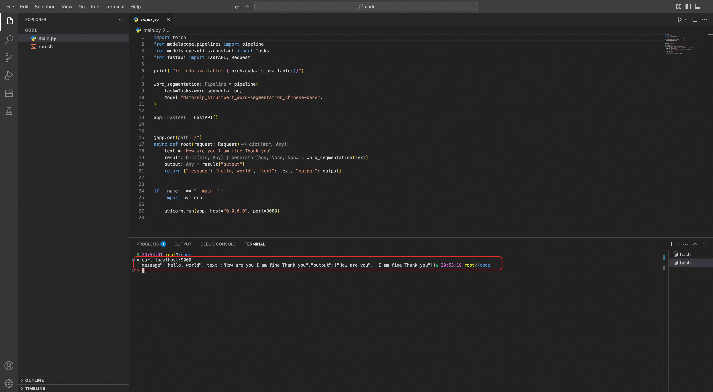

# DevPod开发环境

DevPod 是函数计算 FC 提供的云端开发环境。它集成了 VS Code、Jupyter Notebook 与终端等常用开发工具，支持通过预置或自定义的容器镜像快速创建开发环境。用户可以在 DevPod 中完成 AI 模型的开发、训练、调试，并将其部署为在线服务。

## **准备工作**

在开始之前，请确保您已拥有一个可用的阿里云账号，并已登录到[FunModel控制台](https://functionai.console.aliyun.com/cn-hangzhou/fun-model/model-market)。

1. 切换至新版控制台：如果当前为旧版，请单击页面右上角的 新版控制台。
2. 完成授权：首次登录时，请根据页面指引完成 RAM 角色授权等配置。

## **快速入门**

本教程将以一个 ModelScope 分词模型为例，引导您完成从搭建开发环境到最终部署为在线服务的完整流程。

### 步骤1：创建DevPod实例

1. 在**模型市场******左侧导航栏选择**自定义开发**；
2. 配置以下关键参数：
  
  | **参数** | **说明** | **填写示例** |
  | --- | --- | --- |
  | **地域** | 在右上角选择 DevPod 实例部署的阿里云地域 | `华东1（杭州）` |
  | **选择模型环境** | 选择一个预置的深度学习框架环境，或指定[自定义镜像](#b222831a0fd43) | `Modelscope 1.26.0` |
  | **模型名称** | 为实例设置一个便于识别的名称 | `tokenizer-deploy-dev` |
  | **模型描述** | 简要说明模型用途、功能或开发目标 | `ModelScope 分词模型` |
  | **模型来源** | 根据[模型来源说明](https://help.aliyun.com/zh/functioncompute/fc/custom-model-deployment#9ca0d22c15943)填写相关路径信息 | 无（Modelscope 1.26.0模型环境已包含相关内容） |
  | **资源配置** | 根据任务需求选择**实例类型**和**GPU规格** | **弹性实例**>**GPU进阶型** |
  | **角色名称** | 指定用于访问云资源的 RAM 角色（需具备必要权限） | `AliyunFCDefaultRole` |
3. 点击**DevPod开发调试**。

### 步骤2：开发与调试

1. 进入**VS Code**在线开发环境。
2. 打开 Terminal 执行`./run.sh`，下载模型至外置存储并启动应用，可在**运行日志**中看到模型加载和 Web 服务启动的日志。
3. 打开新的 Terminal 执行`curl localhost:9000`，查看分词结果。



### 步骤3：制作镜像并部署服务

完成开发调试后，您需要将当前包含代码和依赖的环境固化成一个容器镜像，并将其部署为在线服务。

**注意事项与限制：**

本地盘中变更的文件数量少于 10 万个，且变更文件的总大小不超过 5GB。否则构建会因超时或容量不足而失败。

**操作步骤：**

1. [准备ACR实例](#0a5d49ab64yob)。
2. **制作镜像**。
  
  - 返回 DevPod 实例列表页面，在实例的操作列中选择**制作镜像**。
  - 选择ACR 类型：**个人版/企业版**，填写以下参数：
    
    | **配置项** | **说明** |
    | --- | --- |
    | **ACR 地域** | 选择已创建的 ACR 实例所在地域（必须与 DevPod 一致） |
    | **ACR 命名空间** | 从已创建的命名空间中选择 |
    | **ACR 镜像仓库** | 选择目标仓库（需属于所选命名空间） |
    | **镜像名称（版本）** | 自定义镜像标签，如`v1.0`或`latest` |
    | **自定义排除路径** | 可指定不打包的目录（如`/data/cache`），避免敏感数据泄露或减小镜像体积。系统自动排除：`/.function_ai`、`/usr/local/share/jupyter/labextensions` |
    
    注意：NAS 挂载目录（`/mnt/<name>`）中的内容不会被打包进镜像。
  - 其他选项保持默认，然后点击**开始制作**。AI 相关的镜像通常较大，首次构建和推送耗时较长，请耐心等待。
3. **部署为在线服务**。
  
  - 镜像制作成功后，系统会自动跳转到镜像详情页。点击**直接部署**。
  - 配置部署参数：
    
    - **启动命令**：输入`/code/run.sh`。
    - **监听端口**：输入`9000`，与`main.py`中指定的端口一致。
    - **超时时间**：单次请求最大处理时间（单位：秒）
  - 点击**开始部署**。

**

**说明**

部署成功以后，可以通过模型列表找到对应的模型服务并进入。此时如果要再次进入 DevPod，需要点击模型服务右上角的`DevPod 开发`。

### 步骤4：验证在线服务

1. 部署成功后，进入模型服务详情页，选择**在线调试**。
2. 在**API在线调试界面**>**手动配置API端点**添加一个请求：
  
  - **Path**：输入`/`。
  - **HTTP Method**：选择`GET`。
3. 点击**发送请求**，在右侧的**响应结果**区域可以看到模型的回答。

## **核心功能详解**

### 环境管理

您可以在**自定义开发**页面对 DevPod 实例进行完整的生命周期管理：

- **创建**：根据需求配置并创建新的开发环境。
- **启动/停止**：在不使用实例时可将其停止，以节省计算资源费用。停止后，计算资源会被释放，但`/mnt`目录下的持久化数据会保留。
- **删除**：彻底删除实例。请注意，删除操作不可逆，但`/mnt`目录下的数据仍会保留**。**

### 开发工具

DevPod 在一个统一的界面中集成了三种主流开发工具，您可以在实例的**DevPod 开发调试**页面中随时切换：

- **VS Code**：功能强大的在线集成开发环境，基于`openvscode-server`，提供完整的代码编辑、调试、Git 管理和终端功能。
- **Jupyter Notebook**：业界标准的交互式计算环境，非常适合进行数据探索、算法实验和模型可视化。
- **Terminal**：一个完整的 Linux Shell 环境，您可以执行任何命令行操作，如安装软件、管理文件等。

### 持久化存储

每个 DevPod 实例都会自动挂载一个 NAS 文件存储目录，路径为`/mnt/<devpod名称>`。该目录中的数据不会随实例销毁而丢失，建议将模型权重、训练数据等重要文件存放于此。非`/mnt`路径下的文件为本地存储，实例重启后可能丢失。

**DevPod默认启用的环境变量：**

```
HF_HOME=/mnt/<devpod名称>/hf MODELSCOPE_CACHE=/mnt/<devpod名称>/modelscope OLLAMA_MODELS=/mnt/<devpod名称>/ollama
```

**持久化存储的特点：**

1. 制作镜像时不会被 build 到镜像中；
2. 即使 DevPod 删除销毁，内容依然存在；
3. 适合存储大模型文件，控制镜像体积。

**提示**: DevPod 内置开发镜像默认都有一个示例代码`main.py`和`run.sh`，可以直接运行`run.sh`启动应用，第一次执行`run.sh`会自动下载模型到持久化的 NAS 盘，下载目录为环境变量 MODELSCOPE_CACHE 指向的目录

### 自定义镜像

当预置镜像无法满足您的需求时（例如需要特定版本的库、自定义的系统工具或私有基础镜像），可以使用您自己的自定义镜像来创建 DevPod 实例。

- **使用方法**：在创建 DevPod 实例时，**模型环境**选择**自定义镜像**，并填入您在容器镜像服务（ACR）中的镜像地址。
- **镜像要求**：
  
  - **操作系统**：基于 AMD64 架构的 Linux 系统，最低要求 glibc 2.28 推荐基础镜像：`debian:10`、`ubuntu:20.04`、`centos:8`或更高版本，不支持`alpine`镜像。
  - **预装工具**：必须包含`curl`命令。
  - **用户权限**：默认用户为`root`。
  - **可选支持**：如果需要使用 jupyter，则镜像中需安装 Python ≥ 3.8 且包含`pip`命令。
  - **GPU兼容性**：函数计算GPU目前使用的驱动版本为570.133.20，其对应的CUDA用户态驱动版本为12.8。为了最佳的兼容性支持，建议您使用的CUDA Toolkit最低版本为11.8，最高不超过平台提供的CUDA用户态驱动版本。详情见：[【产品变更】GPU驱动版本由550.54.15升级至570.133.20](https://help.aliyun.com/zh/functioncompute/fc/product-overview/product-change-gpu-driver-version-upgraded-from-550-54-15-to-570-133-20)。

### 镜像构建与ACR集成

您可以将当前 DevPod 实例的完整运行环境（包括代码、依赖、配置）打包为容器镜像，并推送至[阿里云容器镜像服务（ACR）](https://cr.console.aliyun.com/cn-hangzhou/instances)，实现环境固化与复用。

#### **使用限制：**

- 仅支持在**运行中**的 DevPod 实例上执行镜像构建。
- ACR 实例必须与 DevPod 位于同一地域。虽然 ACR 个人版支持跨地域创建，但为避免网络延迟与推送失败，强烈建议使用同地域实例。

#### ACR 版本选择

在保存镜像时，您可以选择 ACR 个人版或企业版。

| **特性** | **个人版 ACR** | **企业版 ACR** |
| --- | --- | --- |
| **费用** | 免费 | 按实例规格计费（[计费说明](https://help.aliyun.com/zh/acr/product-overview/billing-of-container-registry-enterprise-edition-instances)） |
| **网络访问** | 通过公网访问，无需 VPC 配置 | 必须与DevPod同VPC，通过内网访问，更安全稳定 |
| **性能与可靠性** | 受公网带宽影响，大镜像（≥5 GiB）可能推送失败 | 内网高速传输，适合大镜像与生产环境 |
| **适用场景** | 个人学习、功能验证、小规模测试 | 团队协作、生产部署、高可用需求、跨地域分发 |

#### **准备ACR实例**

- **个人版**：访问 ACR 控制台，确保您已在与 DevPod 相同的地域开通个人版实例。
  
  - [创建个人版ACR实例](https://help.aliyun.com/zh/acr/user-guide/create-a-container-registry-personal-edition-instance)
  - [创建命名空间](https://help.aliyun.com/zh/acr/user-guide/use-a-container-registry-personal-edition-instance-to-push-and-pull-images#section-sep-lzq-eyi)
  - [在命名空间下创建镜像仓库](https://help.aliyun.com/zh/acr/user-guide/use-a-container-registry-personal-edition-instance-to-push-and-pull-images#section-8jz-y58-z18)
- **企业版**：访问 ACR 控制台，创建或确保已有一个与 DevPod 实例在同一 VPC 下的企业版实例、命名空间和镜像仓库。
  
  - [创建专有网络VPC与交换机](https://help.aliyun.com/zh/vpc/vpc-and-vswitch)
  - [创建安全组并绑定VPC](https://help.aliyun.com/zh/ecs/user-guide/start-using-security-groups)
  - [创建企业版ACR实例并配置VPC访问](https://help.aliyun.com/zh/acr/user-guide/cross-account-access-to-container-registry-service-enterprise-edition-instances-by-using-vpc-sharing-service)
  - [使用企业版实例构建镜像](https://help.aliyun.com/zh/acr/getting-started/build-images-on-container-registry-enterprise-edition-instances)

### 远程访问与调试

DevPod 允许您将实例内部运行的 HTTP 服务通过安全代理暴露出来，方便进行远程调试或前后端联调。

- **操作步骤**：
  
  1. 在 DevPod 终端内启动 HTTP 服务，例如：
    
    ```
    python -m http.server 8000
    ```
  2. 在 DevPod 实例的**快速访问**页面，找到对应端口的代理地址。地址格式通常为：
    
    ```
    https://<devpod-id>.cn-<region>.ide.fc.aliyun.com/proxy/8000/
    ```
  3. 通过此 URL 即可从本地浏览器或使用`curl`等工具访问您的服务。
- **重要提示**：
  
  此代理方式会在 URL 中增加`/proxy/<port>`前缀。如果您的前端应用（如 React/Vue SPA）使用了绝对路径引用静态资源（如`/main.js`），可能会导致资源加载失败。您需要修改前端应用的构建配置，为其增加一个公共路径前缀。

### 文件传输

- **通过 IDE 界面**：在 VS Code 或 JupyterLab 的左侧文件浏览器中，您可以通过右键菜单或拖拽的方式上传和下载文件。此方式最便捷，适合传输小文件。
- **通过 HTTP API**：
  
  ```
  # 上传文件 curl -T /tmp/app.py -u root:{vscodeToken} {url}/webdav/app.py # 下载文件 curl -u root:{vscodeToken} -o app.py {url}/webdav/app.py # 删除文件 curl -X DELETE -u root:{vscodeToken} {url}/webdav/app.py
  ```
  
  **
  
  **说明**
  
  通过DevPod控制台**快速访问**页签，找到上述相关参数获取命令。
- **大文件传输**：对于大型文件（如数据集、模型），建议先上传到阿里云对象存储 OSS，然后在 DevPod 终端内使用`ossutil`工具高速下载到`/mnt`目录。

## **最佳实践**

### 成本优化

- **及时启停实例**：在非工作时间**停止**DevPod 实例。停止状态下只收取少量存储费用，可节省大量计算资源成本。
- **善用持久化存储**：将大型数据集和模型文件存放在`/mnt`目录，而不是打包进镜像。这可以显著减小镜像体积，降低 ACR 存储成本和模型部署时的拉取时间。

### 安全规范

- **自定义排除路径**：在制作镜像时，使用**自定义排除路径**功能，避免将本地缓存、日志或配置文件等无关或敏感内容打包进生产镜像。
- **使用ACR企业版进行安全扫描**：对于生产环境，建议使用 ACR 企业版，并开启镜像安全扫描功能，及时发现镜像中的安全漏洞。

### 团队协作流程

1. **构建基础环境镜像**：由团队负责人或架构师创建一个包含所有通用依赖、工具和配置的自定义镜像，并推送到团队共享的 ACR 企业版仓库中。
2. **共享开发环境**：团队成员基于此共享镜像创建各自的 DevPod 实例，确保开发环境的一致性。
3. **共享数据与模型**：通过共享的 NAS 文件系统（或 OSS），团队成员可以方便地访问和共享大型数据集与模型文件。

## **参考信息**

#### **官方预置镜像**

如需在官方环境基础上微调，可使用 FunModel 预置镜像作为基础镜像：

- **国内地域**:`serverless-registry.cn-hangzhou.cr.aliyuncs.com/functionai/vllm-openai:<tag>`
- **海外地域**:`serverless-registry.ap-southeast-1.cr.aliyuncs.com/functionai/vllm-openai:<tag>`

可用`<tag>`包括`v0.10.1`、`v0.10.2`和`v0.11.0`。为确保使用最新的环境，推荐您查阅以下链接获取完整的镜像版本列表：[FunModel 预置镜像列表](https://fun-model-docs.devsapp.net/user-guide/devpod/#_24)。

### 故障排除 (FAQ)

**DevPod 实例启动失败**

- **现象**：实例长时间处于“启动中”状态或启动失败。
- **排查步骤**：
  
  - **检查自定义镜像**：若使用自定义镜像，请确认镜像在本地或其他环境中可以正常拉取和启动。
  - **查看实例日志**：查看日志排查具体错误。

**镜像部署服务失败**

- **现象**：模型服务部署超时或失败。
- **可能原因与解决方案**：
  
  - **镜像拉取超时**：若镜像较大，首次部署时底层节点拉取可能耗时较长。可稍后在服务详情页手动触发重新部署。
  - **服务启动失败**：
    
    - 检查镜像是否符合要求（即上文镜像要求中的 curl、glibc 版本等）。
    - 检查是否是 GPU 库存不足，并进行重试。
  - 详情可参见：[GPU实例FAQ](https://help.aliyun.com/zh/functioncompute/fc/faq-about-gpu-accelerated-instances-1)。

**JupyterLab 无法访问**

- **现象**：在 GPU 实例中，JupyterLab 无法正常启动或访问。
- **排查步骤**：
  
  - 在 DevPod 终端中确认 Python 版本不低于 3.8。
  - 检查`jupyter`相关的 Python 库是否已正确安装。
  - 查看 JupyterLab 的启动日志以定位具体错误。

### 计费说明

DevPod 涉及的费用主要包括：

- **DevPod 实例费用**：底层计算资源（vCPU, 内存, GPU）的费用，按使用时长计费。停止实例可停止计费。
- **存储费用**：挂载的 NAS 持久化存储的费用，按容量和存储类型计费。
- **部署服务费用**：将模型部署为在线服务后，产生的计算资源和公网流量费用。
- **其他费用**：可能涉及的容器镜像服务（ACR）企业版实例费、对象存储（OSS）费用等。
