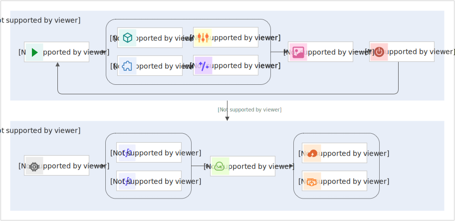
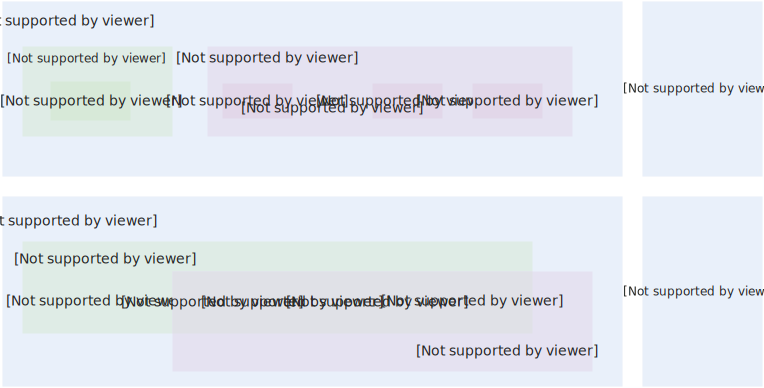

# 什么是FunArt

FunArt可以一键托管并启动开源的`ComfyUI`应用，提供从项目开发到API调用的全生命周期管理能力。

- 项目开发阶段：通过调试提示词与工作流，安装模型与插件，生成实现预期效果的图片或视频。
- API调用阶段：项目开发阶段通过安装模型、插件和依赖，搭建好出图环境。API调用阶段基于出图环境运行工作流，通过Serverless API弹性高效出图。

## **优势**

### **一键部署，开箱即用**

- 一键部署：一键拉起图像生成项目，分钟级完成端到端环境搭建。
- 开箱即用：自动分配`Serverless GPU`算力与存储资源，预装开箱即用的`ComfyUI`环境，全程无需手动安装依赖。

### **提供项目开发到API调用的全生命周期管理**

- 简单易上手的项目开发，项目开发阶段拉齐本地出图体验，可便捷地下载模型，安装插件，调试提示词与流程，快速出图。
- 弹性高可用的API调用：API调用阶段充分发挥Serverless优势，弹性高可用，自动扩缩容。
- 一站式发布：项目开发阶段调试通过的流程可直接发布为弹性高可用的API。

### **国内网络加速，减少等待**

- 模型预缓存：缓存50+ 常用模型，提升模型下载速度。
- 使用国内Github源站加速插件下载，避免跨境访问连接超时。
- 使用阿里云PyPI源，提升依赖安装速度。

### **灵活开放**

- 自定义模型上传：支持上传自定义模型，即时生效。
- 自定义插件扩展：可通过文件管理或实例登录上传自定义插件，适配个性化需求。

### **资源独享，安全无忧**

- 独立的运行环境：项目独占GPU资源，避免资源争抢带来的性能波动。
- 隔离的资源存储：模型与生成内容均存储在用户的NAS中，保证数据安全。

### **Serverless算力，弹性扩展，按需付费**

- 自动弹性伸缩：Serverless算力在突发流量时可自动扩容，轻松应对波峰流量。
- 算力按需计费：算力按需计费，无请求时可自动释放计算资源，随起随停，浅休眠（原闲置）成本低。

### **企业级可靠性保障**

服务高可用：算力多可用区容灾部署，单点故障可自动迁移恢复。

## **使用流程**

项目部署阶段帮您一键创建好需要的算力和存储资源，拉起开箱即用的图像生成项目。

## **项目开发阶段**

项目开发阶段是使用`ComfyUI`生成图片或视频。

启动工作空间会启动一个GPU函数实例，您可以下载模型、安装插件，通过调试提示词与工作流生成图片和视频。使用完成后，您需要关闭工作空间，关闭工作空间会销毁函数实例，您在下次使用工作空间前需要再次启动。

## **API调用阶段**

在`ComfyUI`上安装好模型与插件，调试好提示词与工作流后，发布线上服务可将当前调试好的工作空间（包含ComfyUI需要的源码、插件及依赖包）发布。

发布线上服务会创建新的函数，您可以配置新的资源规格和弹性策略，基于Serverless API弹性出图。可以通过配置将出图结果转存至OSS。

## **项目开发阶段与API调用阶段的转化**

发布线上服务时，会将工作空间的ComfyUI源码、插件及依赖打包成`snapshot`存储。API调用阶段的函数实例启动后会加载`snapshot`并恢复出与项目开发阶段相同的环境，执行出图请求。

API 调用阶段与项目开发阶段的计算资源是隔离的，插件是隔离的，只有模型是共享的。因此，项目开发阶段对插件和依赖的改动不会影响API调用。要让项目开发阶段插件和依赖的改动对API调用生效，需要重新发布线上服务。发布对新弹起的函数实例生效。

## **架构与原理**

图像生成应用是基于您的Serverless GPU算力与合适的云存储构建的弹性高可用应用。在项目部署时会自动创建需要的计算和存储资源。

- Serverless GPU算力资源使用的是函数计算GPU函数。
- 存储产品使用了文件存储NAS、对象存储OSS和日志服务SLS。
  
  - 其中NAS挂载到函数实例上，用于存储ComfyUI的常用目录，包含custom_nodes/、input/ 、output/和models/目录。也用于持久化ComfyUI的snapshot。
  - **
    
    **说明**
    
    snapshot中包含了ComfyUI的项目与依赖环境。
    
    项目开发阶段工作空间启动时会加载snapshot，工作空间关闭时会保存snapshot，用于下次工作空间启动。
    
    项目开发阶段与API调用阶段拥有不同的snapshot，snapshot 是项目开发阶段与API 调用阶段的纽带，API发布是将项目开发阶段可以运行工作流的环境发布为API调用阶段的snapshot，这样API就可以基于新的snapshot运行了。
  - SLS用于存储项目运行产生的日志。
  - OSS可以用于存储您在API调用阶段生成的图片或视频。
