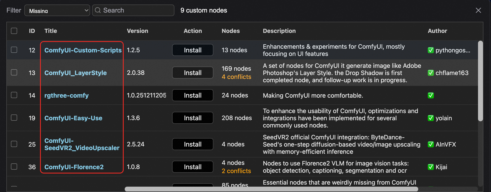
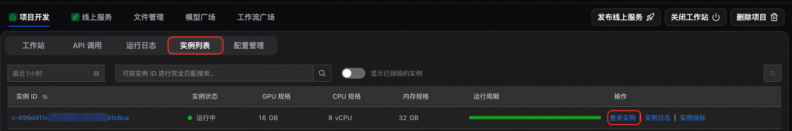
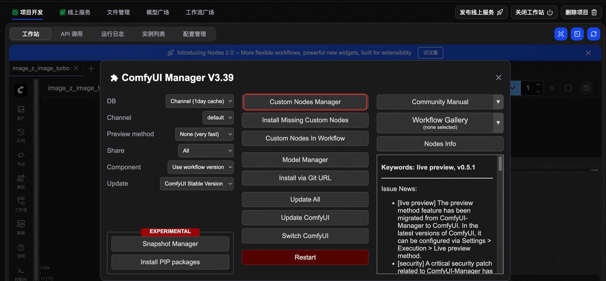
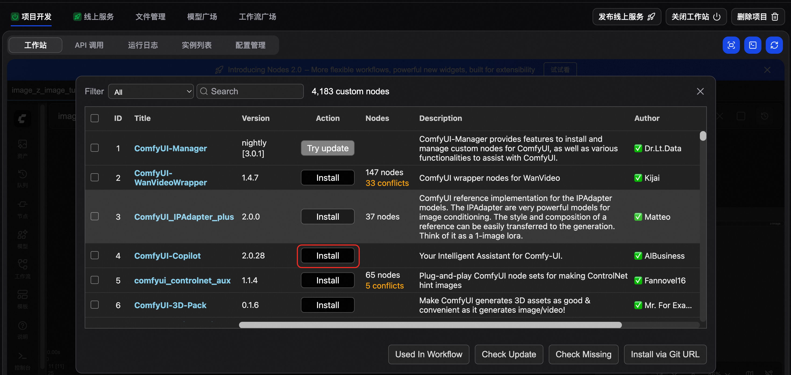
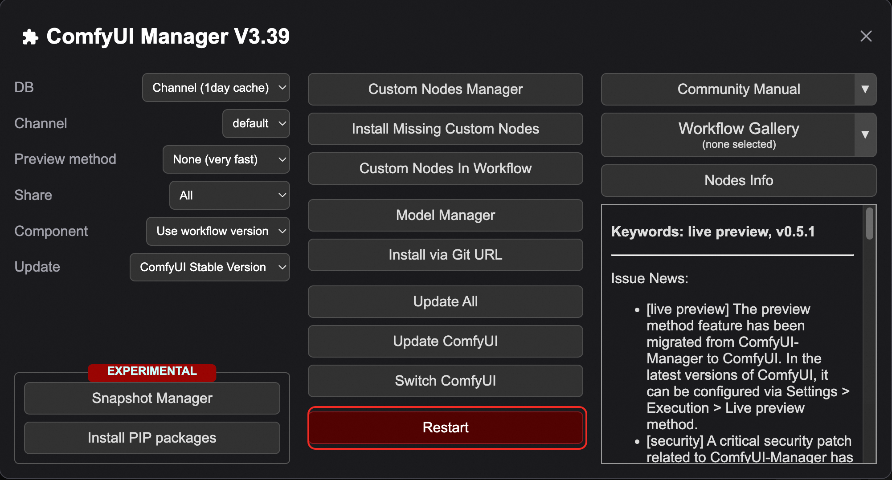

# 插件安装指南

ComfyUI 通过安装插件（自定义节点）可扩展能力，例如更高级的图像处理、新工作流组件或与外部工具集成。本指南介绍三种安装方式：登录实例后使用 git clone（推荐）、通过 ComfyUI Manager 安装、通过文件管理导入。

## **概述**

| **方式** | **适用场景** | **前置条件** |
| --- | --- | --- |
| [方法一：登录实例，通过 git clone 安装（推荐）](#de742eceb1wqj) | 准确地逐个安装开源插件。安装速度快、成功率高且流程可控，但操作较繁琐 | 启动工作站，且已获取缺失插件的GitHub地址（可通过ComfyUI Manager获取） |
| [方法二：通过 ComfyUI Manager 安装](#8313d06feev64) | 通过图形界面一键安装、管理开源插件。操作简单，但安装速度较慢、成功率较低 | 启动工作站 |
| [方法三：通过文件管理安装](#7b128027201q8) | 插件批量迁移、闭源插件导入、网络受限下开源插件安装 | 其他ComfyUI环境中已有一批插件，或已有闭源插件源码包 |

## **方法一：登录实例，通过 git clone 安装（推荐）**

适用于需要准确地逐个安装开源插件、对成功率有较高要求的场景。

### 前提条件

- 工作站已启动。可参考[创建ComfyUI项目快速入门](https://help.aliyun.com/zh/functioncompute/fc/quick-start-comfyui)。
- 通过ComfyUI Manager查看缺失插件的GitHub源码链接
  
  

### 安装步骤

1. **获取插件 Git 地址**
  
  打开插件仓库页面（如 GitHub），点击**<> Code**，复制 HTTPS 下的仓库 URL。示例：`https://github.com/mit-han-lab/ComfyUI-nunchaku.git`。
2. **登录实例**
  
  在 FunArt 控制台点击已创建的 ComfyUI 项目进入**项目开发**>**实例列表**，在目标实例的操作列点击**登录实例**，在弹窗中确认风险后进入终端。
  
  
  
  登录实例时将按弹性实例（活跃）计费；实例上的变更可能影响正在执行的任务，请谨慎操作。
3. **进入****custom_nodes****并克隆仓库**
  
  ```
  cd comfyui/custom_nodes git clone https://github.com/mit-han-lab/ComfyUI-nunchaku.git
  ```
  
  将上述 URL 替换为实际要安装的插件仓库地址。
4. **安装依赖**
  
  ```
  cd ComfyUI-nunchaku pip install -r requirements.txt
  ```
  
  目录名以实际克隆的插件名为准。
  
  **
  
  **说明**
  
  部分ComfyUI开源插件的安装涉及特殊步骤（如辅助模型、.whl文件的安装等），请以该插件GitHub README中的安装方式为准。
5. **重启 ComfyUI**
  
  安装完成后通过 ComfyUI Manager 的**Restart**重启 ComfyUI，刷新浏览器后即可使用新插件。
  
  

### **更新插件（可选）**

如果您想更新通过git clone安装的插件，可以按照以下步骤操作：

1. 登录 ComfyUI 实例进入终端页面。
2. 使用`cd`命令进入您想要更新的插件的特定目录，例如：
  
  ```
  cd comfyui/ComfyUI-nunchaku
  ```
3. 运行`git pull`命令来拉取最新的代码或者`git checkout v-xxx`切换到指定版本。
4. 安装依赖`pip install -r requirements.txt`。
  
  **
  
  **说明**
  
  某些插件可能包含自己的`requirements.txt`文件，安装这些依赖时可能会与其他已安装插件的依赖版本冲突 。如果遇到节点缺失或功能异常，请检查ComfyUI的控制台输出，并可能需要手动调整依赖。
5. 重启ComfyUI使插件生效。

## **方法二：通过 ComfyUI Manager 安装**

ComfyUI Manager 提供图形界面，便于浏览、安装和管理自定义节点，操作最简便。

### 前提条件

- 工作站已启动。可参考[创建ComfyUI项目快速入门](https://help.aliyun.com/zh/functioncompute/fc/quick-start-comfyui)。

### 安装步骤

1. **打开 Manager**
  
  在 ComfyUI 界面右侧面板点击**Manager**。
2. **进入自定义节点管理**
  
  在 Manager 菜单中点击**Custom Nodes Manager**。
  
  
3. **搜索并安装**
  
  在右上角搜索框输入插件名称，在结果中找到目标插件，点击其旁的**Install**。
  
  
4. **等待安装完成**
  
  Manager将自动执行以下操作：
  
  - 下载插件源代码。
  - 验证GPG签名（若插件支持）。
  - 安装Python依赖包。
  - 创建节点配置文件。
5. **重启并刷新**
  
  安装完成后通过 ComfyUI Manager 的**Restart**重启 ComfyUI，刷新浏览器后即可使用新插件。
  
  

## **方法三：通过文件管理安装**

适用于从已有 ComfyUI 环境（如 ECS）插件批量迁移插件、导入闭源插件、或在网络受限情况下安装开源插件

### 前提条件

- 其他ComfyUI环境中已有一批插件，或已有闭源插件源码包。

### **操作步骤**

1. **准备插件压缩包**
  
  - 从现有环境打包：在已有的 ComfyUI 环境中，进入`custom_nodes`目录，选中需要的单个或多个插件文件夹打包成`.zip`文件。
    
    **
    
    **说明**
    
    由于插件越多ComfyUI启动越慢，建议在`custom_nodes`目录下仅选择必要的插件并压缩成.zip包，不建议直接将`custom_nodes`目录压缩。
  - 从代码托管平台下载：直接在 GitHub 等平台的仓库页面下载源码的`.zip`压缩包。
2. **上传并导入压缩包**
  
  根据压缩包的大小，选择适合的上传方式：
  
  - 从 OSS 导入（推荐，适合大文件或跨项目共享）
    
    1. 将`.zip`文件上传至 OSS。
      
      OSS Bucket 需与目标 FunArt 项目处于同一地域。上传方法参考[命令行工具ossutil 2.0](https://help.aliyun.com/zh/oss/developer-reference/ossutil-overview/)。
    2. 在 FunArt 控制台，进入ComfyUI项目，通过**文件管理**>**从OSS导入**，选择对应的 Bucket 和文件将其导入到项目中。
  - 本地直接上传（仅适合小文件）
    
    - 在 FunArt 控制台，进入ComfyUI项目，通过**文件管理**>**本地上传**，将本地的压缩包直接上传到项目。
      
      本地上传公网，速度较慢，通常用于单个小型插件的源码包。
  
  **
  
  **说明**
  
  压缩包制作和使用文件管理上传、导入时无需保持工作站开启。
3. **启动工作站并解压**
  
  为避免 ComfyUI 在启动时触发大量插件依赖的自动安装而导致启动卡死，建议按以下顺序操作：
  
  1. 进入**项目开发**，启动工作站并等待实例成功运行。
  2. 进入**文件管理**，找到刚才导入的插件压缩包，将其解压到目标路径（如`comfyui/custom_nodes`目录下）。
    
    **
    
    **说明**
    
    发布线上服务时对`custom_nodes`目录大小有限制，详见[ComfyUI项目FAQ](https://help.aliyun.com/zh/functioncompute/fc/comfyui-project-faq)。若将压缩包导入到`custom_nodes`目录下，解压后请及时删除压缩包。
4. **安装插件依赖**
  
  进入**项目开发**>**实例列表**>**登录实例**进入终端，为刚解压的插件安装依赖。可任选以下一种方式：
  
  - 手动安装：参考[方法一：登录实例，通过 git clone 安装（推荐）](#de742eceb1wqj)
  - 一键安装：使用以下命令调用 FunArt 提供的**一键依赖安装**功能。
    
    安装过程的详细输出可在**项目开发**>**运行日志**中查看
    
    ```
    curl -X POST http://localhost:9000/management/install -H "Content-Type: application/json"
    ```
5. **重启验证与排错**
  
  - 重启服务：在**工作站**通过**ComfyUI Manager**点击**Restart**重启 ComfyUI。
  - 检查日志：进入**项目开发**>**运行日志**，搜索关键词`Import times for custom nodes`，查看各插件的加载状态。
  - 处理冲突（若有）：开源插件间可能存在 Python 库的依赖冲突。虽然**一键依赖安装**会尽量缓解此类问题，但无法保证 100% 成功。
    
    - 若日志显示某插件导入失败（`Failed to import`），请根据[方法一](#de742eceb1wqj)和报错信息，结合该插件的官方文档手动修复依赖。
    - 重复执行**修复依赖**>**重启**>**查看日志**的流程，直到所有目标插件均成功加载。
