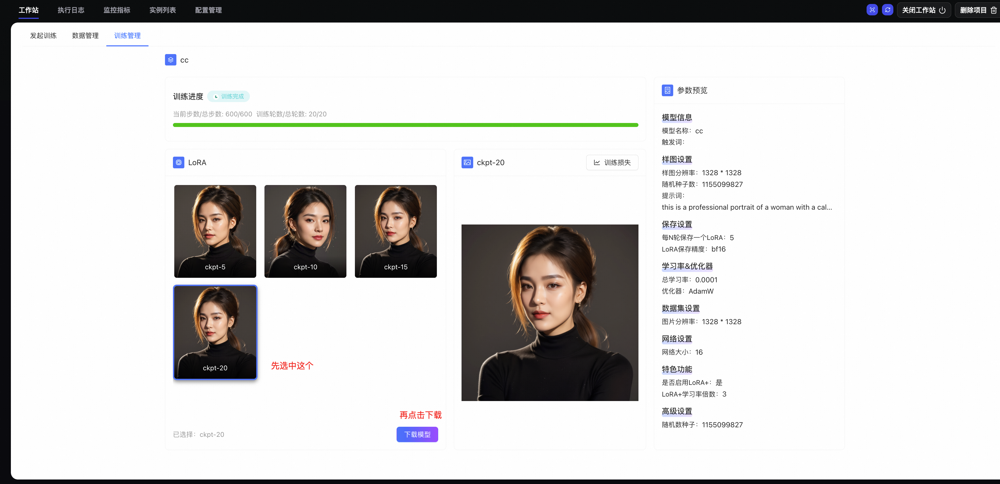

# LoRA训练项目指南

## **概述**

LoRA 是一种高效的模型微调技术，可在不修改大模型主参数的前提下，为 Stable Diffusion、FLUX 等预训练模型注入新能力。FunArt 提供独立的 LoRA 训练项目类型（Powered by 魔搭）。

**LoRA 相比全量微调的优势：**

| **维度** | **LoRA 训练** | **全量微调** |
| --- | --- | --- |
| 模型文件大小 | 通常几十 MB 至几百 MB | 数百 GB |
| 训练速度 | 仅更新少量“适配器”参数，更快 | 需更新全部参数 |
| 显存占用 | 显著降低，消费级显卡可训练 | 需大量 GPU 显存 |

**核心原理**：LoRA 通过低秩分解，在权重矩阵中注入两个小矩阵来近似参数变化，在保持效果的同时大幅减少需训练的参数，实现高效微调。

**说明**：LoRA 训练项目未执行训练请求时不收 GPU 活跃费用，价格更低。

## 前提条件

- 已登录[FunArt 控制台](https://functionai.console.aliyun.com/funart/cn-hangzhou/workspaces)。
- 已开通相关服务并完成账号授权。
- （可选）若需基于压缩包上传数据集，需提前为 OSS Bucket 配置 CORS 规则。

## 一、创建 LoRA 训练项目

1. 在 FunArt 控制台**项目**页面，点击**创建新项目**。
2. **第一步：选择项目类型**
  
  选择**LoRA 训练（Powered by 魔搭）**。
3. **第二步：选择 GPU 卡型和规格**
  
  在表格中选择 GPU 规格（如 Ada 系列 48 GB、Blackwell 系列 32 GB 等），确认 vCPU、内存、磁盘及预计价格后点击**下一步**。
4. **第三步：配置其他项目属性**
  
  - **项目名称**：必填，输入项目名称。
  - **地域**：默认华东1（杭州），可按需选择。
  - **存储配置**：默认“自动配置”。选择自动配置时，会默认在该账号下创建一个 OSS Bucket，Bucket 名称以 serverless 为前缀，例如`serverless-cn-hangzhou-56ec******5cc076a`，用于存储数据集和训练数据。
5. 点击**下一步**，在**第四步：确认并完成创建**中核对配置信息及部署资源（函数计算 FC、对象存储 OSS、日志服务 SLS），点击**确认部署**。
6. 等待项目准备完成（约 3～5 分钟，部署阶段不产生 GPU 费用）。

## 二、数据集准备

数据准备是决定 LoRA 模型效果的关键环节。

### 2.1 标注数据集

**图片要求：**

| **维度** | **要求** |
| --- | --- |
| **数量** | 至少 10 张；建议 15–30 张，效果更佳 |
| **质量** | 主体清晰、构图合理；避免模糊、过曝或欠曝 |
| **一致性** | 统一图片尺寸和宽高比 |
| **聚焦** | 图片聚焦训练目标，减少无关背景干扰 |

**标注说明**：上传后需对图片进行**标注**，即告诉模型每张图包含什么内容。LoRA 训练可理解为：让模型“学习图片内容”与“你提供的文字描述”之间的对应关系。

### 2.2 上传数据集

在项目内选择**工作站**，可通过以下方式准备数据：

- **方式一（发起训练页）**：在**发起训练**右侧点击**拖拽或点击上传图片**或**选择已有数据集**，直接上传本地图片或选择已创建数据集。
- **方式二（数据管理）**：在**数据管理**中，选择类型（**图片数据集**或**图像编辑数据集**），点击**创建数据集**进行创建和管理，发起训练时再选择该数据集。

**

**说明**

若需基于压缩包上传数据集，需先为 OSS 配置跨域规则，参见[五、配置 OSS CORS（可选）](#e60e7285bdcim)。

## 三、发起训练与参数配置

### 3.1 进入训练页面

1. 在项目列表点击 LoRA 项目名称，进入项目详情。
2. 选择**工作站**，进入**发起训练**。

### 3.2 模型选择

- 选择**图像模型**或**图像编辑模型**。
- 在底模选项中选用内置模型（如 Qwen Image、FLUX.1-dev、FLUX.1-超清、麦橘超然、FLUX.1 Krea）或**自定义**底模。

### 3.3 参数设置

| **参数** | **说明** | **必填** |
| --- | --- | --- |
| **使用底模** | 训练的基础预训练模型，如`Stable Diffusion 1.5`或`SDXL`。LoRA 模型是基于特定底模的结构进行训练的。 ** **说明** **LoRA 训练时使用哪个底模，推理时就必须使用对应的底模**。这是因为 LoRA 模型只包含微调所需的“差异”信息，它必须加载到原始底模上才能工作。如果底模不匹配，模型结构将无法对应，导致无法正常加载或生成错误图像。 | 是 |
| **单张次数（Repeat）** | 每张图片在训练中的重复次数，默认 10。如果数据集图片数量较少，可以通过增加“单张次数”来让模型更好地学习，从而防止过拟合。 | 否 |
| **训练轮数（Train epochs）** | 整个**数据集**被模型完整学习的次数。一轮训练结束后，模型会重新开始处理整个数据集。推荐范围 16–41，界面默认 20。 | 否 |
| **LoRA 模型名称** | 最终保存的 LoRA 模型文件的名称。 | 是 |
| **模型触发词** | 在训练中用来与数据集中的概念绑定的特殊词语。在推理时，需要通过这个词来激活模型。 | 否 |

### 3.4 专业参数（可选）

点击**专业参数**可配置以下高级选项：

| **分类** | **参数** |
| --- | --- |
| **样图设置** | - **样图分辨率**：训练过程中，模型在每隔固定步数时生成用于预览和评估的图像分辨率。 - **随机种子数**：用于生成样图的随机种子。保持种子数一致可以确保每次生成的样图可复现。 - **提示词**：生成样图时所使用的提示词。 |
| **保存设置** | - **LoRA 保存精度**：训练好的 LoRA 模型的保存格式。通常选择`**fb16**`以减小文件体积，或者选择`fp16`、`fp32`来保留更多细节（文件会更大）。 - **每 N 轮保存一个 LoRA**：设置一个保存间隔，比如每 10 轮保存一次，以便在训练过程中检查不同阶段的模型效果。 |
| **学习率&优化器** | - **总学习率 (Learning Rate)**：决定模型参数更新的步长。 **学习率太高**：前进的步子太大，可能会直接跳过最优解，导致模型无法收敛，生成混乱的图像。 **学习率太低**：前进的步子太小，虽然最终能到达最优解，但会耗费非常多的时间，训练效率很低。 **推荐值**：通常设置为`1e-4`到`5e-5`之间，这是多数情况下的经验值。 - **优化器**：决定模型参数如何更新的算法，如`**AdamW**`。不同的优化器使用不同的策略来寻找最优解，选择合适的优化器有助于模型更快地收敛。 |
| **数据集设置** | - **图片分辨率**：训练时，图片被缩放到的分辨率。 - **是否启动 arb 桶 (Arbitrary Resolution Bucket)**：一种优化技术，用于处理尺寸不一的图片数据集。如果您的数据集中包含不同长宽比的图片，开启此功能可以避免将所有图片都裁剪或拉伸到单一尺寸，从而保留原始长宽比和构图。 - **arb 桶最小分辨率**：动态分辨率桶的最小分辨率。 - **arb 桶最大分辨率**：动态分辨率桶的最大分辨率。 - **arb 桶分辨率划分单位**：动态分辨率桶的划分粒度。 |
| **网络设置** | - **网络大小（Network Rank）**：LoRA 的核心参数，决定了模型的“学习能力”。可以理解为 LoRA 模型的容量，也就是它能记住多少信息。 ** **重要** 秩越高，模型能学习的细节越多，但同时也更容易过拟合。对于训练一个简单的概念（如一个人物或一个物体），较低的秩（如 8 或 16）就足够了；而对于复杂的风格或多个概念，则需要更高的秩（如 64 或 128）。 - **网络 Alpha（Network Alpha）**：通常设置为与网络大小相同的值。该参数影响 LoRA 权重在最终模型中的混合程度。 |
| **特色功能** | LoRA+、LoRA+ Lambda |

### 3.5 提交训练

确认数据集已上传、参数已配置后，点击**开始训练**，等待训练完成。

## 四、训练与模型管理

### 4.1 查看训练任务

在**训练管理**中查看训练任务列表及状态（如：进行中、已完成、失败）。

### 4.2 查看与下载 LoRA 模型

训练完成后，可以在**训练管理**中进入对应训练任务中查看LoRA模型信息：

- **模型名称**
- **模型类型**（LoRA 模型 / 基础模型）
- **模型状态**（已完成 / 训练中等）
- **操作**：下载模型、删除等

在模型列表中点击**下载模型**，将 LoRA 模型文件下载到本地，可用于后续在 ComfyUI 中加载。

### 4.3 在 ComfyUI 项目中使用 LoRA 模型

将下载的 LoRA 模型文件放入[ComfyUI项目](https://help.aliyun.com/zh/functioncompute/fc/quick-start-comfyui)的文件目录（如`models/loras`）下，即可在 ComfyUI 页面中加载模型并进行推理。

## 五、配置 OSS CORS（可选）

若通过**压缩包**上传数据集，需为 OSS Bucket 配置跨域规则，否则上传可能失败。

**操作步骤：**

1. 登录[对象存储 OSS 控制台](https://oss.console.aliyun.com/)。
2. 选择对应 Bucket，进入**数据安全**>**跨域设置**。
3. 点击**创建规则**，参考以下示例配置：
  
  | **配置项** | **建议值** |
  | --- | --- |
  | 来源 | `*.devsapp.net`（填入实际域名） |
  | 允许 Methods | GET、POST、PUT、DELETE、HEAD |
  | 允许 Headers | `*` |
  | 暴露 Headers | `ETag` |
  | 缓存时间 | 0 |
4. 保存规则。

## 总结

LoRA 训练完整流程包括：

1. **创建项目**：在 FunArt 控制台创建 LoRA 训练项目，选择 GPU 规格并完成部署。
2. **数据准备**：按规范标注数据集，统一尺寸与宽高比，至少 10 张、建议 15–30 张。
3. **发起训练**：选择底模、配置参数（LoRA 模型名称、触发词等），上传或选择数据集后开始训练。
4. **模型管理**：在训练管理中查看任务状态，在模型管理中下载 LoRA 模型。
5. **在 ComfyUI 中使用**：将 LoRA 放入 ComfyUI 的`models/lora`目录，通过 Load Checkpoint、LoRA Loader 等节点构建工作流，在提示词中使用触发词进行推理。
