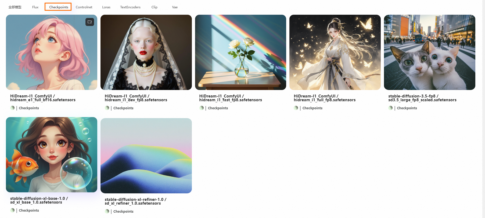
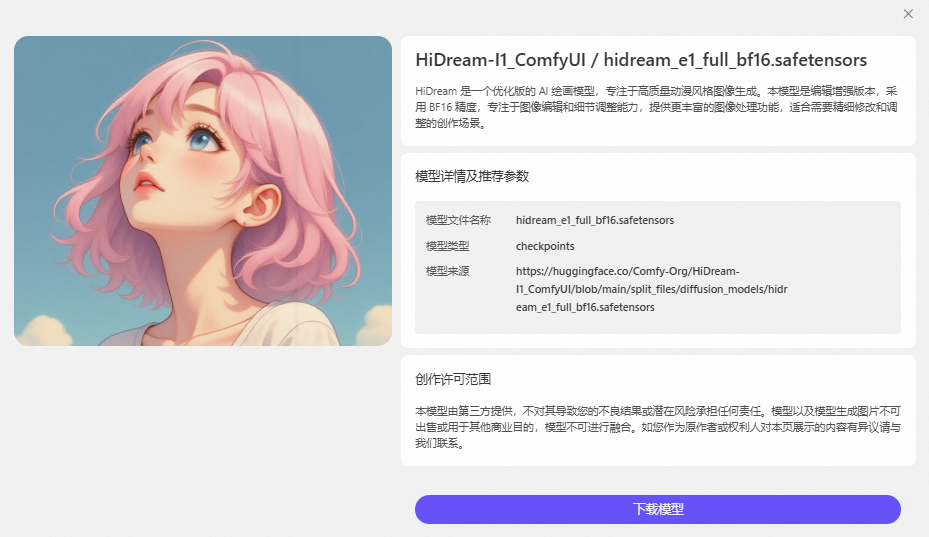
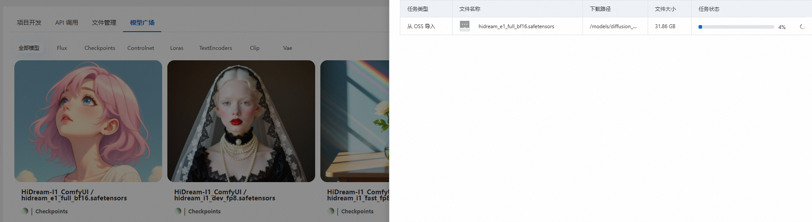
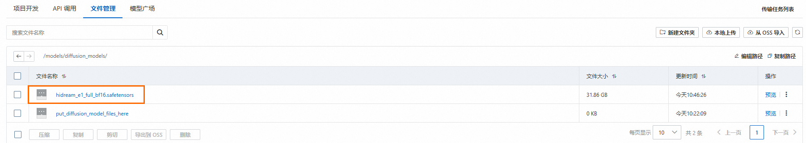
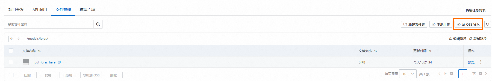
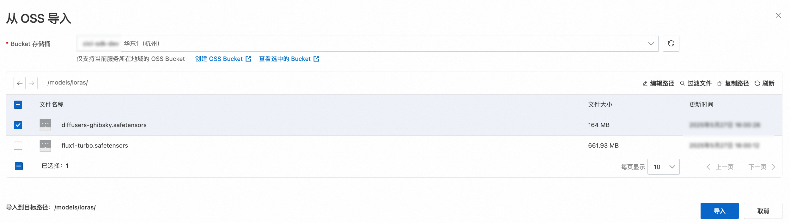
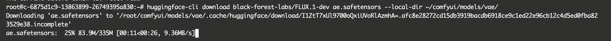
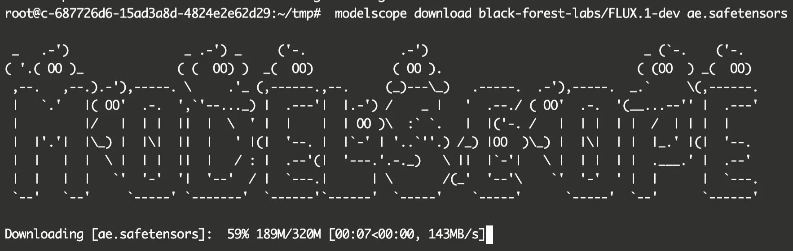

# 模型下载指南

ComfyUI是一款功能强大的开源图像生成工具，它的核心能力在于支持各种各样的模型。这些模型决定了ComfyUI能生成什么，如何生成。本指南将介绍下载ComfyUI模型的多种方式，帮助您高效、便捷地获取所需模型。

## **1. 模型广场：一站式精选模型下载**

为了简化模型获取流程，缓解跨境网络下载模型难的痛点，我们提供了**模型广场**，模型广场汇集了常见的ComfyUI模型，帮助您轻松找到并下载模型。

**下载步骤：**

1. **登录控制台：**首先[登录Function AI控制台](https://cap.console.aliyun.com/projects)，在左侧导航栏，单击**项目**，然后在项目列表单击目标图像生成项目。
2. **访问模型广场：**在图像生成项目详情页面，单击**模型广场**页签。
  
  
3. **浏览与选择：**模型广场会展示一个清晰的模型列表。您可以根据模型类型、源地址进行筛选和浏览，找到最符合您需求的模型。
  
  根据筛选栏筛选指定分类的模型，比如筛选全部是Checkpoints的模型。
  
  
4. **一键下载：**找到心仪的模型后，您可以单击模型右上角的，然后在弹出的**添加到我的模型**对话框，确认模型文件和存储路径，然后单击**确定**。
  
  也可以单击模型查看模型详情，单击**下载模型**按钮，在弹出的**添加到我的模型**对话框，确认模型文件和存储路径，然后单击**确定**。
  
  
5. 开始下载后会自动弹出任务列表展示模型下载进度。
  
  
6. 下载完成后，您可以在**文件管理**页签的`models`目录查看已下载的模型。接下来就可以在ComfyUI项目中使用此模型了。
  
  

## **2. 文件管理：灵活上传本地或云端模型**

如果您已经拥有模型文件，存储在本地计算机上，或者存储在对象存储服务（OSS）中，您都可以通过**文件管理**功能，轻松上传模型并集成到ComfyUI中。

### **2.1 从OSS上传模型**

1. **登录控制台：**首先[登录Function AI控制台](https://cap.console.aliyun.com/projects)，在左侧导航栏，单击**项目**，然后在项目列表单击目标图像生成项目。
2. **进入文件管理：**在图像生成项目详情页面，单击**文件管理**页签。
3. **进入模型目录：**进入要上传模型的子目录，例如`/models/loras`目录。
  
  
4. **从OSS导入模型**：在对应模型目录下，单击右上角的**从OSS导入**，在弹出的对话框，选择**Bucket 存储桶**，勾选要上传的模型文件，单击**导入**按钮，系统将开始从OSS拉取模型文件，并将其导入到您选择的目标路径中。
  
  

### **2.2 从本地上传模型**

对于存储在您本地计算机上的模型文件，您可以直接通过文件管理功能将其上传。

1. **登录控制台：**首先[登录Function AI控制台](https://cap.console.aliyun.com/projects)，在左侧导航栏，单击**项目**，然后在项目列表单击目标图像生成项目。
2. **进入文件管理：**在图像生成项目详情页面，单击**文件管理**页签。
3. **选择本地上传：**进入要上传模型的子目录，例如`/models/loras`目录，然后单击右上角的**本地上传**。
4. **选择模型文件：**系统会打开一个文件选择器，请浏览您的本地文件系统，找到并选择您希望上传的ComfyUI模型文件。
5. **确认上传：**单击**上传**按钮，模型文件将上传到您的ComfyUI环境中。

## **3. 使用Hugging Face和ModelScope命令行工具**

对于熟悉命令行操作的用户，或者需要下载最新、最前沿的模型，直接通过**Hugging Face Hub**和**ModelScope**的命令行工具进行下载是最高效的方式。这两种平台都是全球领先的AI模型开源社区。

### **3.1 使用**`**huggingface_cli**`**下载Hugging Face模型**

Hugging Face Hub汇集了数以万计的预训练模型，`huggingface_cli`是官方提供的命令行接口，能让您轻松下载这些模型。

#### **前提条件**

您的环境中已安装`huggingface_hub`的Python 库。如果没有，可以在图像生成项目详情页面，依次单击**项目开发**>**实例列表**>**登录实例**，在实例页面执行以下命令安装`huggingface_hub`的Python 库。

```
pip install huggingface_hub
```

#### **下载命令**

使用以下命令下载指定的模型。您可以在Hugging Face Hub网站上找到每个模型的完整ID。

huggingface-cli下载模型可参考[huggingface文档](https://huggingface.co/docs/huggingface_hub/main/guides/cli#huggingface-cli-download)。

```
huggingface-cli download <model_id> --local-dir <local_directory>
```

- `**<model_id>**`**:**这是您希望下载的模型在 Hugging Face Hub 上的**完整标识符**。例如，[**https://huggingface.co/black-forest-labs/FLUX.1-dev/blob/main/ae.safetensors**](https://huggingface.co/black-forest-labs/FLUX.1-dev/blob/main/ae.safetensors)**的标识符为**`black-forest-labs/FLUX.1-dev ae.safetensors`。
- `**--local-dir <local_directory>**`**:**指定模型下载后在您本地文件系统中的**保存路径**。请确保该路径存在且有写入权限。

#### **下载示例**

下载`ae.safetensors`模型并保存到`./models/vae`目录下：

```
huggingface-cli download black-forest-labs/FLUX.1-dev ae.safetensors --local-dir ~/comfyui/models/vae/
```



### **3.2 使用ModelScope下载模型**

ModelScope是由阿里巴巴达摩院主导的AI模型开源社区，提供了丰富的中文及多模态模型。

#### **前提条件**

您的环境中已安装`modelscope`的Python 库。如果没有，可以在图像生成项目详情页面，依次单击**项目开发**>**实例列表**>**登录实例**，在实例页面执行以下命令安装。

```
pip install modelscope
```

#### **下载命令**

使用以下命令下载指定的模型。modelscope下载模型可参考[模型的下载](https://www.modelscope.cn/docs/models/download)。

```
modelscope download <model_id> --local_dir <local_directory>
```

- `**<model_id>**`**:**这是您希望下载的模型在 Modelscope 上的**完整标识符**。例如，[https://www.modelscope.cn/models/black-forest-labs/FLUX.1-dev/file/view/master/ae.safetensors](https://www.modelscope.cn/models/black-forest-labs/FLUX.1-dev/file/view/master/ae.safetensors?status=2)**的标识符为**`black-forest-labs/FLUX.1-dev ae.safetensors`。
- `**--local_dir <local_directory>**`**:**指定模型下载后在您本地文件系统中的**保存路径**。请确保该路径存在且有写入权限。

#### **下载示例**

下载`ae.safetensors`模型并保存到`./models/vae`目录下：

```
modelscope download black-forest-labs/FLUX.1-dev ae.safetensors --local_dir '~/comfyui/models/vae'
```



## **更多信息**

随着AI技术的飞速发展，新的模型会不断涌现。建议您持续关注模型广场的更新，以获取最新的模型，不断拓展ComfyUI的创作边界。

在您探索ComfyUI模型世界的过程中，如果遇到任何疑问或需要帮助，请随时查阅我们的帮助文档或联系技术支持团队。祝您创作愉快！
