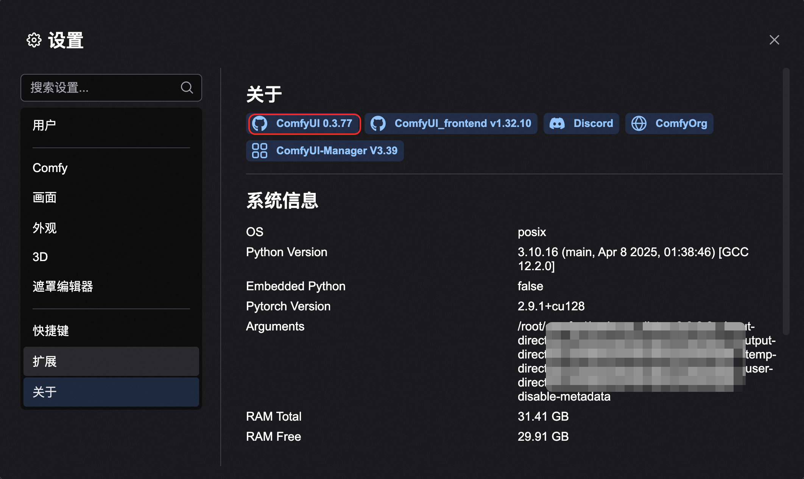
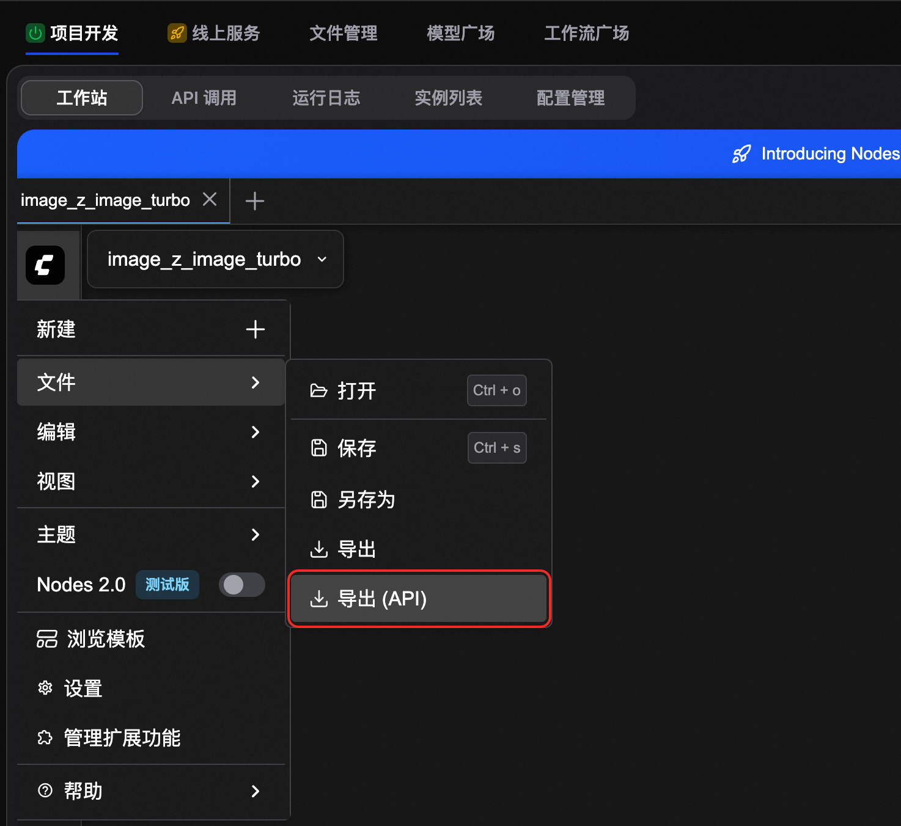
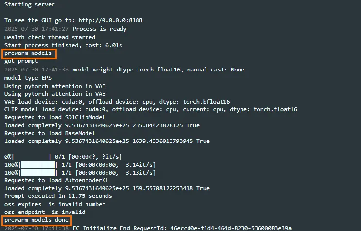

# ComfyUI项目FAQ

本文汇总 ComfyUI 项目在开发、发布与线上服务阶段的常见问题与处理方式，便于快速排查与解决。

## **项目开发阶段**

### **Q：**工作站很久都启动不起来，如何处理？

#### **常见问题与处理**

| **原因类型** | **具体表现** | **处理方式** |
| --- | --- | --- |
| **GPU 卡预留失败** | 所选 GPU 卡型资源紧张 | 等待资源池补充，或稍后重试 |
| 所选卡型达到账号级配额 | 前往配额中心申请提高配额，或释放其他项目中同卡型 GPU |  |
| **ComfyUI 进程启动超时** | 插件导入时间过长 | 见[插件导致启动超时](#676f38f0d0b2i) |
| ComfyUI源码依赖版本错误导致无法启动 | 通过[工作站手动回滚](#db27b901b8ybg)回滚至上一次保存状态 |  |
| **其他** | 账号余额不足 | 检查并保证账号余额充足 |

#### **插件导致启动超时**

开源 ComfyUI 启动时会扫描`custom_nodes`下所有插件并执行各插件的`__init__.py`。部分插件在此过程中会检查并自动安装缺失的 Python 依赖或辅助模型，导致启动时间变长甚至超时。

在**项目开发**>**运行日志**中可查看 ComfyUI 启动阶段日志。若发现卡在某一插件的安装流程无法完成启动，建议先保证工作站能正常启动，再按需安装插件：

1. 在**文件管理**中删除`custom_nodes`下可能异常的插件目录。
2. 通过[工作站手动回滚](#db27b901b8ybg)将 ComfyUI 源码与依赖回滚至上一次保存的状态。

工作站成功启动后，再根据[插件安装指南](https://help.aliyun.com/zh/functioncompute/fc/comfyui-plugin-installation-guide)安装所需插件。

**

**说明**

**ComfyUI源码依赖版本错误**：插件版本变更可能调整部分 Python 依赖版本，若与 ComfyUI 所需版本冲突，ComfyUI 将无法启动。此时建议通过[工作站手动回滚](#db27b901b8ybg)回滚至上一次保存状态。

#### **工作站手动回滚**

工作站默认使用最近一次保存的快照启动。若最近一次误保存了无法成功启动的环境，可按以下步骤回滚：

1. 打开**文件管理**，进入`snapshots`目录。
2. 删除以`dev-`为前缀的最近一个快照目录。
3. 重新启动工作站。

**

**说明**

删除快照目录会将距上一次保存期间的所有依赖改动丢弃，插件源码、模型、工作流的改动不会丢失。

### Q：工作站为什么会突然自动重启？

当开源 ComfyUI 进程崩溃时，FunArt 平台会自动重新拉起 ComfyUI 进程。崩溃时的内核日志可在**文件管理**的`.funart/crash_reports`目录下查看。

常见崩溃原因包括内存溢出（RAM OOM）或显存溢出（VRAM OOM）。处理方式：调整工作流参数（如降低出图分辨率）、或更换 GPU 卡型。

### Q：如何查看 ComfyUI 版本？

#### **方法一：在工作站中查看**

1. 启动工作站，点击菜单。
2. 点击**设置**>**关于**，查看 ComfyUI 版本。
  
  

各版本前端样式可能不同，本文以ComfyUI 0.3.77为例。

#### 方法二：登录实例查看

1. 打开**实例列表**，单击**登录实例**。
2. 在终端执行：

```
cd comfyui && git log -1
```

### Q：如何升级 ComfyUI 版本？

1. **登录实例并进入目录**
  
  ```
  cd comfyui
  ```
2. **添加或更新远程镜像仓库**
  
  ```
  git remote add mirror https://gh.llkk.cc/https://github.com/comfyanonymous/ComfyUI.git
  ```
  
  若已添加过该镜像，会提示`fatal: remote mirror already exists.`，可忽略并继续下一步。
3. **从镜像拉取最新信息**
  
  ```
  git fetch mirror --tags
  ```
4. **切换到指定版本**
  
  ```
  # 将 v0.3.49 替换为目标版本号 git checkout -f v0.3.49
  ```
5. **安装新版本依赖**
  
  ```
  pip install -r requirements.txt
  ```
6. **重启工作站**
  
  在 ComfyUI-Manager 中重启工作站，确认新版本能正常启动。
  
  - **若重启成功**：下次关闭工作站时勾选**保存环境**，以持久化本次源码与依赖变更。
  - **若重启失败**：根据**项目开发**>**运行日志**排查原因；关闭工作站时不勾选保存环境，以丢弃本次变更。

**

**说明**

若在`git checkout`时遇到文件权限相关报错（常见于 Windows 与 Linux 切换场景），可先执行`git config --global core.fileMode false`，设置 Git 忽略文件权限的变化，再重新执行`checkout`。

## **发布线上服务阶段**

### Q：制作快照时提示目录大小超出限制怎么办？

生图环境过大会影响快照制作与后续实例轮转速度。平台在制作快照时会校验相关目录大小，超过默认限制将中止发布。

| **目录** | **默认限制** | **排查与处理** |
| --- | --- | --- |
| 插件目录（`custom_nodes`） | 5GB | 用于存放 ComfyUI 插件源码。通过**项目开发**>**实例列表**>**登录实例**登录后，在`~/comfyui/custom_nodes`下执行`du -sh *`与`sort -rh`按大小倒序查看；检查并清理体积过大的插件或误放的模型。 |
| 缓存目录（`.cache`） | 5GB | 存放工作流运行时按需下载的辅助模型与数据集。建议清理后在工作站中重新运行一次核心工作流，由节点自动拉取所需缓存。 |

若确认目录内容无异常且业务确需更大配额，可通过[提交工单](https://smartservice.console.aliyun.com/service/create-ticket)申请评估并提高配额。

### Q：为什么在函数计算控制台修改的配置被回滚或导致部署失败？

FunArt 通过自身发布流程管理并覆盖函数计算（FC）的配置，以保证环境一致与版本可追溯。在 FC 控制台的手动修改不会同步回 FunArt，且会在下次发布时被 FunArt 配置覆盖。

**

**重要**

不要直接在 FC 控制台修改由 FunArt 创建和管理的函数配置。所有配置变更应在**线上服务**>**配置管理**中完成。

若因在 FC 控制台修改导致部署失败，请先在**线上服务**>**配置管理**中按错误提示修正配置，再在**线上服务**>**发布记录**中对失败任务执行**重试**。重试将跳过快照制作，直接进入服务部署。

### Q：发布成功后，为什么线上配置未生效、实例仍是旧版本？

发布成功仅表示函数新配置已写入成功；配置真正生效依赖实例轮转（新实例启动并完成替换）。

若等待较久仍无轮转，通常表示新实例启动失败。排查步骤：

1. **判断轮转状态**：在**线上服务**>**实例列表**>**推理实例**中，通过实例的运行周期-存续时长区分新旧；新实例的存续时长从零开始。
2. **排查启动失败**：若长时间无新实例，先查看**线上服务**>**服务概览**是否有实例启动错误信息，再结合函数日志定位原因（例如 ComfyUI 非预期地动态下载辅助模型等）。

## **线上服务阶段**

### Q：如何通过模型预热避免首次出图耗时过长？

新实例启动时需将模型从磁盘加载到显存，加载耗时较长，会导致首次出图变慢。加载完成后模型缓存在显存中，后续出图会明显加快。因配置更新、资源轮转等原因，偶发慢请求仍可能出现。

FunArt 提供模型预热能力：在 ComfyUI 启动后、对外承接出图前，自动执行一次出图任务，提前完成模型加载，使新实例也能较快出图。

#### 准备模型预热脚本

在**项目开发**>**工作站**中制作并验证预热工作流，导出为可用的预热工作流JSON。



**预热工作流要求**：

- 工作流能正确运行，所需模型、插件与自定义节点已在函数实例中安装。
- 需预热多个模型时，可在工作流中增加多个模型加载器或延伸出子工作流。
- 预热目的是将模型加载进显存，而非生成高质量图。建议缩短预热时间：
  
  - 采样器迭代步数`steps`设为 1。
  - 图像尺寸`width`/`height`设为最小值 16×16。

预热脚本示例如下：

```
{ "3": { "inputs": { "seed": 234571336938304, "steps": 1, "cfg": 8, "sampler_name": "euler", "scheduler": "normal", "denoise": 1, "model": [ "4", 0 ], "positive": [ "6", 0 ], "negative": [ "7", 0 ], "latent_image": [ "5", 0 ] }, "class_type": "KSampler", "_meta": { "title": "K采样器" } }, "4": { "inputs": { "ckpt_name": "sd-v1-5-inpainting.ckpt" }, "class_type": "CheckpointLoaderSimple", "_meta": { "title": "加载检查点" } }, "5": { "inputs": { "width": 16, "height": 16, "batch_size": 1 }, "class_type": "EmptyLatentImage", "_meta": { "title": "空潜空间图像" } }, "6": { "inputs": { "text": "beautiful scenery nature glass bottle landscape, , purple galaxy bottle,", "clip": [ "4", 1 ] }, "class_type": "CLIPTextEncode", "_meta": { "title": "CLIP文本编码（提示）" } }, "7": { "inputs": { "text": "text, watermark", "clip": [ "4", 1 ] }, "class_type": "CLIPTextEncode", "_meta": { "title": "CLIP文本编码（提示）" } }, "8": { "inputs": { "samples": [ "3", 0 ], "vae": [ "4", 2 ] }, "class_type": "VAEDecode", "_meta": { "title": "VAE解码" } }, "9": { "inputs": { "filename_prefix": "ComfyUI", "images": [ "8", 0 ] }, "class_type": "SaveImage", "_meta": { "title": "保存图像" } } }
```

#### **配置模型预热**

1. [为ComfyUI项目发布线上服务](https://help.aliyun.com/zh/functioncompute/fc/publish-online-service-for-comfyui-project)后，进入**线上服务**>**配置管理**，在**工作流预热**中填入上述预热脚本 JSON。
2. 在**弹性策略**中选择合适的 GPU 规格与最小实例数，单击**保存并部署**。

FunArt 将创建实例，在 ComfyUI 启动后自动执行预热工作流；可在运行日志中查看预热情况。



### Q：如何缩短实例启动（轮转）时间？

线上实例的启动时间取决于最近一次发布时项目开发工作站的启动时间。优化工作站启动速度即可缩短轮转耗时。

| **优化方向** | **操作建议** |
| --- | --- |
| **分析插件加载耗时** | 启动工作站后，在**项目开发**>**运行日志**中搜索`Import times for custom nodes`，查看各插件加载耗时，重点优化加载过久的插件。 |
| **检查预热工作流** | 若在**线上服务**>**配置管理**中配置了**工作流预热**，发布前需在项目开发环境中完整运行一次预热工作流，确保辅助模型与文件已提前下载到缓存，否则新实例预热时实时下载可能耗时过长或导致启动超时。 |

### Q：如何限制子账号使用发布、配置修改、文件管理？

需要为子账号做更细粒度权限控制（如区分运维、设计师等角色）时：

1. 先按[授权RAM用户使用图像生成项目](https://help.aliyun.com/zh/functioncompute/fc/authorize-ram-users-to-use-images-to-generate-projects)为子账号配置必要的操作权限。
2. 再通过以下 RAM 策略显式拒绝发布、配置修改与文件管理相关操作：

```
{ "Action": [ "devs:DeployEnvironment", "devs:UpdateEnvironment", "devs:GetFileManagerTask", "devs:FileManager*" ], "Resource": "*", "Effect": "Deny" }
```
